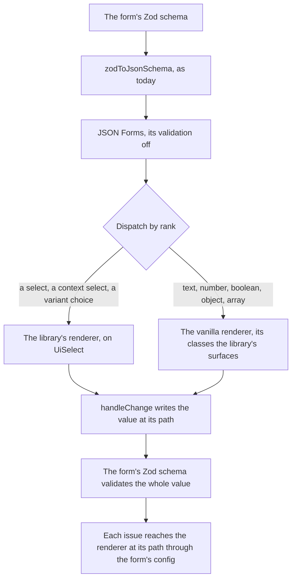

# Schema Forms

The sheet editor's column dialogs, its settings and the dashboard's visual editor render their forms from a Zod schema: `zodToJsonSchema` turns the form schema into JSON Schema, and vjsf renders that with Vuetify components. It is the one engine in the app whose whole interface is Vuetify's, so theming it from outside, as [page migration](/docs/proposals/refactors/ui-library/page-migration) does for the other editors, is not possible: its fields are Vuetify fields. As long as it stays, Vuetify stays.

It is also where a good part of the repository's form workarounds live. The `vjsf` skill records them: a literal discriminant that only works with a read-only marker, an enum discriminant that breaks with one, a cross-field check that must be an ajv keyword because the renderer validates with ajv rather than with the Zod schema the form came from, and item lists supplied as JavaScript expression strings evaluated against a context object. Each is a cost of rendering through an engine that does not know the schema started as Zod.

This stage depends only on the [foundation](/docs/architecture/ui-library) and the library's form components, so it can run beside page migration once those exist.

## Why an engine rather than a renderer of our own

A schema form engine is most of the work: laying out an object's fields, dispatching each node to a control, detecting which variant of a union the data is in, editing arrays, and keeping every nested value in step. Writing that for four dialogs puts an engine in the repository that nothing else maintains, whose every edge case is ours. The engine is adopted; only the look is ours.

| Candidate                                                                       | Why it is or is not the one                                                                                                                                                                                                                                                                            |
| :------------------------------------------------------------------------------ | :----------------------------------------------------------------------------------------------------------------------------------------------------------------------------------------------------------------------------------------------------------------------------------------------------- |
| [JSON Forms](https://jsonforms.io/), chosen                                     | Renders the JSON Schema the app already generates. Its Vue binding is framework-free, its vanilla renderers take their class names from one styles object, and a renderer of ours is registered by rank beside them. Maintained by EclipseSource, with the largest user base of the Vue schema engines |
| vjsf 4                                                                          | The engine today, still bound to Vuetify as a peer dependency, so Vuetify cannot leave while it stays                                                                                                                                                                                                  |
| [shadcn-vue's AutoForm](https://radix.shadcn-vue.com/docs/components/auto-form) | Walks the Zod schema itself, but it is copied into the repository rather than installed — a renderer of our own under another name — and it brings Reka UI and vee-validate beside Vuetify 0                                                                                                           |
| [FormKit](https://formkit.com/)                                                 | A whole form framework whose inputs, validation and schema format replace the library's fields and the app's JSON Schema, so every form moves, not four                                                                                                                                                |
| A renderer of our own                                                           | The previous plan: the smallest renderer that fits the app's schemas, and exactly the maintenance this change exists to avoid                                                                                                                                                                          |

## How it works



- **JSON Schema stays the input.** `zodToJsonSchema` and its snapshot tests are unchanged, and JSON Forms generates the layout from the schema where no UI schema is given, which is every form the app has.
- **The vanilla renderers wear the library's look.** Their class names come from one styles object provided at the root — an input takes `ui-field`, a group the frame — so most nodes need no renderer of ours at all.
- **A few nodes are the library's own.** A select and a variant choice are `UiSelect`, so they open in the library's popover rather than a native one, and a select whose items come from the dialog reads them from the form's config by a typed key rather than from an expression string.
- **The Zod schema validates.** JSON Forms runs with validation off, the form's Zod schema checks the whole value on every change as the error icon does today, and each issue is handed to the renderer at its path through the config. A cross-field rule is a refinement, and the ajv keywords go.
- **A variant is its discriminant.** JSON Forms' one-of dispatch matches the variant whose `const` discriminant the data carries, so the read-only marker the `vjsf` skill requires on a literal discriminant, and forbids on an enum one, stops mattering.

## Next steps

1. Install `@jsonforms/core`, `@jsonforms/vue` and `@jsonforms/vue-vanilla`, and wrap them as `UiSchemaForm`: the styles object, the library's renderers, validation off and the Zod issues in the config. Its test renders every registered form schema, so a node no renderer handles fails the suite.
2. Move the sheet's settings, the simplest form, onto it; then the column create and edit dialogs, whose items come from the context; then the dashboard's visual editor.
3. Delete vjsf, its options model, the ajv keywords and the `vjsf` skill, whose surviving rules move to the `ui-library` skill.

## What it deletes

- vjsf and its Vuetify-bound field set.
- The ajv keyword definitions, which become Zod refinements.
- The expression strings in form schema meta, which become typed config keys.
- The `vjsf` skill, whose surviving rules — a form schema separate from the entity schema, variant titles, the typed context — move into the "ui-library" skill as its schema forms section.

## Key files

| File                                                                   | Role after the change                              |
| :--------------------------------------------------------------------- | :------------------------------------------------- |
| `apps/web/app/services/jsonSchema/zodToJsonSchema.ts`                  | Unchanged: the renderer's input                    |
| `apps/web/app/services/jsonSchema/processAnyOf.ts`                     | Read by the renderer for union variants            |
| `apps/web/app/models/vjsf/VjsfOptions.ts`                              | Replaced by the renderer's typed context           |
| `apps/web/app/models/resource/sheet/column/ColumnFormVjsfContext.ts`   | Becomes the column dialogs' typed context          |
| `apps/web/app/composables/resource/sheet/useColumnFormOptions.ts`      | Supplies the typed context instead of vjsf options |
| `apps/web/app/components/Resource/Sheet/Column/EditDialog.vue`         | Renders through the library's schema form          |
| `apps/web/app/components/Resource/Sheet/Column/CreateDialogButton.vue` | Renders through the library's schema form          |
| `apps/web/app/components/Resource/Sheet/Settings.vue`                  | Renders through the library's schema form          |
| `apps/web/app/components/Dashboard/Visual/Preview/EditFormDialog.vue`  | Renders through the library's schema form          |
| `.agents/skills/vjsf/SKILL.md`                                         | Deleted, its surviving rules moved                 |

```text
apps/web/app/components/Ui/SchemaForm/Index.vue     JSON Forms with the styles, the renderers and the Zod issues
apps/web/app/components/Ui/SchemaForm/Select.vue    a select, from the schema's enum or the form's config
apps/web/app/components/Ui/SchemaForm/OneOf.vue     a variant choice over the chosen variant's fields
```

## Notes

- JSON Forms still carries ajv for its one-of matching, so the dependency stays; what goes is the ajv keywords the app wrote and the validation the forms showed through it.

## Sources

- [vjsf](https://koumoul-dev.github.io/vuetify-jsonschema-form/latest/): the renderer replaced, and the layout vocabulary the typed meta keeps the useful half of.
- [JSON Forms' Vue binding](https://github.com/eclipsesource/jsonforms/tree/master/packages/vue) and [vanilla renderers](https://github.com/eclipsesource/jsonforms/tree/master/packages/vue-vanilla): the engine adopted — `useJsonFormsControl`, `rankWith`, the styles object and the `NoValidation` mode.
- [JSON Schema in Zod](https://zod.dev/json-schema): the conversion the renderer's input comes from.
