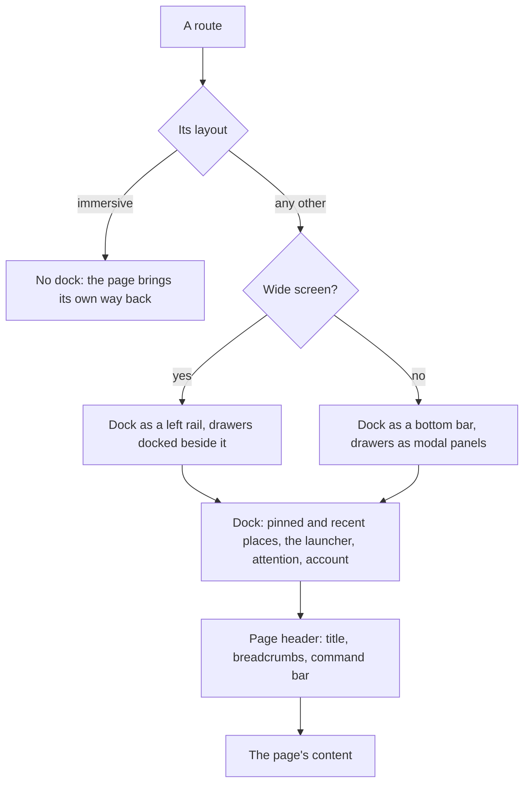

# App Shell

The app bar is the one piece of Vuetify every page shows, so it is where the new look reaches the most screens in one change. It is also where the migration's permission to rethink rather than repaint matters most. Today's bar is a Material top bar holding a logo, the site's name, a grid of products, the theme toggle, the notification bell and an account menu. It takes a full row off the top of every page, and on a phone every control in it is at the edge furthest from the thumb.

This page decides the frame that replaces it. It depends on the [agent console stage](/docs/proposals/refactors/ui-library/agent-console), which proves the frame, button, menu and loading bar it is built from.

## The decision

**A dock instead of a bar.** On a wide screen, the dock is a narrow rail down the left edge. On a narrow screen, it is a bar along the bottom. It holds what is app-wide — where to go, what needs attention, and who is signed in — and nothing that belongs to the page.

- **The dock holds the reader's places, not the app's catalogue.** A flat list of every product is the one arrangement that serves nobody: it shows a reader the dozen things they never open to reach the two they do. The dock shows what this reader comes back to — the few places they pinned, and below them the most recent few, ranked by frecency (how often and how lately) — whether a place is a product, a room, a document, a console session or a game. Each is one click. A new reader with no history sees a handful of starting points instead.
- **Everything else is one click or one keystroke away.** A launcher at the top of the dock opens every product as a panel, grouped by what it is for — talking, making, playing, building — with the games inside it. The [command palette](/docs/proposals/refactors/ui-library/command-palette) reaches every product and page by name. Nothing is more than one step from the dock, and nothing is on screen until it is wanted.
- **Products link to each other where the work crosses.** Rather than a reader going back to the dock to change product, a thing that belongs to another product links there in place: a message naming a document opens it, a console session links the resources it changed, an achievement links the game it was earned in, a resource's activity links the room it was shared in. The [flow map](/docs/proposals/refactors/ui-library/flow-map) shows where such a crossing exists and where a page is a dead end, and each page's unit in page migration closes the dead ends it owns.
- **The page owns its title and its actions.** Each page's header carries its title, its breadcrumbs and its own command bar, which the [responsive](/docs/architecture/responsive) rules already collapse into one overflow menu on a narrow screen. The site's name leaves the chrome, since the logo at the top of the dock says it and the page's title is what the reader needs.
- **Rarely used controls go to the account menu.** The theme toggle, the readable-text setting from the [design language](/docs/proposals/refactors/ui-library/design-language), settings, the secondary pages and sign-out are in the menu behind the avatar at the foot of the dock. Signed out, the avatar is a sign-in button, and the same menu holds the secondary pages.
- **The command palette is on the dock** as a button, and on every page as a shortcut ([command palette](/docs/proposals/refactors/ui-library/command-palette)).
- **Page drawers are panels beside the dock.** A page's left and right drawers keep their meaning and their store, and are drawn as frames docked beside the rail on a wide screen and as modal panels over the page on a narrow one.

This is the arrangement of Discord and Slack, which the messaging surfaces already follow, and of the desktop tools this app sits beside. Esbabbler's room list becomes the panel beside the rail, and the app's navigation and the product's navigation stop being stacked bars.



## Nothing lost

Every flow the frame carries today has a place in the new one. A row missing here is a gap, and the stage does not ship until it is filled.

| Today                                                               | In the new frame                                                                                                                |
| :------------------------------------------------------------------ | :------------------------------------------------------------------------------------------------------------------------------ |
| Logo, back to the home page                                         | The logo at the top of the rail, or the first button of the bottom bar                                                          |
| Site name                                                           | The logo's label; the page's own title in its header                                                                            |
| Products grid, with the games group                                 | The launcher on the dock, games included, and every product in the palette; the reader's own places pinned and recent beside it |
| Theme toggle                                                        | The account menu, with the readable-text setting beside it                                                                      |
| Notification bell with its unread badge                             | The dock, above the account, with the badge                                                                                     |
| Account menu: settings, pages, sign-out                             | The account menu, unchanged in content                                                                                          |
| Signed-out menu: sign-in, pages                                     | A sign-in button, with the secondary pages in its menu                                                                          |
| The loading bar under the app bar                                   | The console's voxel loading bar along the top edge of the viewport                                                              |
| Left and right drawers, opened by default on a wide screen          | Docked panels, opened by the same store and the same default                                                                    |
| Scroll-to-top button                                                | Unchanged, as a raised icon button in the page's corner                                                                         |
| Alerts, the clipboard snackbar, notification and achievement toasts | One toast stack in one corner                                                                                                   |
| The call picture-in-picture window                                  | Unchanged, above the page                                                                                                       |
| The user settings dialog                                            | Unchanged, on the library's dialog                                                                                              |

## What it builds on the way

- **The dialog shell** is rebuilt on the library's dialog, keeping every rule its [standard](/docs/architecture/dialog-shell) states, so every dialog in the app changes look in this stage whether its page has moved or not.
- **The toast stack** replaces the alert list and every snackbar with one component over Vuetify 0's notifications composable, keeping the one corner the Vuetify defaults chose and its reason.
- **The places** are a small store: pinned places saved with the user's settings so they follow the reader between devices, recent ones kept on the device, since a recent list is a convenience rather than data worth a server round trip. Signed out, only the recent list exists.
- **The layout's fixed styles** — the composable that keeps drawers from shifting the page between routes — are kept and read the rail's width as a token instead of the app bar's height.

## Checking it

- **By eye**, on a wide and a narrow screen, signed in and signed out: every row of the table above, each product reached from the launcher and a pinned place from the dock, the recent list after a few visits, each drawer opened and closed, a notification arriving, and a dialog opened from a page not yet migrated.
- **Component tests** for the dock's keyboard order and labels, and for the drawer's modal behaviour on a narrow screen. The existing tests of the Styled drawer and navigation list are rewritten against the new components, and the ones that test Vuetify's own drawer behaviour are deleted with it.

## Key files

| File                                                   | Role after the change                                         |
| :----------------------------------------------------- | :------------------------------------------------------------ |
| `apps/web/app/App.vue`                                 | Renders the dock instead of the app bar, and the toast stack  |
| `apps/web/app/components/App/Bar.vue`                  | Replaced by the dock                                          |
| `apps/web/app/components/App/Menu/Button.vue`          | Replaced by the launcher                                      |
| `apps/web/app/components/App/MoreDropdownButton.vue`   | Becomes the account menu, with the theme toggle moved into it |
| `apps/web/app/components/App/ToggleThemeButton.vue`    | Becomes an item in the account menu                           |
| `apps/web/app/components/App/LoadingIndicator.vue`     | Draws the voxel loading bar                                   |
| `apps/web/app/services/app/ProductListLinkItems.ts`    | The launcher's products                                       |
| `apps/web/app/services/app/MoreDropdownLinkItems.ts`   | The account menu's secondary pages                            |
| `apps/web/app/layouts/default.vue`                     | Docks its drawers beside the rail                             |
| `apps/web/app/components/Styled/Navigation/Drawer.vue` | Rebuilt on the library's drawer                               |
| `apps/web/app/components/Styled/AlertList.vue`         | Replaced by the toast stack                                   |
| `apps/web/app/store/layout.ts`                         | Keeps the drawers' state                                      |

```text
apps/web/app/components/App/Dock/Index.vue       the rail or the bottom bar
apps/web/app/components/App/Dock/Places.vue      the pinned and recent places
apps/web/app/components/App/Dock/Launcher.vue    every product, grouped, the games included
apps/web/app/store/app/places.ts                 pinned places, saved; recent places, on the device
apps/web/app/components/App/Dock/Account.vue     the avatar or sign-in, and its menu
apps/web/app/components/Ui/Toast/Stack.vue       every toast in one corner
```

## Notes

- A dock on the left is a reading-direction choice, and the app is left-to-right only while [internationalisation](/docs/architecture/deferred/i18n) is deferred. A right-to-left locale would mirror it, which the rail's placement as a logical inline-start edge already allows.
- The bottom bar sits where the message composer and the mobile keyboard also want to be. On a narrow screen a page with a composer hides the bottom bar while the composer has focus, and the bar returns when it loses it.

## Sources

- [Hick's law](https://lawsofux.com/hicks-law/), Laws of UX: decision time grows with the number of choices shown, which is the case against a dock listing every product.
- [Fitts's law](https://lawsofux.com/fittss-law/), Laws of UX: a target's reach depends on its distance and size, which puts the dock on a screen edge and the bottom bar under the thumb.
- [Progressive disclosure](https://www.nngroup.com/articles/progressive-disclosure/), Nielsen Norman Group: the rarely used behind one step, the common in view — the launcher and the account menu.
- [Pinned tabs](https://resources.arc.net/hc/en-us/articles/19231060187159-Pinned-Tabs-Tabs-you-want-to-stick-around) and [Spaces](https://resources.arc.net/hc/en-us/articles/19228064149143-Spaces-Distinct-Browsing-Areas), Arc: a sidebar of the reader's own places, pinned above and recent below, rather than of the app's sections.
- [Address bar ranking](https://firefox-source-docs.mozilla.org/browser/urlbar/ranking.html), Firefox: frecency, the recency-and-frequency score the recent places are ordered by.
