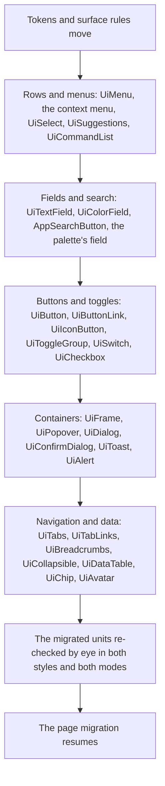

# Tonal Standard

Standard shipped as a column of values taken from Nuxt UI, Radix and Linear ([design styles](/docs/architecture/ui-library#design-styles)): a hairline around every surface, one small radius, flat fills. Seen across the migrated units it reads as a wireframe. Every frame, field, button and menu is the same outlined box, so nothing leads, and a menu's rows, each a line of text in a tinted rectangle, are the plainest thing on screen. Material 3, which Vuetify drew before, told surfaces apart by tone rather than by line, and that is what the app looked finished in.

Three drawings of the same screen were set side by side: standard as it is, Material 3 as it is specified (pill controls, large radii, rows twelve steps tall), and a tonal standard between them. The tonal one was chosen. It takes Material's way of drawing and keeps the app's density.

## What changes

The layout tier stays as it is, and every change is a style token or a surface rule. A change that needs a length is a layout change for both styles, and it is said so where it appears.

| Part            | Standard now                          | Tonal standard                                                                                                            |
| :-------------- | :------------------------------------ | :------------------------------------------------------------------------------------------------------------------------ |
| Frame           | A hairline inset in the border colour | No edge: a tone above the background, as Material's surface containers are                                                |
| Popover, dialog | A hairline and one soft shadow        | A deeper tone, a wider soft shadow and a faint ring, so it floats without a line                                          |
| Sunk (a field)  | The background inside a hairline      | A filled tone, no edge; the focus ring alone marks the focused field                                                      |
| Search          | A field like any other                | A pill: the palette button and every search field take a full radius                                                      |
| Raised (button) | A flat fill inside a hairline         | Tonal: the accent at a low mix with the accent as text; Accent stays filled and Quiet stays clear                         |
| Radius          | One small radius everywhere           | Two: a control's (a button, a field, a row) and a container's (a frame, a popover, a dialog), the container's the larger  |
| Row (`ui-item`) | Text in a tint of the text colour     | A leading icon column every row keeps even without an icon, a trailing shortcut, and the state layer tinted in the accent |
| Divider         | The border colour                     | A step fainter than the border, since it is now the only line                                                             |

The tint token already exists and is voxel's accent; standard's moves from the text colour to the accent at a lower mix. The second radius is a new style token, and voxel's is none, as its first is. A row's height is the layout's: it grows for both styles if the leading icon column needs it, and the eye check says whether voxel's rows still read.

## The component pass

Once the tokens and rules have moved, every library component is taken through the design pass (`ui-library` skill, `references/design-pass.md`) in the tonal standard and re-checked in voxel. The drawing is decided by the tokens; the pass is for what a value cannot say — a row that lacks its icon, a menu entry with no meaning, a state nobody drew. It runs by kind, so the components one reader meets together are checked together:

- **Every menu row names its meaning.** A `UiItem`, a `UiMenuItem` or a `UiCommand` with neither a meaning nor an icon is a finding of this pass, fixed by adding the meaning to `UiIconMeaning` with a class in both rows of `UiIconMap`.
- **One commit per kind**, each with the components' tests run once per style, and the kind handed over for the eye check before the next begins.
- **The page migration waits for it.** The messaging units are the largest left, so they are migrated once, into the drawing they will keep, rather than checked in one look and re-checked in the next.

## Rejected

- **Material 3 as specified.** Pill buttons, rows twelve steps tall and a radius of seven steps on containers are sized for touch-first Android, and at the app's density they halve what a room's message list or a sheet shows on one screen. The tonal standard takes Material's surfaces and state layers and leaves its sizes.
- **Keeping the hairlines and adding tone.** A line and a tone that say the same thing are two edges on one surface, which is the weight this change takes out.
- **Drawing Vuetify's components again.** The library already owns the behaviour and its tests; what the app lacked was a drawing, and a drawing is tokens and rules.

## Key files

| File                                      | Role after the change                                                          |
| :---------------------------------------- | :----------------------------------------------------------------------------- |
| `apps/web/configuration/UiStyleMap.ts`    | Standard's column in tones, and the container radius beside the control radius |
| `apps/web/app/models/ui/UiStyleToken.ts`  | The container radius token                                                     |
| `apps/web/uno.config.ts`                  | The surface, item and button rules reading the new tokens                      |
| `apps/web/app/models/ui/UiIconMeaning.ts` | The meanings the component pass finds missing                                  |
| `apps/web/app/services/ui/UiIconMap.ts`   | A class for each new meaning in both styles' rows                              |

## Sources

- [Material 3, color roles](https://m3.material.io/styles/color/roles): surface containers as the tones a surface is told apart by, rather than an outline.
- [Material 3, states](https://m3.material.io/foundations/interaction/states/overview): the state layer, a translucent overlay of one colour at a fixed opacity per state.
- [Material 3, shape](https://m3.material.io/styles/shape/corner-radius-scale): a corner scale where a container rounds more than the controls inside it.
