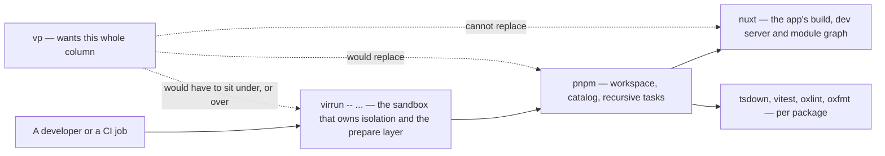

# What This Takes From Vite+

[Vite+](https://viteplus.dev) is the Vite team's unified toolchain: one entry point over Vite, Vitest, Oxlint, Oxfmt, Rolldown, tsdown and a task runner, MIT-licensed like the projects underneath it ([announcement](https://voidzero.dev/posts/announcing-vite-plus)). Its monorepo convention is the one this refactor adopts — `apps/` for applications, `packages/` for libraries — with a third root recognised for repository tooling, which it names `tools` or `generators`.

The reason to look at it is not the layout, which is a common shape. It is that this repository independently arrived at **four of the tools Vite+ bundles** — Vitest, Oxlint, Oxfmt and tsdown — plus a fifth underneath them, since the app's bundler is already Rolldown's Vite. The distance to Vite+ is therefore not a toolchain distance. It is an **entry point** distance, and that is the part that is genuinely hard here.

## What is already aligned, and costs nothing to keep

Three of Vite+'s conventions are things this repo does today for its own reasons, so alignment is free and no work is proposed against them:

- **Centralised configuration with per-package overrides by glob.** Vite+ composes one root config with lint and format overrides scoped by pattern. That is exactly the shape of the single root `.oxlintrc.json` whose `overrides` name file globs, and of the shared factories in `@esposter/configuration` that every package's config calls.
- **One package manager and one catalog.** Versions live in the workspace catalog, not in fifteen manifests.
- **Recursive tasks selected by filter.** `vp run -r --parallel --filter` is the command this repo already writes as `pnpm -r --parallel --filter`, and the [two product roots](/docs/architecture/monorepo-tooling) are what make those filters address a directory rather than a name — which is how Vite+'s examples select them too.

The layout in this proposal is the fourth. It is worth doing on its own evidence, and if the toolchain never moves, nothing has been spent on a migration that did not happen.

## The entry-point conflict

Vite+ manages the runtime, the package manager and the toolchain from one place. So does virrun, for a different reason — it isolates a command so a Windows host's artifacts cannot misfire Linux-targeted tooling ([monorepo tooling](/docs/architecture/monorepo-tooling)). Two things that both want to be the outermost command is the real integration question, and it is not answered by anything in this proposal.

The second unanswered question is Nuxt. The app is not a Vite application with extra steps; its build, its dev server, its module graph and its `nuxt prepare` output belong to Nuxt, and a toolchain whose build command targets a Vite package has to have a story for that before the app could move. The libraries are a different matter — they are already tsdown packages, which Vite+ bundles.

## What a migration would still have to answer

- **Publishing.** Releases are one local script: a check chain, then a fixed-mode conventional-commit version and publish across the public packages. Any replacement has to keep the property that a release fails on a dirty tree rather than tidying it.
- **Task caching.** Vite+ ships a cached task runner with CI integration. This repo's caching is hand-built, content-hashed and argued, and per-package caching has already been [rejected for this workspace's shape](/docs/architecture/rejected/monorepo-task-runners) — the library set builds in a fraction of the app build that gates the workflow either way. A cache arriving bundled does not by itself change that verdict; it changes who maintains it.
- **The custom lint surface.** Several oxlint rules here are local JavaScript plugins enforcing this repo's own conventions, and they must keep loading.

## The recommendation

Take the layout now, take nothing else in anticipation, and revisit the toolchain when two things are true: Vite+ has a stable release, and a Nuxt application is a first-class target for it. Neither is a reason to hold this refactor, because every part of it is justified by the repository's own filters and would be done identically if Vite+ did not exist.
