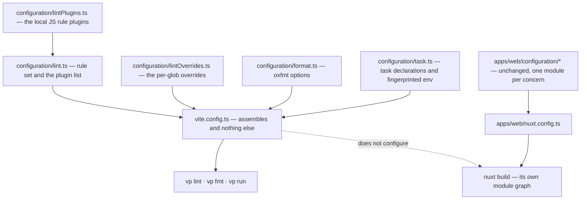

# Configuration

Vite+ reads its settings from a root `vite.config.ts`, and reads a monorepo's existence from that file too — a root config is how `vp` knows it is in a workspace at all ([monorepo guide](https://viteplus.dev/guide/monorepo)). Lint settings belong in its `lint` block and format settings in its `format` block, and the guide is explicit that `.oxlintrc.json` and `oxlint.config.ts` are not the recommended shape alongside it ([lint guide](https://viteplus.dev/guide/lint)).

Taken naively that produces one root file carrying every rule, every override glob and every task declaration for a workspace of a dozen-odd packages, which is the wrong end state and is not what this proposes.

## One file per concern, composed at the root

Vite+ supports composable configs directly: a config value can be imported as a plain object from a separate file and merged into the root's overrides, so ownership distributes while behaviour stays centralised. That is the mechanism this repository already applies twice, for its own reasons, before Vite+ existed:

- `apps/web/configuration/` decomposes the Nuxt config into one module per concern — modules, nitro, vite, content, pwa, security, typescript and the rest — and `nuxt.config.ts` is a thin assembler over them.
- `packages/configuration/src/` exposes shared factories rather than shared literals, so a package's config calls `getTsdownConfiguration` or `getVitestConfiguration` instead of copying one.

So the target shape is not a new convention, it is the existing one applied to a third config. A root `configuration/` directory holds one module per concern, and `vite.config.ts` composes them and nothing else. The rule that decides whether a concern earns a file is the same rule that governs the app's directory: a concern is a file when it is separately editable and separately reviewable, not when it is merely long.

The dotted edge is the point of the diagram. Every other config in the repo feeds one tool; this one feeds `vp` while a second, parallel config tree feeds Nuxt, and the two never merge. That is a seam to hold deliberately, not a transitional state.

## The Nuxt seam

Nuxt wraps Vite and discourages a standalone `vite.config.ts`; Vite+ requires one. Asking `nuxt.config.ts` to be the authoritative source for Vite+ has been raised upstream and closed without an implementation ([issue 912](https://github.com/voidzero-dev/vite-plus/issues/912)), and the maintainer position on the resulting warning is that it is a warning rather than a defect — a separate `vite.config.ts` works, and the real limitation is elsewhere ([Nuxt discussion](https://github.com/nuxt/nuxt/discussions/34857)).

So the arrangement is: the root `vite.config.ts` exists for `vp` and configures no bundler. The app's build, dev server, module graph and prepare output stay entirely Nuxt's, reached as a task rather than as a `vp build` target. Anyone reading the root config expecting to find how the app is built will not find it there, and the file should say so in a comment rather than leaving that inference to be made once per contributor.

This is the migration's least satisfying part and it is worth being plain about: two config trees where one would do, held apart because two upstreams disagree about who owns the Vite config. The compensating property is that the seam is _static_ — it does not need per-change attention, and it collapses on its own if the upstream issue is ever reopened and implemented.

## Lint: what moves and what cannot

The rule set, the plugin list and the per-glob `overrides` move into the `lint` block. That part is close to mechanical, because `.oxlintrc.json` already has the shape Vite+ expects — a single centralised config whose `overrides` name file globs is the arrangement the monorepo guide describes, arrived at here independently.

Two things need care:

- **The local JS rule plugins must keep loading.** Several rules enforcing this repository's own conventions are JavaScript plugins declared in `jsPlugins`, and they are not optional — they are the enforcement half of conventions the skills only describe. Oxlint's JS plugin support is what Vite+ exposes, so this is a relocation rather than a rewrite, but it is the first thing to verify and the phase fails without it.
- **ESLint does not leave.** Oxlint parses a `.vue` file's script block and not its template, and templates are where a large share of this repo's rules apply. `vp lint` therefore replaces the oxlint invocation and not the ESLint one, and the two continue to run side by side exactly as they do today. Which rules eventually cross over is governed by the [ESLint to oxlint migration](/docs/proposals/refactors/eslint-to-oxlint-migration) and is not accelerated by this proposal — Vite+ changes who invokes the linter, not what it can parse.

## Format

`oxfmt` is already the formatter and `format`/`format:check` are already the thinnest scripts in the repo. The block gains the options and the per-package overrides; the behaviour does not change.

One property must survive the move. The format check is the workflow's quickest job specifically because it does not depend on the package build and installs only the root project — a formatter reading source files cannot observe a dependency graph, so it waits for nothing. Routing it through `vp` must not reintroduce that wait, which means the format task declares no dependency on any build task. A task runner's default is to respect the graph, so this is an explicit declaration rather than an omission.

## Node runtime and package manager

`vp env` manages the Node runtime and `vp install`/`vp pm` front the detected package manager. Both are genuine consolidations here, because both jobs currently exist as bespoke scripts — the runtime version is pinned twice in the root manifest on purpose, and one script is the only thing permitted to write either pin, install the version and make it the default. What `vp env` subsumes and what has to stay is settled in [commands](/docs/proposals/refactors/vite-plus/commands).

The catalog does not move. Versions live in the workspace catalog and `vp` drives pnpm rather than replacing it, so the single source of truth for a dependency version is untouched — which also means the [dependency update process](/docs/architecture/monorepo-tooling) survives the migration unedited.

## IDE integration

Vite+ ships an editor story worth taking as part of the same change rather than later, because it is the half of the migration a developer actually feels: a VS Code extension pack wiring Oxc as the default formatter with format-on-save and fix-on-save, `npm.scriptRunner` set so the editor's script panel routes through the cached task runner, and equivalent setups for Zed and JetBrains ([IDE integration](https://viteplus.dev/guide/ide-integration)).

The repository-level part of that is committed editor settings, which is a change with a real cost: an editor config in the repo overrides a contributor's own. It is worth it for the formatter and the fix-on-save actions, because those two decide whether a commit arrives already passing the checks or fails them, and it should stop there — nothing about themes, nothing about keybindings.
