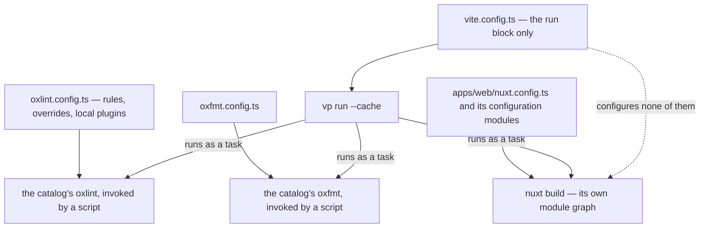

# Configuration

Vite+ reads its settings from a root `vite.config.ts`, and reads a monorepo's existence from that file too — a root config is how `vp` knows it is in a workspace at all ([monorepo guide](https://viteplus.dev/guide/monorepo)). The guides then invite moving every tool's settings into blocks of that file: `lint`, `fmt`, `test`, `pack` and `run`. Under this proposal's decision only one of those blocks is taken.

## The root config holds tasks and nothing else

The root `vite.config.ts` carries the `run` block: one task per cached script, each running the script by name. Tasks rather than script caching, because every script measured so far rewrites a file it also read — a build's previous `dist` and generated barrels, `tsconfig.tsbuildinfo`, Nuxt's build directory and caches, and pnpm's own run-state file — and `vp` refuses to cache a task that modified its inputs. A task's `cache.input` keeps automatic tracking and subtracts exactly those files, while its `cache.output` keeps them so a hit restores them; a script can carry no such setting, and a task may not share a script's name, so each task is the script's name under a `cached:` prefix ([run config](https://viteplus.dev/config/run)).

The subtraction is a list, but a different list from the one the CI key keeps. The key subtracts files a build might not read, and is wrong when it guesses; a task subtracts files the build demonstrably rewrote, named by `vp` itself when it refuses, and a missing entry fails as a refusal to cache rather than as a stale hit.

That makes the file small, and small is the reason it stays one file. The repository decomposes a config into one module per concern when the concerns are separately editable and separately reviewable — `apps/web/configuration/` for Nuxt, the shared factories in `packages/configuration/src/` for every package — and a single block of cache switches is one concern. A `configuration/` directory beside it would be the structure without the reason.

```mermaid
flowchart TD
  root["vite.config.ts — the run block only"] --> vp["vp run --cache"]
  oxlintConfig["oxlint.config.ts — rules, overrides, local plugins"] --> oxlint["the catalog's oxlint, invoked by a script"]
  oxfmtConfig["oxfmt.config.ts"] --> oxfmt["the catalog's oxfmt, invoked by a script"]
  nuxtRoot["apps/web/nuxt.config.ts and its configuration modules"] --> nuxtBuild["nuxt build — its own module graph"]
  vp -->|"runs as a task"| oxlint
  vp -->|"runs as a task"| oxfmt
  vp -->|"runs as a task"| nuxtBuild
  root -.->|"configures none of them"| nuxtBuild
```

The dotted edge is the point of the diagram. `vp` reaches every tool only as a task, so no tool's behaviour is configured by the file `vp` reads.

## One copy of every tool

`vite-plus` is a root dev dependency, and it would bring its own copy of everything it bundles: it depends on exact versions of Oxlint, Oxfmt, the Oxlint plugin API, tsgolint and Vitest with its subpackages, each behind what the catalog runs, and aliases `vite` to its own core build. Left alone that is a second copy of every tool in the lockfile, every bump waiting on a Vite+ release, and the local rule plugins split across two plugin APIs.

The root `overrides` remove all of it. Each tool `vite-plus` depends on is overridden to `catalog:`, and its `vite` alias takes the workspace's global `vite` override like every other dependent, so the lockfile resolves exactly one version of each and `vp` runs on plain Vite. The catalog stays the one statement of every version, and Renovate keeps bumping them.

The cost is running the `vp` CLI ahead of the tool versions it was released against. Every override is a semver-compatible move within the same major, and `vp` loading this config on plain Vite is checked rather than assumed — a Vite+ release that starts depending on its core build's internals fails the cached tasks loudly, and the fix is narrowing the `vite` override to exclude `vite-plus`.

## Why lint and format keep their own files, for now

The lint guide is explicit that standalone `oxlint.config.ts` files are not the recommended shape with Vite+ ([lint guide](https://viteplus.dev/guide/lint)). That advice is about `vp lint`, and it does not apply here, because `vp lint` is not used.

That also fires the trigger `vp lint` and `vp fmt` were parked behind — the built-in commands now run the installed tools — so whether to move the lint and format settings into this file is reopened in [phases](/docs/proposals/refactors/vite-plus/phases) rather than settled here. Until then the standalone files stay: the `lint` block would hold exactly what `oxlint.config.ts` holds, so the move changes who reads the settings and nothing they do.

ESLint is untouched either way. Oxlint parses a `.vue` file's script block and not its template, and templates are where a large share of this repo's rules apply; which rules cross over is governed by the [ESLint to oxlint migration](/docs/architecture/lint-toolchain), and Vite+ changes neither what the linter can parse nor who owns that migration.

## The Nuxt seam

Nuxt wraps Vite and discourages a standalone `vite.config.ts`; Vite+ requires one. Asking `nuxt.config.ts` to stand in for it was closed upstream without an implementation ([issue 912](https://github.com/voidzero-dev/vite-plus/issues/912)), and a broader request for a Nuxt and Astro integration — a module exposing Vite+ config from the framework's own config, and `vp dev`/`vp build` calling the framework's commands — is open, with a Nuxt maintainer exploring a generated `vite.config.ts` from the Nuxt side ([issue 1506](https://github.com/voidzero-dev/vite-plus/issues/1506)). So far it has produced only a hint pointing `vp dev` users at the package script.

The warning that discussion is about does not reach this layout. Nuxt's external-config check looks for a `vite.config` file by resolving from the app's own root directory, and the config `vp` needs sits at the workspace root, above it; the app's directory gets no `vite.config.ts` of its own, because the app's build is declared as a task in the root file rather than there. The two config trees still exist — one for `vp`, one for Nuxt — but they do not overlap, and nothing is warned about.

That arrangement is static: it needs no per-change attention, and it collapses on its own if the integration request ships. The root file should still say in a comment that it configures no bundler, because anyone opening it expecting to find how the app is built will not find it there.

## Node runtime and package manager

`vp env` manages Node and the package manager together, so it subsumes the provisioning half of `update:node` and nothing else — the pins it writes and why they cannot move are in [commands](/docs/proposals/refactors/vite-plus/commands). The catalog does not move: versions live in the workspace catalog and `vp` drives pnpm rather than replacing it, so the [dependency update process](/docs/architecture/monorepo-tooling) survives unedited — which is the same property the lint decision above protects.

## Key files

| File                                  | Role after the change                                                                     |
| ------------------------------------- | ----------------------------------------------------------------------------------------- |
| `vite.config.ts`                      | the `run` block — one `cached:` task per cached script, with its rewritten files excluded |
| `pnpm-workspace.yaml`                 | the `vite-plus` catalog entry and the overrides that leave one copy of each tool          |
| `oxlint.config.ts`                    | unchanged — the catalog's Oxlint keeps reading it, run as a task                          |
| `oxfmt.config.ts`                     | unchanged, for the same reason                                                            |
| `apps/web/nuxt.config.ts`             | the Nuxt seam, which keeps owning the app build                                           |
| `packages/configuration/src/index.ts` | the shared config factories, untouched — `vp` configures none of these tools              |

## Sources

- [Vite+ — monorepo guide](https://viteplus.dev/guide/monorepo), [lint guide](https://viteplus.dev/guide/lint) and [run config](https://viteplus.dev/config/run) — the root config, the advice against standalone lint files, and the 1.0 cache settings.
- [Vite+ issue 912](https://github.com/voidzero-dev/vite-plus/issues/912), [issue 1506](https://github.com/voidzero-dev/vite-plus/issues/1506) and the [Nuxt discussion](https://github.com/nuxt/nuxt/discussions/34857) — what Vite+ cannot yet own for a Nuxt app, and the integration still open.
