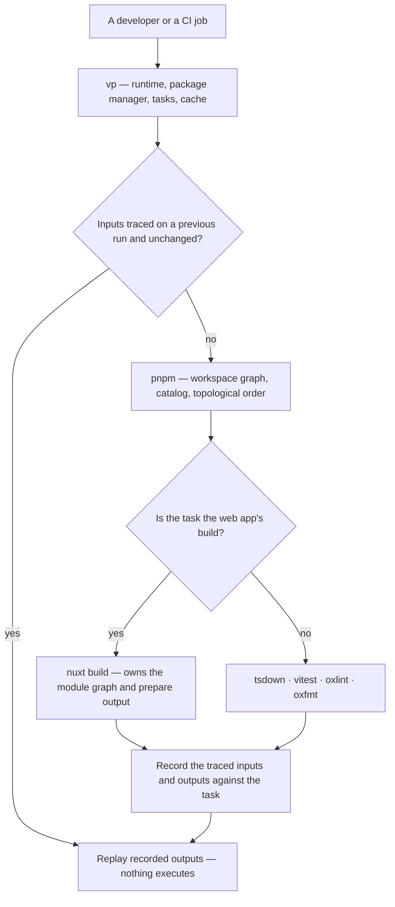

# Vite+ Migration

[Vite+](https://viteplus.dev) is the Vite team's unified toolchain: one `vp` entry point over Vite, Vitest, Oxlint, Oxfmt, Rolldown, tsdown and a cached task runner, MIT-licensed like the projects underneath it ([announcement](https://voidzero.dev/posts/announcing-vite-plus), [beta](https://voidzero.dev/posts/announcing-vite-plus-beta)).

This repository already runs Vitest, Oxlint, Oxfmt and tsdown, and the app's bundler is already Rolldown's Vite. So the distance to Vite+ is not a toolchain distance — every tool it bundles is either installed here or is the thing installed here. The distance is an **entry point** distance, and three commands currently claim that position: `pnpm` orchestrates the workspace, `virrun` wraps anything that must run isolated, and `nuxt` owns the app's build and module graph.

The earlier reading of this was that the entry-point conflict had no answer and the toolchain should not move until it did. That reading was made before the beta, and one fact has since changed the arithmetic: `vp run --cache` **infers its own inputs** by observing what a command reads — file reads, missing-file probes, directory listings, written outputs ([cache guide](https://viteplus.dev/guide/cache)). This repository's caching does the opposite. It hashes every tracked file under a root and then subtracts by hand, which is a policy `get-build-cache-keys` states outright:

> Everything under a hashed root is an input until proven otherwise, and only three things are subtracted

Each of those three subtractions is a heuristic that was discovered by paying a wrong rebuild, and each is a place the key can drift from reality in the direction that serves a stale `dist`. A traced input set deletes the whole category: a file no build opened is provably not an input, and there is no list to maintain.

## The decision

**Adopt `vp` as the outer command for everything except the app build, and let the cache it brings retire both of the content-hash caches this repo maintains.** The migration is not a toolchain swap — the tools stay. It is a consolidation of three entry points into one, and a deletion pass over the machinery that existed only because no entry point owned caching.

Three things do not move, and each is a bounded exception rather than an unresolved question:

- **The app build stays Nuxt's.** `nuxt build` is not `vite build` with extra steps.
- **ESLint stays for Vue templates.** Oxlint parses a `.vue` file's script and not its template ([Nuxt discussion](https://github.com/nuxt/nuxt/discussions/34857)), which is most of this repo's component surface.
- **virrun's local speed has no replacement.** Its task cache is subsumed and its prepare layer turns out to be a cost it imposes on itself, so what removal actually trades away is the warm-snapshot loop and nothing else. See [virrun retirement](/docs/proposals/refactors/vite-plus/virrun-retirement).

## Where the entry point lands

The gate is the whole proposal. Today that diamond does not exist in CI: the decision is made ahead of the run by a `git ls-tree` hash that cannot see what a command will actually open, and made again, differently, by virrun's own task cache. Moving the gate behind the command is what lets both of those disappear.

`vp` does not replace `pnpm` — it drives it. The workspace, the catalog and the topological build order stay exactly where they are declared, which is why the [two product roots](/docs/architecture/monorepo-tooling) and every filter that addresses them survive the migration unedited: `vp run -r --parallel --filter ./packages/*` is the command this repo already writes with a different first word ([monorepo guide](https://viteplus.dev/guide/monorepo)).

## What the migration is made of

| Page                                                                       | Decides                                                                        |
| :------------------------------------------------------------------------- | :----------------------------------------------------------------------------- |
| [Task runner](/docs/proposals/refactors/vite-plus/task-runner)             | `vp run --cache` replacing the two content-hash caches, and the CI job shape   |
| [Configuration](/docs/proposals/refactors/vite-plus/configuration)         | the modular config layout, the lint and format blocks, the Nuxt config seam    |
| [virrun retirement](/docs/proposals/refactors/vite-plus/virrun-retirement) | virrun's three separable jobs, which one blocks removal, and what gets deleted |
| [Commands](/docs/proposals/refactors/vite-plus/commands)                   | every root script before and after, and which ones stop existing               |
| [Docs cleanup](/docs/proposals/refactors/vite-plus/docs-cleanup)           | the pages this supersedes, and the tombstones to invert rather than delete     |

## Order, and why it is this order

Each phase is independently shippable and independently revertible, and none of them is a prerequisite for a phase above it being useful.

1. **Task caching in CI.** Highest value, smallest surface, and it is the phase that proves or kills the rest — if traced inputs do not reproduce a correct key under this repo's builds, nothing below is worth attempting. Measurable against the existing key: the gap between vp's inferred input set and what `get-build-cache-keys` hashes is the finding.
2. **Configuration.** Lint and format move into the Vite+ config, decomposed per concern rather than as one root file. Nothing about the checks changes; only who reads their settings.
3. **The command surface.** Root scripts become `vp` tasks. This is where the script count falls.
4. **virrun retirement.** Last, not because anything gates it — nothing does — but because phases 1–3 remove its remaining jobs one at a time, and a removal argued after them is a removal of something already unused rather than a substitution to be got right.
5. **Docs and skills.** In the same change as each phase, never after it.

## What this is expected to delete

Stated as an expectation rather than a count, because the point of the phase order is that each phase's deletion is only earned once the phase before it has landed:

- One of the two content-hash caches outright, and the composite action that computes the other's key.
- The subtract-list heuristics in that key — the test-source, bench-artifact and markdown exclusions each stop being expressible, because nothing enumerates inputs any more.
- The `virrun --` prefix from every root script, and — once the speed trade is accepted — a published workspace package, its differential correctness harness, its bench artifacts and its docs area.
- The root scripts that exist only to compose other root scripts, and the runtime-pinning script that `vp env` subsumes.

## What it does not buy

Two things worth stating before anyone plans around them:

- **No remote cache.** It is on the roadmap and not in the beta, so CI still wraps a local cache directory in `actions/cache` ([CI guide](https://viteplus.dev/guide/ci)). The plumbing stays ours; only the key improves.
- **No early cutoff.** Nothing documented hashes a task's _output_ to stop an invalidation wave when a rebuild produces identical bytes. That remains the one genuinely unowned idea here, and it is the one that would help most on a commit touching a leaf everything depends on — so it is recorded as its own item in [task runner](/docs/proposals/refactors/vite-plus/task-runner) rather than assumed away.
