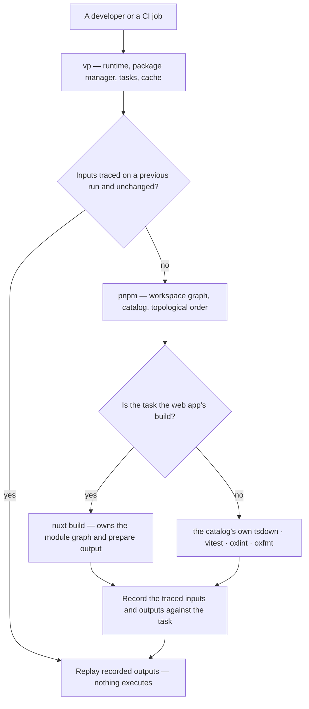

# Vite+ Migration

[Vite+](https://viteplus.dev) is the Vite team's unified toolchain: one `vp` entry point over Vite, Vitest, Oxlint, Oxfmt, Rolldown, tsdown, a runtime and package-manager manager, and a cached task runner, MIT-licensed like the projects underneath it ([1.0 announcement](https://voidzero.dev/posts/announcing-vite-plus-1-0)). It is stable since 1.0, and stable has a precise meaning there: semver covers the `vp` CLI and the config schema — command names, flags, config keys and generated file locations hold for the whole 1.x line — and explicitly does **not** cover the bundled tools, which keep their own version numbers ([Q3 plan](https://github.com/voidzero-dev/vite-plus/issues/2405)).

This repository already runs Vitest, Oxlint, Oxfmt and tsdown, and the app's bundler is already Rolldown's Vite. So the distance to Vite+ is not a toolchain distance. It is an **entry point** distance, and three commands currently claim that position: `pnpm` orchestrates the workspace, `virrun` wraps anything that must run isolated, and `nuxt` owns the app's build and module graph.

What makes the move worth weighing at all is the cache. `vp run --cache` **infers its own inputs** by observing what a command reads — file reads, missing-file probes, directory listings, written outputs ([cache guide](https://viteplus.dev/guide/cache)). This repository's caching does the opposite. It hashes every tracked file under a root and then subtracts by hand, which is a policy `get-build-cache-keys` states outright:

> Everything under a hashed root is an input until proven otherwise, and only three things are subtracted

Each of those subtractions was discovered by paying a wrong rebuild, and each is a place the key can drift toward serving a stale `dist`. A traced input set deletes the whole category — a file no build opened is not an input, and there is no list to maintain. That is the proposal's premise, not an established fact, and the tracer's own issue tracker is the reason it stays a premise: it still has open reports of reads it misses and replays as a stale hit ([Phase 0](/docs/proposals/refactors/vite-plus/phases) lists them). A traced key that misses an input serves a stale build with more confidence than the conservative key it replaced, so nothing below the Phase 0 gate is reachable until the measurement clears it.

## The decision

**Adopt `vp` for the two jobs it does that nothing here does well — a traced task cache and runtime provisioning — and nothing else.** Every tool keeps running from the binary the workspace catalog installs, invoked by the existing scripts. The migration is a consolidation of entry points and a deletion pass over the caching machinery, not a toolchain swap.

The narrower scope than "all of Vite+" has two independent causes:

- **The app is a Nuxt app, not a Vite one.** Vite+'s `dev`, `build` and `migrate` are built for a project that calls Vite directly; the full support matrix is in [Nuxt compatibility](/docs/proposals/refactors/vite-plus/nuxt-compatibility). The app build stays `nuxt build`, reached as a task — a seam, not a pending item.
- **The built-in tool commands carry their own tool versions.** The `vite-plus` package pins exact versions of Oxlint, Oxfmt and Vitest — at 1.0, each behind what this repository's catalog already runs — and ships its own build of Vite beside the one Nuxt uses. `vp lint`, `vp fmt`, `vp check` and `vp test` would therefore move version ownership from Renovate and the catalog to Vite+'s release cadence — a downgrade on every bump in exchange for a shorter command. Invoking the installed tools as tasks keeps the cache's value and costs none of that.

## Recommendation at 1.0

Each rung of the [adoption ladder](/docs/proposals/refactors/vite-plus/nuxt-compatibility) gets a verdict on its own, because the value and the risk sit on different rungs.

| Rung                                           | Verdict                                     | Why                                                                                                                                                                                                                                      |
| :--------------------------------------------- | :------------------------------------------ | :--------------------------------------------------------------------------------------------------------------------------------------------------------------------------------------------------------------------------------------- |
| Phase 0 — measure the traced inputs            | **Do now**                                  | a throwaway CI job with nothing committed; the only result that can cancel or unblock the rest                                                                                                                                           |
| Runtime and package manager (`vp env`)         | **Available now, optional**                 | independent of the cache; deletes the fnm and Corepack workarounds in the local install scripts, while CI already provisions both through one action and gains nothing                                                                   |
| Task caching in CI                             | **Wait for Phase 0**                        | the whole value of the migration, and the one claim nobody has verified for this tree                                                                                                                                                    |
| Task caching in the local loop                 | **Wait for virrun**                         | a cached task cannot spawn children under bubblewrap, and a Windows tracer cannot see into WSL, so local caching only exists for commands that run natively ([virrun retirement](/docs/proposals/refactors/vite-plus/virrun-retirement)) |
| `vp lint`, `vp fmt`, `vp check`, `vp test`     | **Don't**                                   | bundled, exactly-pinned tool versions behind the catalog's; `vp check`'s type-check cannot read `.vue` files and `vp test` has two blockers of its own                                                                                   |
| `vp dev`, `vp build`, `vp migrate` for the app | **Never, while Nuxt owns the module graph** | the app is not a Vite application                                                                                                                                                                                                        |

So the honest short answer at 1.0 is: the stable release removes the config-churn risk from everything this proposal would write, and changes nothing about the Nuxt gap or the tracing question. Run the measurement; take `vp env` if the local install scripts are worth deleting; leave everything else where it is until Phase 0 reports.

## Where the entry point lands

```mermaid
flowchart TD
  dev["A developer or a CI job"] --> vp["vp — runtime, package manager, tasks, cache"]
  vp --> cached{"Inputs traced on a previous run and unchanged?"}
  cached -->|yes| replay["Replay recorded outputs — nothing executes"]
  cached -->|no| pm["pnpm — workspace graph, catalog, topological order"]
  pm --> app{"Is the task the web app's build?"}
  app -->|yes| nuxt["nuxt build — owns the module graph and prepare output"]
  app -->|no| tools["the catalog's own tsdown · vitest · oxlint · oxfmt"]
  nuxt --> record["Record the traced inputs and outputs against the task"]
  tools --> record
  record --> replay
```

The gate is the whole proposal. Today that diamond does not exist in CI: the decision is made ahead of the run by a `git ls-tree` hash that cannot see what a command will actually open, and made again, differently, by virrun's own task cache. Moving the gate behind the command is what lets both of those disappear.

`vp` does not replace `pnpm` — it drives it. The workspace, the catalog and the topological build order stay exactly where they are declared, which is why the [two product roots](/docs/architecture/monorepo-tooling) and every filter that addresses them survive the migration unedited: `vp run -r --filter "./packages/*" build` is the command this repo already writes with a different first word ([run guide](https://viteplus.dev/guide/run)).

## What the migration is made of

| Page                                                                         | Decides                                                                                    |
| :--------------------------------------------------------------------------- | :----------------------------------------------------------------------------------------- |
| [Nuxt compatibility](/docs/proposals/refactors/vite-plus/nuxt-compatibility) | what Vite+ supports here, why `vp migrate` is unusable, and the adoption ladder            |
| [Phases](/docs/proposals/refactors/vite-plus/phases)                         | each phase's blocker, exit condition and kill condition, the upstream issues Phase 0 reads |
| [Task runner](/docs/proposals/refactors/vite-plus/task-runner)               | `vp run --cache` replacing the two content-hash caches, and the CI job shape               |
| [Configuration](/docs/proposals/refactors/vite-plus/configuration)           | the one root config `vp` needs, why lint and format stay in their own files, the Nuxt seam |
| [virrun retirement](/docs/proposals/refactors/vite-plus/virrun-retirement)   | virrun's three separable jobs, and why the local cache waits on removing it                |
| [Commands](/docs/proposals/refactors/vite-plus/commands)                     | every root script before and after, and which ones stop existing                           |
| [Docs cleanup](/docs/proposals/refactors/vite-plus/docs-cleanup)             | the pages this supersedes, and the tombstones to invert rather than delete                 |

## What this is expected to delete

Stated as an expectation rather than a count, because each phase's deletion is only earned once the phase before it has landed:

- One of the two content-hash caches outright, and the composite action that computes the other's key.
- The subtract-list heuristics in that key — the test-source, bench-artifact and markdown exclusions each stop being expressible, because nothing enumerates inputs any more.
- The fnm and Corepack provisioning in `update:node`'s install scripts, if `vp env` is taken; the pin-writing half stays.
- The `virrun --` prefix from every root script, and — once the speed trade is accepted — a published workspace package, its differential correctness harness, its bench artifacts and its docs area.

## What it does not buy

- **No remote cache in 1.0.** `vite-task` has since merged one — an endpoint named by `cache: { remote: { url } }` or `VP_REMOTE_CACHE_URL`, read by default, written with `--remote-cache=read-write`, uploads authenticated by a GitHub Actions OIDC token ([changelog](https://github.com/voidzero-dev/vite-task/blob/main/CHANGELOG.md)) — but the `vite-task` revision `vite-plus` 1.0.0 pins predates it, and upstream publishes the server's API contract rather than a server, so the endpoint would be ours to host. Until a release carries the client, CI wraps a local cache directory in `actions/cache` ([CI guide](https://viteplus.dev/guide/ci)), and the plumbing stays ours; only the key improves.
- **No early cutoff.** Nothing documented hashes a task's _output_ to stop an invalidation wave when a rebuild produces identical bytes. That remains the one genuinely unowned idea here, recorded as its own item in [task runner](/docs/proposals/refactors/vite-plus/task-runner) rather than assumed away.
- **No shorter script surface by itself.** The lint, test and typecheck script families encode arguments, but pnpm forwards arguments too, so collapsing them is not something `vp` unlocks ([commands](/docs/proposals/refactors/vite-plus/commands)).

## Sources

- [Announcing Vite+ 1.0](https://voidzero.dev/posts/announcing-vite-plus-1-0) — what 1.0 bundles, and remote caching listed as future work.
- [vite-task changelog](https://github.com/voidzero-dev/vite-task/blob/main/CHANGELOG.md) and [remote cache server API](https://github.com/voidzero-dev/vite-task/pull/713) — the remote cache client merged after 1.0's pin, and the contract a self-hosted endpoint implements.
- [Vite+ Q3 plan](https://github.com/voidzero-dev/vite-plus/issues/2405) — what the 1.0 semver promise covers, and that bundled tools keep their own versions.
- [Vite+ cache guide](https://viteplus.dev/guide/cache) and [run guide](https://viteplus.dev/guide/run) — inputs inferred from what a command reads, and the pnpm-compatible filters.
