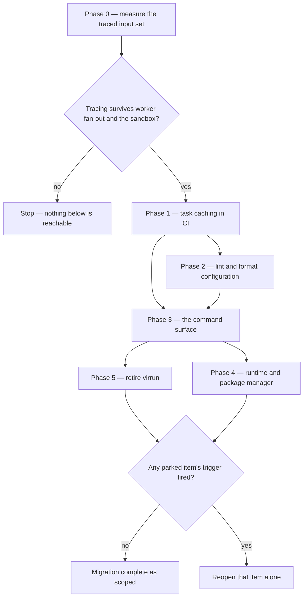

# Phases

Every phase here is independently shippable and independently revertible, and each one states the condition that ends it. That last part is the point of the page: a migration without exit conditions is a migration that is never finished, only abandoned quietly somewhere in the middle, and the half-migrated state is worse than either end — two ways to run every check, and no way to tell which one a contributor used.

Phase 0 is a measurement rather than a change, and it is the only phase whose result can cancel the rest.

The gate at the top is the one that matters. Everything below it rests on a single unverified claim — that Vite+ can infer this repository's build inputs correctly — and that claim is cheap to test and expensive to assume.

## Phase 0 — measure

**Does:** runs `build:packages` under `vp run --cache`, dumps the input set it inferred, computes what `get-build-cache-keys` hashes for the same tree, and diffs them. The method and how to read each direction of the diff are in [task runner](/docs/proposals/refactors/vite-plus/task-runner).

**Blocked by:** nothing.

**Ends when:** both directions of the diff are explained. Files hashed today but not traced are the over-invalidation being bought out. Files traced but not hashed are the interesting direction — each is either a tracing artifact or a real input the current key is missing, and the second reading means the existing cache can already serve a stale build.

**Killed by:** either failure mode reproducing. Tracing that does not follow child processes gives a confidently wrong key, which is worse than today's conservative one; tracing through the bubblewrap overlay recording sandbox paths rather than host paths gives a key that never hits. tsdown and Nuxt both fan out to workers, so the first is not a remote possibility.

## Phase 1 — task caching in CI

**Does:** wraps the cached task runner around the existing build scripts and deletes the hand-rolled key. Tasks invoke the current scripts verbatim; no import is rewritten and no config is merged.

**Blocked by:** phase 0 clearing.

**Ends when:** `get-build-cache-keys` and its subtract-list are gone, the app-build marker's key comes from the same mechanism, and two properties still hold — a cache hit needs no install, and the skip gate reads the output on disk rather than the cache action's hit flag. Both are argued at length in the existing workflow and both are easy to lose in a rewrite.

**Killed by:** a hit rate below what the content hash achieves today. The whole case is that a traced key invalidates less; a key that invalidates more is a straight regression, whoever maintains it.

## Phase 2 — lint and format configuration

**Does:** relocates the oxlint and oxfmt settings into the Vite+ config, decomposed one module per concern with the root config as a thin assembler ([configuration](/docs/proposals/refactors/vite-plus/configuration)).

**Blocked by:** the local JavaScript rule plugins loading. They enforce this repository's own conventions and are the enforcement half of rules the skills only describe, so this is verified before the phase starts rather than discovered during it.

**Ends when:** the standalone oxlint config file is deleted, the per-glob overrides read from their new home, and a lint run reports the identical finding set — same rules, same files, same counts. Identical output is the acceptance test; anything else is a rule that stopped running.

**Killed by:** the plugins not loading, or the format check acquiring a dependency on a build task. The second is subtle and worth guarding explicitly: the format check is the quickest job in CI precisely because it waits for nothing, and a task runner's default is to respect the graph.

## Phase 3 — the command surface

**Does:** collapses the script families whose variants encode an argument — lint crossed with two filters and a fix flag, test and typecheck crossed with project selectors — into single tasks taking those as arguments ([commands](/docs/proposals/refactors/vite-plus/commands)).

**Blocked by:** phases 1 and 2. The tasks have to exist and the configs have to be read from their new home before the names that invoke them change, or the rename lands on top of a moving target.

**Ends when:** the collapsed families are gone from the root manifest **and** every place that names a command in prose has been swept — the agent guide's finishing ritual, the package-scripts skill, the context-efficiency skill's batching rule. A stale path fails a test here; a stale command name fails nothing, which is exactly why it belongs in the exit condition rather than in a cleanup pass.

**Killed by:** nothing external. If it stalls it stalls half-done, which is the state this page exists to prevent — so it ships as one chunk per family rather than as one change.

## Phase 4 — runtime and package manager

**Does:** moves runtime provisioning to `vp env` and the install surface to `vp install`.

**Blocked by:** the double-pin question. The root manifest pins the runtime twice on purpose — one field the CI setup action reads, one every other tool reads — plus a matching catalog entry, and one script is the only thing permitted to write all three. `vp env` owns the runtime half and knows nothing about the other two.

**Ends when:** there is exactly one writer for all three values. Either the existing script survives in reduced form, writing the pins and delegating the install, or the second pin is proven redundant — which is a separate investigation with its own answer.

**Killed by:** nothing, but it is the phase most likely to be judged not worth doing. Assuming `vp env` covers the pins is how one of them goes stale in silence, and the symptom is CI provisioning the wrong runtime.

## Phase 5 — retire virrun

**Does:** removes the package, the prefix on every root script, and the two coverage-job constraints that exist only for its sandbox ([virrun retirement](/docs/proposals/refactors/vite-plus/virrun-retirement)).

**Blocked by:** nothing technical. Its task cache is subsumed by phase 1 and its prepare layer is a cost the sandbox imposes on itself, so the only open question is whether the warm-snapshot loop's local speed is worth the maintenance surface that keeps it correct. That is a judgement call, available at any time.

**Ends when:** the package and its documentation area are gone, `pnpm build` is back to one selector, the coverage job has dropped its sandbox install and its image pin, and the published-package decision has been taken explicitly rather than by omission.

**Killed by:** deciding the speed is worth keeping — in which case phases 1 through 4 still stand, and virrun keeps exactly one job.

## Parked, with the trigger each waits on

None of these is scheduled, and none blocks anything above. They are recorded so that a trigger firing is recognised as a trigger rather than rediscovered as an idea.

| Item                          | Reopens when                                                                                                 |
| :---------------------------- | :----------------------------------------------------------------------------------------------------------- |
| `vp test` as the runner       | the Nuxt Vitest environment registers under it **and** the shard, blob and merge flags forward cleanly       |
| `vp build` for the app        | Nuxt stops owning the module graph, or the upstream request to read `nuxt.config.ts` is implemented          |
| Remote caching                | Vite+ ships it — it is on the roadmap and absent from the beta                                               |
| Early cutoff on the app build | independent of this migration in both directions; it becomes a roadmap item on its own or it does not happen |
| Retiring ESLint               | oxlint parses `.vue` templates. Governed by its own migration, and not accelerated by this one               |

The two test triggers are stated as a conjunction deliberately. Either one alone is not enough, and the second is the dangerous one: a wrapper that drops the shard flags does not fail, it quietly stops producing one coverage report, and the aggregate gate that means "every shard passed" has already gone green here while a shard did not.
