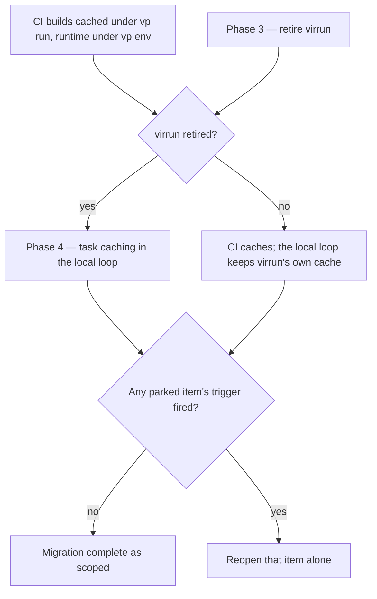

# Phases

Every phase here is independently shippable and independently revertible, and each one states the condition that ends it. That last part is the point of the page: a migration without exit conditions is a migration that is never finished, only abandoned quietly somewhere in the middle, and the half-migrated state is worse than either end — two ways to run every check, and no way to tell which one a contributor used.

Phases 0, 1 and 2 have shipped: the measurement cleared, both CI builds run under `vp run` with the hand-kept key deleted, and `update:node` hands its install to `vp env` — the mechanism, and what the measurement found, are in [monorepo tooling](/docs/architecture/monorepo-tooling) under `## CI job shape`. What is left is the local loop, whose caching waits on virrun.

```mermaid
flowchart TD
  start["CI builds cached under vp run, runtime under vp env"] --> local{"virrun retired?"}
  retire["Phase 3 — retire virrun"] --> local
  local -->|yes| loop["Phase 4 — task caching in the local loop"]
  local -->|no| ciOnly["CI caches; the local loop keeps virrun's own cache"]
  loop --> parked{"Any parked item's trigger fired?"}
  ciOnly --> parked
  parked -->|no| done["Migration complete as scoped"]
  parked -->|yes| reopen["Reopen that item alone"]
```

## Upstream issues the remaining phases read

The tracer is `fspy`, inside the `vite-task` crate set. Its open reports, and what each still means here:

| Issue                                                                   | What it means for this repository                                                                                                                                                                                                                                    |
| :---------------------------------------------------------------------- | :------------------------------------------------------------------------------------------------------------------------------------------------------------------------------------------------------------------------------------------------------------------- |
| [vite-task 777](https://github.com/voidzero-dev/vite-task/issues/777)   | on Linux, reads a dynamically linked program issues without going through libc are not seen and the task replays stale output; the in-process native compiler `typecheck:root` runs was probed and traced, so a new tool of that class is probed before it is cached |
| [vite-task 700](https://github.com/voidzero-dev/vite-task/issues/700)   | a cache-enabled task cannot spawn any child inside a rootless bubblewrap sandbox — the reason Phase 4 waits on virrun                                                                                                                                                |
| [vite-task 548](https://github.com/voidzero-dev/vite-task/issues/548)   | on Windows, a task can complete and still be refused a cache entry — a refusal rather than a stale hit, so it costs speed, never correctness                                                                                                                         |
| [vite-task 504](https://github.com/voidzero-dev/vite-task/issues/504)   | a negative `input` pattern is ignored for files discovered by listing a directory, so a hand-written exclusion cannot be trusted to subtract                                                                                                                         |
| [vite-plus 1610](https://github.com/voidzero-dev/vite-plus/issues/1610) | `vp run --filter` reports a cycle where pnpm tolerates one between siblings linked by a dev or peer dependency; whether this workspace has such a pair is answered by running the filter                                                                             |

## Phase 3 — retire virrun

**Does:** removes the package, the prefix on every root script, and the two coverage-job constraints that exist only for its sandbox ([virrun retirement](/docs/proposals/refactors/vite-plus/virrun-retirement)).

**Blocked by:** nothing technical. The only open question is that page's single judgement call — whether the warm-snapshot speed is worth its maintenance surface — and it can be taken at any time.

**Ends when:** the package and its documentation area are gone, the coverage job has dropped its sandbox install and its image pin, and the published-package decision has been taken explicitly rather than by omission.

**Killed by:** deciding the speed is worth keeping — in which case Phases 1 and 2 still stand, and the local loop keeps virrun's own task cache.

## Phase 4 — task caching in the local loop

**Does:** the same cached tasks CI runs, run locally. Without virrun the checks run natively, so the tracer sees them.

**Blocked by:** Phases 1 and 3. Under virrun a cached task either runs inside bubblewrap, where it cannot spawn children at all, or wraps a Windows-side command whose real work happens inside WSL, where a Windows tracer cannot follow — so there is no arrangement in which the tracer and the sandbox compose.

**Ends when:** a second local run of an unchanged check replays, and an edit to a file it read misses.

**Killed by:** the Windows tracer refusing entries often enough that the local hit rate is negligible — a speed loss, not a correctness one, and the trigger to move the loop onto Linux.

## Parked, with the trigger each waits on

None of these is scheduled, and none blocks anything above. They are recorded so that a trigger firing is recognised as a trigger rather than rediscovered as an idea.

| Item                            | Reopens when                                                                                                                                                                                                                         |
| :------------------------------ | :----------------------------------------------------------------------------------------------------------------------------------------------------------------------------------------------------------------------------------- |
| `vp lint`, `vp fmt`, `vp check` | **fired** — the overrides make the built-in commands run the catalog's Oxlint and Oxfmt ([configuration](/docs/proposals/refactors/vite-plus/configuration)); what is left to decide is whether the settings move into the root file |
| `vp test` as the runner         | the Nuxt Vitest environment registers under it, the shard, blob and merge flags forward cleanly, **and** it runs the project's own Vitest                                                                                            |
| `vp build` for the app          | Nuxt stops owning the module graph, or the [Nuxt integration request](https://github.com/voidzero-dev/vite-plus/issues/1506) ships                                                                                                   |
| Remote caching                  | a `vite-plus` release pins a `vite-task` carrying the client, merged upstream after 1.0 — and upstream merges its server API specification, still a draft, for an endpoint of ours to implement, since upstream does not host one    |
| Retiring ESLint                 | Oxlint parses `.vue` templates. Governed by its own migration, and not accelerated by this one                                                                                                                                       |

The test triggers are stated as a conjunction deliberately. Any one alone is not enough, and the second is the dangerous one: a wrapper that drops the shard flags does not fail, it quietly stops producing one coverage report, and the aggregate gate — every shard passed — has already gone green here over the report that was never written.

## Key files

| File               | Role after the change |
| ------------------ | --------------------- |
| `virrun.config.ts` | Phase 3's retirement  |

## Sources

- [Vite+ — CI guide](https://viteplus.dev/guide/ci) and [cache guide](https://viteplus.dev/guide/cache) — the cached task runner CI runs under.
- [vite-task 777](https://github.com/voidzero-dev/vite-task/issues/777), [700](https://github.com/voidzero-dev/vite-task/issues/700), [548](https://github.com/voidzero-dev/vite-task/issues/548) and [504](https://github.com/voidzero-dev/vite-task/issues/504) — the tracer's open gaps Phase 0 probes for.
- [vite-plus 1610](https://github.com/voidzero-dev/vite-plus/issues/1610) — the filter's cycle handling against pnpm's.
- [Vite+ releases](https://github.com/voidzero-dev/vite-plus/releases) — `vp env` taking over the package manager from Corepack, which `update:node` now delegates to.
