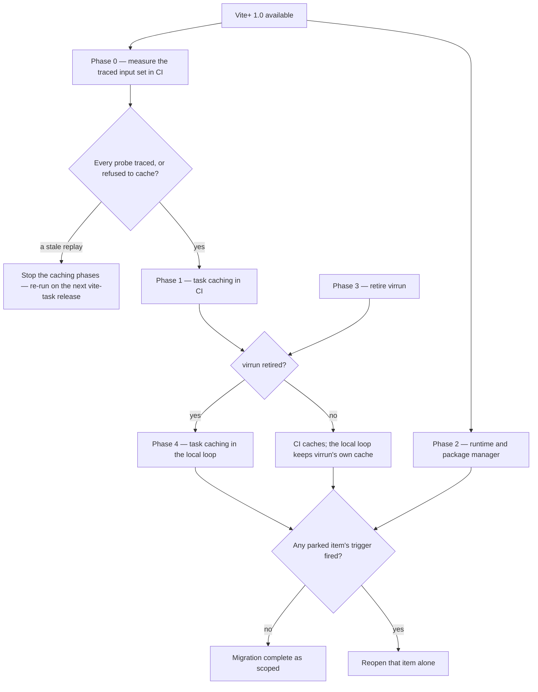

# Phases

Every phase here is independently shippable and independently revertible, and each one states the condition that ends it. That last part is the point of the page: a migration without exit conditions is a migration that is never finished, only abandoned quietly somewhere in the middle, and the half-migrated state is worse than either end — two ways to run every check, and no way to tell which one a contributor used.

Phase 0 is a measurement rather than a change, and it is the only phase whose result can cancel the caching phases. The runtime phase does not sit behind it: it never touches the cache, so it can land before, after or without the rest.

```mermaid
flowchart TD
  start["Vite+ 1.0 available"] --> probe["Phase 0 — measure the traced input set in CI"]
  start --> rt["Phase 2 — runtime and package manager"]
  probe --> ok{"Every probe traced, or refused to cache?"}
  ok -->|"a stale replay"| stop["Stop the caching phases — re-run on the next vite-task release"]
  ok -->|yes| ci["Phase 1 — task caching in CI"]
  ci --> local{"virrun retired?"}
  retire["Phase 3 — retire virrun"] --> local
  local -->|yes| loop["Phase 4 — task caching in the local loop"]
  local -->|no| ciOnly["CI caches; the local loop keeps virrun's own cache"]
  loop --> parked{"Any parked item's trigger fired?"}
  ciOnly --> parked
  rt --> parked
  parked -->|no| done["Migration complete as scoped"]
  parked -->|yes| reopen["Reopen that item alone"]
```

The gate at the top is the one that matters. Everything on the caching side rests on a single unverified claim — that Vite+ can infer this repository's build inputs correctly — and that claim is cheap to test and expensive to assume.

## Phase 0 — measure

**Does:** in a throwaway CI job, with `vp` installed for that job only and nothing committed, runs `build:packages` under `vp run --cache`, dumps the input set it inferred, computes what `get-build-cache-keys` hashes for the same tree, and diffs them. Then it runs the probes below. The diff method and how to read each direction are in [task runner](/docs/proposals/refactors/vite-plus/task-runner).

**Blocked by:** nothing. It runs on a Linux runner, where virrun already resolves its native passthrough backend, so the sandbox is not in the picture.

**The probes.** Each one edits a single file a cached task read, re-runs the task, and must see a cache miss — or a refusal to cache, which is equally safe. A replay is the failure.

- **A worker fan-out** — a source file of a package whose tsdown build spreads across workers, and a file the app build only reads from a Nuxt worker.
- **Go code** — the native TypeScript compiler behind `typecheck:root`, which runs in-process inside Node through a dynamically linked addon, and the `tsgolint` binary behind type-aware Oxlint, which is statically linked. Go issues its reads as raw syscalls rather than through libc, and the tracer's Linux preload path only sees libc calls, while a fully static binary is traced through seccomp instead — so the in-process compiler sits in the class the tracer currently misses, and `tsgolint` is the control.
- **A missing-file probe** — a config file a build looks for and does not find, then created.

**Read first.** The tracer is `fspy`, inside the `vite-task` crate set, and at 1.0 its tracker carries the open reports this phase exists to rule out for this tree:

| Issue                                                                   | What it means for this repository                                                                                                                                                                                                          |
| :---------------------------------------------------------------------- | :----------------------------------------------------------------------------------------------------------------------------------------------------------------------------------------------------------------------------------------- |
| [vite-task 777](https://github.com/voidzero-dev/vite-task/issues/777)   | on Linux, reads a dynamically linked program issues without going through libc are not seen and the task replays stale output; a maintainer confirmed the cause and is designing a new Linux backend — the in-process compiler probe above |
| [vite-task 700](https://github.com/voidzero-dev/vite-task/issues/700)   | a cache-enabled task cannot spawn any child inside a rootless bubblewrap sandbox — the reason Phase 4 waits on virrun                                                                                                                      |
| [vite-task 548](https://github.com/voidzero-dev/vite-task/issues/548)   | on Windows, a task can complete and still be refused a cache entry — a refusal rather than a stale hit, so it costs speed, never correctness                                                                                               |
| [vite-task 504](https://github.com/voidzero-dev/vite-task/issues/504)   | a negative `input` pattern is ignored for files discovered by listing a directory, so a hand-written exclusion cannot be trusted to subtract                                                                                               |
| [vite-plus 1610](https://github.com/voidzero-dev/vite-plus/issues/1610) | `vp run --filter` reports a cycle where pnpm tolerates one between siblings linked by a dev or peer dependency; whether this workspace has such a pair is answered by running the filter                                                   |

**Ends when:** both directions of the diff are explained and every probe either misses or refuses to cache — none replays stale output. Files hashed today but not traced are the over-invalidation being bought out. Files traced but not hashed are the interesting direction — each is either a tracing artifact or a real input the current key is missing, and the second reading means the existing cache can already serve a stale build, which is a defect to fix on its own timeline.

**Killed by:** any probe replaying. That stops the caching phases for this release only — the trigger to re-run is the next `vite-task` release that closes the Linux backend issue, since the measurement costs one CI job and the cause is upstream.

## Phase 1 — task caching in CI

**Does:** wraps the cached task runner around the existing build scripts and deletes the hand-rolled key. Tasks invoke the current scripts verbatim; no import is rewritten and no tool changes version.

**Blocked by:** Phase 0 clearing.

**Ends when:** `get-build-cache-keys` and its subtract-list are gone, the app-build marker's key comes from the same mechanism, and two properties still hold — a cache hit needs no install, and the skip gate reads the output on disk rather than the cache action's hit flag. Both are argued at length in the existing workflow and both are easy to lose in a rewrite.

**Killed by:** a hit rate below what the content hash achieves today. The whole case is that a traced key invalidates less; a key that invalidates more is a straight regression, whoever maintains it.

## Phase 2 — runtime and package manager

**Does:** hands local Node and pnpm provisioning to `vp env`, which since the 0.3 line manages both together and replaces Corepack with its own shims ([releases](https://github.com/voidzero-dev/vite-plus/releases)). That is exactly the job the install half of `update:node` does today through fnm, with workarounds for Corepack no longer shipping with Node.

**Blocked by:** nothing in this migration. It is a change to every developer machine rather than to the repository's behaviour, which is the reason to take it deliberately rather than as a side effect.

**Ends when:** the install scripts are gone and `update:node` keeps only its writer half — the two runtime pins and the matching catalog entry, which [commands](/docs/proposals/refactors/vite-plus/commands) explains `vp env` does not know about — and delegates the install.

**Killed by:** nothing, and it may simply be judged not worth doing. CI gains nothing from it: the setup action already reads the package manager from `packageManager` and the runtime from the pin in one step.

## Phase 3 — retire virrun

**Does:** removes the package, the prefix on every root script, and the two coverage-job constraints that exist only for its sandbox ([virrun retirement](/docs/proposals/refactors/vite-plus/virrun-retirement)).

**Blocked by:** nothing technical. The only open question is that page's single judgement call — whether the warm-snapshot speed is worth its maintenance surface — and it can be taken at any time.

**Ends when:** the package and its documentation area are gone, the coverage job has dropped its sandbox install and its image pin, and the published-package decision has been taken explicitly rather than by omission.

**Killed by:** deciding the speed is worth keeping — in which case Phases 1 and 2 still stand, and the local loop keeps virrun's own task cache.

## Phase 4 — task caching in the local loop

**Does:** the same cached tasks as Phase 1, run locally. Without virrun the checks run natively, so the tracer sees them.

**Blocked by:** Phases 1 and 3. Under virrun a cached task either runs inside bubblewrap, where it cannot spawn children at all, or wraps a Windows-side command whose real work happens inside WSL, where a Windows tracer cannot follow — so there is no arrangement in which the tracer and the sandbox compose.

**Ends when:** a second local run of an unchanged check replays, and an edit to a file it read misses.

**Killed by:** the Windows tracer refusing entries often enough that the local hit rate is negligible — a speed loss, not a correctness one, and the trigger to move the loop onto Linux.

## Parked, with the trigger each waits on

None of these is scheduled, and none blocks anything above. They are recorded so that a trigger firing is recognised as a trigger rather than rediscovered as an idea.

| Item                            | Reopens when                                                                                                                                                                        |
| :------------------------------ | :---------------------------------------------------------------------------------------------------------------------------------------------------------------------------------- |
| `vp lint`, `vp fmt`, `vp check` | the built-in commands run the project's own installed Oxlint and Oxfmt rather than the copies `vite-plus` pins ([configuration](/docs/proposals/refactors/vite-plus/configuration)) |
| `vp test` as the runner         | the Nuxt Vitest environment registers under it, the shard, blob and merge flags forward cleanly, **and** it runs the project's own Vitest                                           |
| `vp build` for the app          | Nuxt stops owning the module graph, or the [Nuxt integration request](https://github.com/voidzero-dev/vite-plus/issues/1506) ships                                                  |
| Remote caching                  | Vite+ ships it — listed as planned after 1.0                                                                                                                                        |
| Early cutoff on the app build   | independent of this migration in both directions ([task runner](/docs/proposals/refactors/vite-plus/task-runner))                                                                   |
| Retiring ESLint                 | Oxlint parses `.vue` templates. Governed by its own migration, and not accelerated by this one                                                                                      |

The test triggers are stated as a conjunction deliberately. Any one alone is not enough, and the second is the dangerous one: a wrapper that drops the shard flags does not fail, it quietly stops producing one coverage report, and the aggregate gate — every shard passed — has already gone green here over the report that was never written.

## Key files

| File                                               | Role after the change                                           |
| -------------------------------------------------- | --------------------------------------------------------------- |
| `.github/workflows/CI.yaml`                        | Phase 0's throwaway job, then Phase 1's task caching            |
| `.github/actions/get-build-cache-keys/action.yaml` | the hand-kept key Phase 1 retires once the traced key is proven |
| `scripts/src/updateNode/install.sh`                | the provisioning half Phase 2 hands to `vp env`                 |
| `scripts/src/updateNode/install.ps1`               | its Windows twin, retired with it                               |
| `virrun.config.ts`                                 | Phase 3's retirement                                            |

## Sources

- [Vite+ — CI guide](https://viteplus.dev/guide/ci) and [cache guide](https://viteplus.dev/guide/cache) — the cached task runner Phase 1 puts in CI.
- [vite-task 777](https://github.com/voidzero-dev/vite-task/issues/777), [700](https://github.com/voidzero-dev/vite-task/issues/700), [548](https://github.com/voidzero-dev/vite-task/issues/548) and [504](https://github.com/voidzero-dev/vite-task/issues/504) — the tracer's open gaps Phase 0 probes for.
- [vite-plus 1610](https://github.com/voidzero-dev/vite-plus/issues/1610) — the filter's cycle handling against pnpm's.
- [Vite+ releases](https://github.com/voidzero-dev/vite-plus/releases) — `vp env` taking over the package manager from Corepack.
