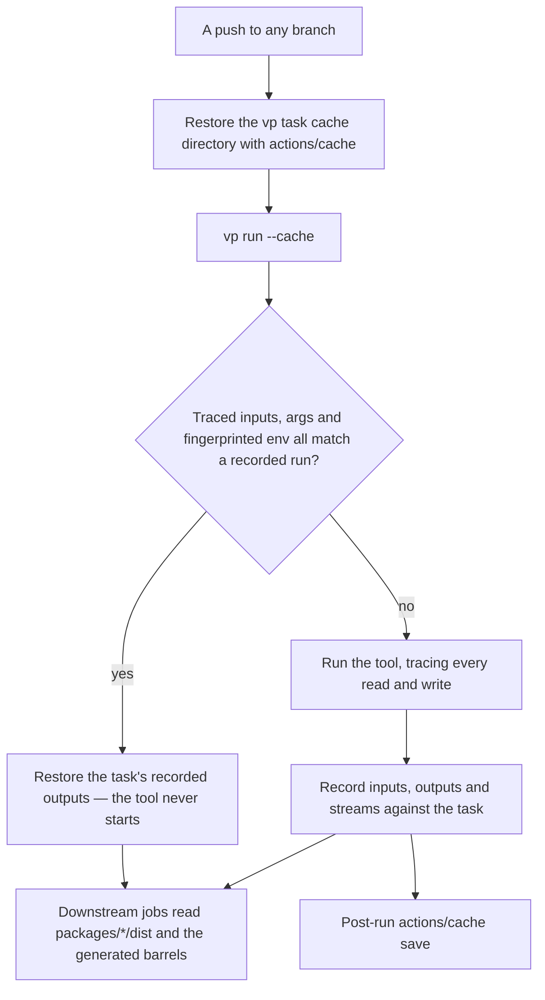

# Task Runner

Three caches currently decide whether work is skipped in this repository, and they disagree about what an input is.

- **`package-builds`** — a `git ls-tree` content hash over every tracked file under `packages/` less the three subtractions below, plus the root manifest, the lockfile and the catalog, computed by the `get-build-cache-keys` composite action and read by five workflows. The virrun config is deliberately not an input: neither build runs under the sandbox.
- **`app-build`** — the same walk plus `apps/web`, keying a marker file that records only that this exact tree built green.
- **virrun's task cache** — the content-keyed replay of a recorded run, on locally and off in CI where a fresh commit defeats its key ([virrun task cache](/docs/virrun/task-cache)).

Three caches that disagree about staleness fail the way [monorepo task runners](/docs/architecture/rejected/monorepo-task-runners) describes. That was already the strongest argument against adding a fourth, and it is now the argument for the swap — `vp run --cache` does not add one, it **subsumes two**.

## Why a traced key is different in kind

The two hand-rolled keys are computed _before_ the command runs, from a walk over the filesystem. Nothing in that walk can know what the command will open, so the only safe policy is to over-approximate and then carve exceptions out by hand. `get-build-cache-keys` says so directly, and lists the three:

- test, type-test and bench sources, which no entrypoint reaches
- committed bench artifacts, because a bench run rewrites them and a full app rebuild for a number no build reads is not a trade
- markdown outside the app's content directory, because exactly one thing here reads markdown and it is the content collection

Every one of those is correct, was arrived at by paying a wrong rebuild, and is unverifiable. Nothing fails when a fourth case appears; the symptom is a build everyone assumed was cached.

Vite+ computes validity from three things instead: the arguments, an explicitly fingerprinted set of environment variables, and **the input files the command read while it ran** — tracked automatically, along with missing-file probes and directory listings, with a task's `cache.input` and `cache.output` available only where tracing proves insufficient ([cache guide](https://viteplus.dev/guide/cache), [run config](https://viteplus.dev/config/run)). The tracer, `fspy`, follows the processes a task spawns rather than only the task itself — through a preloaded library on Unix, syscall interception on Linux and API hooking on Windows — which is what makes a worker-spawning build traceable at all ([vite-task](https://github.com/voidzero-dev/vite-task)). A missing-file probe being an input is the detail that shows the tracing is real rather than a glob in disguise: a build that resolved a config by trying six paths is invalidated when the fourth one starts existing.

Applied here, the three subtractions stop being expressible, because there is no set to subtract from. A bench artifact is not an input because no build opens it — provably, not by policy. That matters doubly because the escape hatch is weaker than it looks: a negative `input` pattern is currently ignored for files the command discovered by listing a directory ([vite-task 504](https://github.com/voidzero-dev/vite-task/issues/504)), so porting the subtract-list into hand-written exclusions would not even subtract.

## The CI job shape after

```mermaid
flowchart TD
  push["A push to any branch"] --> restore["Restore the vp task cache directory with actions/cache"]
  restore --> run["vp run --cache <task>"]
  run --> probe{"Traced inputs, args and fingerprinted env all match a recorded run?"}
  probe -->|yes| replay["Restore the task's recorded outputs — the tool never starts"]
  probe -->|no| exec["Run the tool, tracing every read and write"]
  exec --> record["Record inputs, outputs and streams against the task"]
  replay --> consume["Downstream jobs read packages/*/dist and the generated barrels"]
  record --> consume
  record --> save["Post-run actions/cache save"]
```

Two properties of the current shape survive unchanged and must be preserved deliberately, because they are the parts that were argued into place rather than defaulted:

- **A hit needs no install.** The existing key is computed from tracked files, so a `package-builds` hit skips both the install and the artifact download. A traced key is stored in a cache directory, so this still holds — but only if the cache restore precedes the install, which is the opposite of the order a naive `vp` setup produces.
- **A hit is verified against the disk, not against the cache action's `cache-hit` flag.** `verify-package-builds` exists because a restore whose `path` list has drifted reports success and extracts nothing, and a build skipped on that flag reports green having built nothing. Whatever replaces it, the gate stays "is the output actually on disk", never "did the cache say yes".

The `build-packages` reusable workflow's concurrency group also survives on its own reasoning: two workflows triggering on the same push would otherwise each restore before the other saved, and pay the build twice concurrently for a shared-cache benefit that only ever materialises for a later push.

## What `vp run` does not change

The workspace graph. `vp run` is monorepo-aware and dependency-scheduling, but the topological order it walks is the one pnpm resolves from the manifests, so every rule in [recursive script orchestration](/docs/architecture/monorepo-tooling) still holds — including the one that matters most, that `--parallel` is never used for `build` because it discards the order and a package would compile against a sibling's `dist` mid-write.

The test run is also not a fan-out and does not become one. `test` and `coverage` go through a single root Vitest `projects` config so the suite shares one run, one coverage report and one `--shard` axis. `vp test` would also swap the suite onto the Vitest that `vite-plus` bundles at a pinned version, and whether it forwards `--shard`, `--reporter=blob` and `--merge-reports` cleanly is unanswered ([Nuxt compatibility](/docs/proposals/refactors/vite-plus/nuxt-compatibility)). So the suite keeps invoking the catalog's Vitest directly, and only its _wrapper_ becomes a `vp` task.

## The measurement that decides phase one

This does not get adopted on the strength of the argument. The first change is a spike scoped to `build:packages` alone, and its output is a comparison:

1. Run the package build under `vp run --cache` and dump the input set it inferred.
2. Compute what `get-build-cache-keys` currently hashes for the same tree.
3. Diff them.

Files in the second set and not the first are the over-invalidation the migration is buying out — every one of them is a commit that pays a rebuild today for a file no build opens. Files in the first set and not the second are far more interesting, because each one is either a tracing artifact or a **genuine input the hand-rolled key is missing** — which would mean the current cache can already serve a stale build, and that is a defect to fix on its own timeline rather than a migration talking point.

The probes that run beside the diff — a worker fan-out, a Go binary, a missing-file probe — and the upstream issues behind each are in [phases](/docs/proposals/refactors/vite-plus/phases). One question is answered upstream rather than by the spike: a cache-enabled task cannot spawn any child inside a rootless bubblewrap sandbox ([vite-task 700](https://github.com/voidzero-dev/vite-task/issues/700)), so tracing and virrun's sandbox do not compose at all. CI is unaffected, because virrun resolves its native passthrough backend on Linux; the local loop waits on [virrun retirement](/docs/proposals/refactors/vite-plus/virrun-retirement).

## Early cutoff stays unowned

Neither the current caches nor Vite+ hash a task's _output_ to decide whether an invalidation wave continues. Today a comment edit in the configuration package — a leaf everything depends on — moves both keys and pays the app build, which is the longest job in the workflow. With output hashing, that package rebuilds, emits identical bytes, and the wave stops.

Keying the app build on the packages' built `dist` rather than on their source is the shape of it, and it is a real trade rather than a free win: the app build job would have to obtain the built packages before it could compute its own key, which is exactly the install-and-download that a marker hit currently skips. Seconds of artifact download on every run against minutes of app build skipped more often.

It is recorded here and not scheduled. It is independent of the migration in both directions — it can be built on the existing key, and adopting Vite+ neither delivers nor blocks it — so it becomes a roadmap item on its own or it does not happen.

## Key files

| File                                                 | Role after the change                       |
| ---------------------------------------------------- | ------------------------------------------- |
| `.github/actions/get-build-cache-keys/action.yaml`   | the whole-tree key the traced one replaces  |
| `.github/actions/restore-package-builds/action.yaml` | the package-build cache it restores through |
| `.github/workflows/CI.yaml`                          | the job shape after                         |

## Sources

- [Vite+ — cache guide](https://viteplus.dev/guide/cache) and [run config](https://viteplus.dev/config/run) — inputs inferred from what a command reads, the traced key this page weighs against the hand-kept one, and the 1.0 `cache` settings.
- [vite-task 504](https://github.com/voidzero-dev/vite-task/issues/504) and [700](https://github.com/voidzero-dev/vite-task/issues/700) — negative input patterns and the bubblewrap sandbox, the two limits this page plans around.
