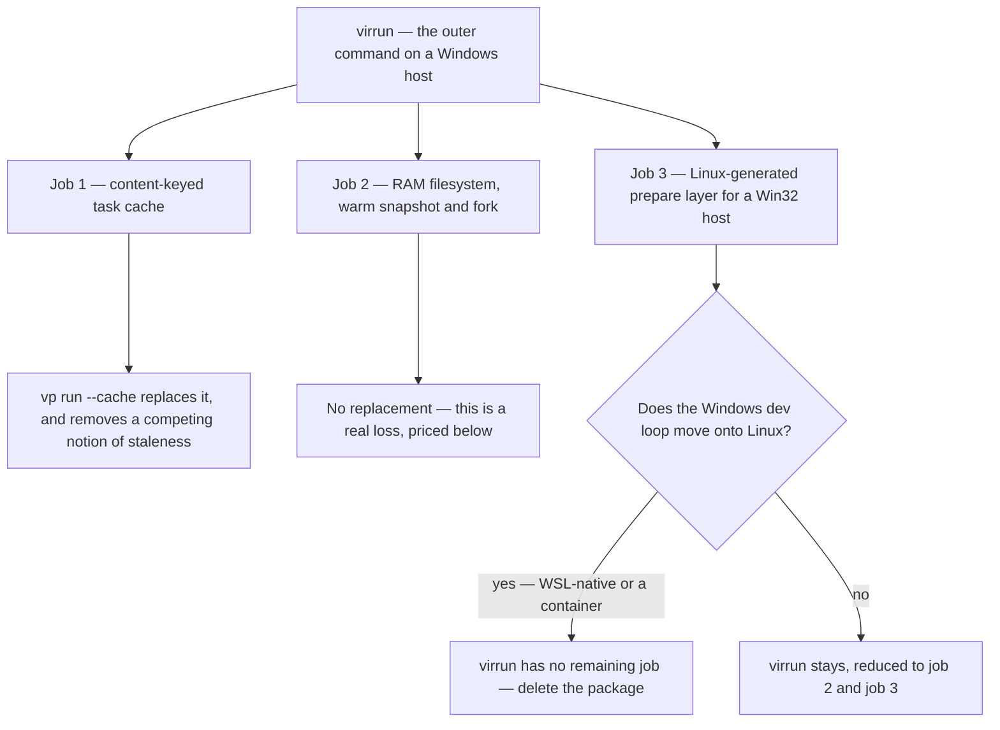

# virrun Retirement

"Migrate off virrun" reads as one decision and is three, because virrun does three separable jobs and only one of them is a caching job. Vite+ replaces that one. The other two are answered — or not — by a decision about the development environment that has nothing to do with which toolchain runs on top of it.

Worth establishing first, because it changes the stakes: **virrun already does nothing in CI.** The committed config branches on the platform, resolving the `os` backend on win32 and the native passthrough backend everywhere else, so on a Linux runner `virrun -- <cmd>` is a prefix that execs the command. Every `virrun --` in a workflow today is a no-op wrapper. Removing virrun therefore buys CI nothing directly, and the case for removal is entirely about the development loop and the maintenance surface.

## The three jobs

The diamond is the whole decision. Jobs 1 and 2 are optimisations and could be traded away on their own merits; job 3 is a correctness property, and nothing in Vite+ provides it.

### Job 1 — the task cache

Content-keyed on environment key, working tree and command, replaying a recorded diff and the captured streams on a hit; default-on locally and off in CI ([virrun task cache](/docs/virrun/task-cache)). This is the Turborepo idea, and the [prior art page](/docs/virrun/prior-art) records it as exactly that.

`vp run --cache` replaces it and improves on it in the same way it improves on the CI key — the inputs are traced from what the command read rather than derived from a whole-tree hash, so a command that opened three files is not invalidated by a fourth changing. Retiring this job is the migration's cleanest deletion, because it removes one of three competing answers to "is this stale", and three caches that disagree fail toward serving output one of them would have rebuilt.

### Job 2 — speed

Dependencies fetched once into a shared store, `node_modules` and build output living in a RAM filesystem, a warm snapshot forked per run so install is skipped entirely. Vite+ has no equivalent and does not attempt one.

This is a genuine loss and should be recorded as one rather than argued away. What makes it acceptable is that it is a **local-loop** loss on one platform, measured against a maintenance surface that is not local: a published package, a differential correctness harness that hard-fails CI on any divergence from native execution, committed bench artifacts under a speed gate, and a documentation area larger than most product areas here. The speed is real; so is the cost of keeping the thing that produces it correct.

### Job 3 — platform correctness, and the only real blocker

A Win32-generated `.nuxt` misfires Linux-targeted type-aware tooling, so sandboxed commands on a Windows host need a Linux-generated prepare layer, and virrun's source-keyed prepare overlay is what produces it. This is not a speed feature. It is the reason the sandbox is not optional on that host, and it is why the config selects the `os` backend there and nothing else.

Vite+ does not solve this and is not the kind of tool that would. `vp env` manages a Node runtime; it does not give a Windows host a Linux filesystem or a Linux process. **So virrun cannot be deleted by adopting Vite+ — it can only be deleted by moving the Windows development loop onto Linux.**

## The decision that actually gates deletion

Three options, and this is a question about how the repository is developed rather than a technical unknown to research:

1. **Develop inside WSL.** The repository already maintains an ext4 source mirror inside WSL and keeps it fresh with a host-side manifest diff, precisely so that Windows-side source reads stop crossing the 9p filesystem ([WSL source mirror](/docs/virrun/wsl-source-mirror)). Working _in_ WSL rather than mirroring _into_ it deletes the mirror, the delta sync, the probe caches and the platform branch in one move, and the prepare layer stops being a problem because the tooling is already running on Linux.
2. **A container.** Same effect, more ceremony, and it reintroduces a filesystem boundary between the editor and the source that the mirror exists to work around.
3. **Re-test the premise.** The `.nuxt` misfire was observed against a particular combination of Nuxt and type-aware tooling. If it no longer reproduces, job 3 evaporates and the sandbox is optional on every platform. This is cheap to check and should be checked before either of the above is planned, because a negative result makes the decision for free.

Option 1 is the recommendation, with option 3 run first as a probe. Neither is part of the Vite+ migration, and both should be settled before its final phase is scheduled.

## What deletion removes, if the decision lands

Beyond the package itself and its documentation area, three things elsewhere in the repository exist only because virrun does:

- **The prefix.** Every root script carrying `virrun --` loses it, which is most of the check and build surface. Detailed in [commands](/docs/proposals/refactors/vite-plus/commands).
- **The second selector in `pnpm build`.** That script derives two filters, and the second exists solely because the toolchain is a build input rather than a dependency: virrun's committed CLI entry imports a `dist` only its own build writes, so a deploy building from source rather than from CI's artifact reached the app build with no `virrun` to run it with. Remove virrun and the app build is one selector again.
- **Two constraints on the coverage job.** It installs a bubblewrap sandbox and pins an Ubuntu image newer than the default, both because the suite exercises virrun's `os` backend and the older image's sandbox version would silently self-gate the differential tests out of existence. Neither constraint has any other cause.

## The published-package question

virrun is published unscoped, so it is not merely repository code — deleting the directory does not delete the package from the registry, and the repository is not the only consumer a published name implies.

That is a decision to take explicitly rather than as a side effect of a toolchain migration, and there are two defensible ends: move it out to its own repository and let it live as an independent project, or stop publishing it and leave the existing versions in place. Nothing here recommends one, because the input is what the package is _for_ going forward, and that is not a question this proposal is entitled to answer. What it does assert is that "we stopped using it internally" is not by itself a reason to make either choice quietly.
