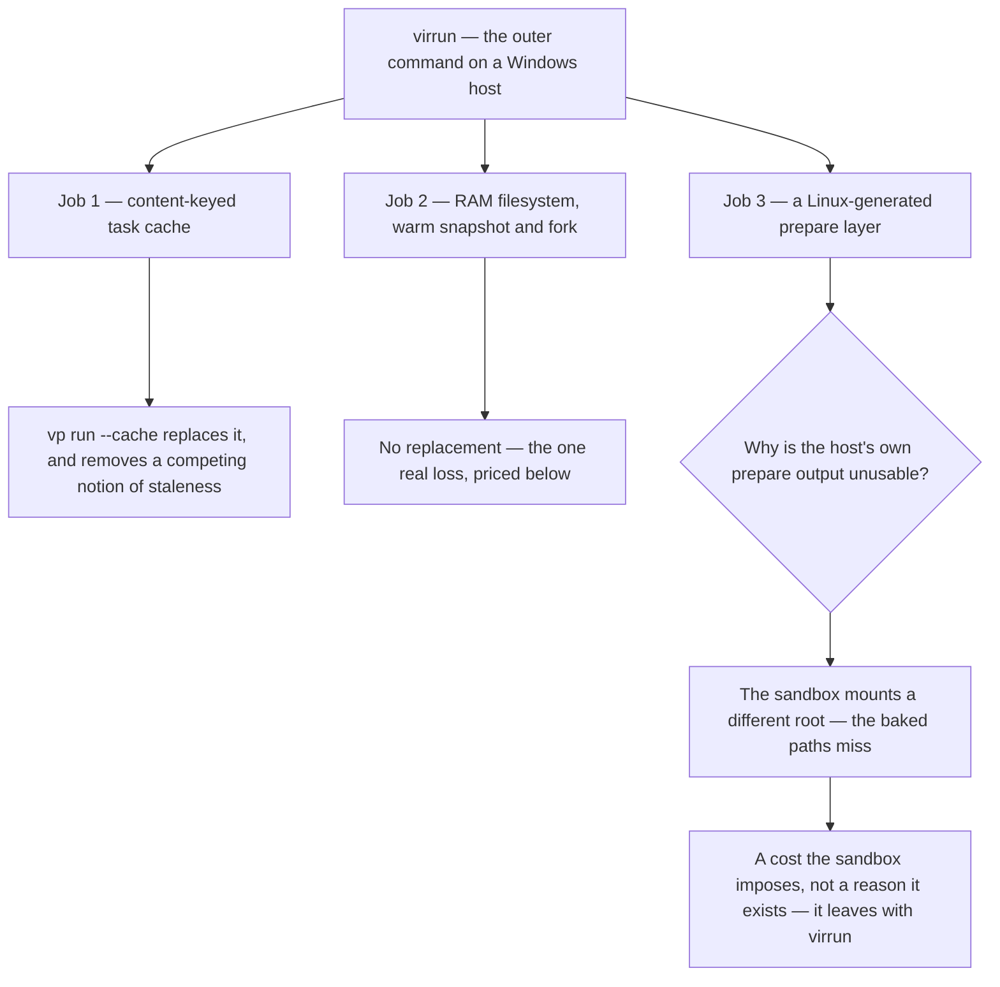

# virrun Retirement

"Migrate off virrun" reads as one decision and is three, because virrun does three separable jobs. Vite+ replaces one of them. The second is a speed feature with no replacement. The third looks like a correctness requirement that would block removal, and does not survive being checked.

Worth establishing first, because it changes the stakes: **virrun already does nothing in CI.** The committed config branches on the platform, resolving the `os` backend on win32 and the native passthrough backend everywhere else, so on a Linux runner `virrun -- <cmd>` is a prefix that execs the command. Every `virrun --` in a workflow today is a no-op wrapper. Removing virrun therefore buys CI nothing directly, and the case for removal is entirely about the development loop and the maintenance surface.

## The three jobs

The diagram used to put a gate at job 3, on a decision about which operating system the development loop runs on. That gate was wrong, and the section below is why.

### Job 1 — the task cache

Content-keyed on environment key, working tree and command, replaying a recorded diff and the captured streams on a hit; default-on locally and off in CI ([virrun task cache](/docs/virrun/task-cache)). This is the Turborepo idea, and the [prior art page](/docs/virrun/prior-art) records it as exactly that.

`vp run --cache` replaces it and improves on it in the same way it improves on the CI key — the inputs are traced from what the command read rather than derived from a whole-tree hash, so a command that opened three files is not invalidated by a fourth changing. Retiring this job is the migration's cleanest deletion, because it removes one of three competing answers to "is this stale", and three caches that disagree fail toward serving output one of them would have rebuilt.

### Job 2 — speed

Dependencies fetched once into a shared store, `node_modules` and build output living in a RAM filesystem, a warm snapshot forked per run so install is skipped entirely. Vite+ has no equivalent and does not attempt one.

This is the one genuine loss, and it should be recorded as one rather than argued away. What makes it a defensible trade is that it is a **local-loop** gain on one platform, bought with a maintenance surface that is not local: a published package, a differential correctness harness that hard-fails CI on any divergence from native execution, committed bench artifacts under a speed gate, and a documentation area larger than most product areas here.

It is also the job that a change of development platform addresses directly, since most of what the RAM filesystem is buying back is the cost of `node_modules` on NTFS. That makes moving the loop onto Linux a **substitute** for job 2 rather than a prerequisite for the removal — a distinction the earlier version of this page had backwards.

### Job 3 — the prepare layer, which is circular

The recorded reason for the layer is narrow and specific: a win32-generated `.nuxt` makes a Linux sandbox's type-aware linter collapse types to `any`, producing a phantom rule finding — **"even though it is fine natively"** ([snapshot and fork](/docs/virrun/snapshot-and-fork)). That last clause is the whole answer, and it was there the entire time.

The mechanism is absolute paths. `nuxt prepare` writes host-absolute paths into its generated declaration files, so on a Windows host the generated module declarations name `C:/…` locations inside the host's package store. Those paths resolve for a consumer running on that host. They resolve for nothing else. A sandbox mounts the source at a different root by construction, so the declarations it reads point at paths that do not exist, the modules do not resolve, the types degrade to `any`, and a type-aware rule fires on the degraded types.

So this is not a property of Windows. It is a property of **any consumer whose filesystem root differs from the generator's**, and the sandbox is the only such consumer here. Windows-native tooling reading a Windows-generated `.nuxt` is self-consistent and correct.

The consequence is that job 3 is not a reason virrun exists. It is a cost virrun imposes on itself, and it leaves when virrun leaves. Nothing has to be migrated to make it go away, and no probe is needed to confirm it — the generated tree can be inspected directly, and the host paths are in it.

## What actually gates deletion

Nothing external. With job 1 replaced and job 3 self-cancelling, the decision reduces to a single question with no dependencies: **is the local speed of the warm-snapshot loop worth the maintenance surface that keeps it correct?**

That is a judgement call about this repository's priorities rather than a technical unknown, and it can be taken at any point — it does not wait on a Vite+ phase, and a Vite+ phase does not wait on it. Two things inform it and neither is a blocker:

- **Moving the development loop onto Linux substitutes for job 2.** The repository already maintains an ext4 source mirror inside WSL with a host-side manifest diff keeping it fresh, precisely so Windows-side source reads stop crossing the 9p filesystem ([WSL source mirror](/docs/virrun/wsl-source-mirror)). Working _in_ WSL rather than mirroring _into_ it deletes the mirror, the delta sync, the probe caches and the platform branch — and it recovers most of the filesystem speed that the RAM overlay exists to provide, because the source is then on a Linux filesystem to begin with.
- **The absolute-path fragility is worth knowing about independently.** Generated declarations carrying host-absolute paths are hostile to anything that relocates the tree — a container, a second checkout path, a cache restored onto a different runner layout. Nothing in this proposal depends on fixing that, and it is not a defect this page is entitled to file, but it is the reason job 3 existed and it does not stop being true when virrun goes.

## What deletion removes

Beyond the package itself and its documentation area, three things elsewhere in the repository exist only because virrun does:

- **The prefix.** Every root script carrying `virrun --` loses it, which is most of the check and build surface. Detailed in [commands](/docs/proposals/refactors/vite-plus/commands).
- **The second selector in `pnpm build`.** That script derives two filters, and the second exists solely because the toolchain is a build input rather than a dependency: virrun's committed CLI entry imports a `dist` only its own build writes, so a deploy building from source rather than from CI's artifact reached the app build with no `virrun` to run it with. Remove virrun and the app build is one selector again.
- **Two constraints on the coverage job.** It installs a bubblewrap sandbox and pins an Ubuntu image newer than the default, both because the suite exercises virrun's `os` backend and the older image's sandbox version would silently self-gate the differential tests out of existence. Neither constraint has any other cause.

## The published-package question

virrun is published unscoped, so it is not merely repository code — deleting the directory does not delete the package from the registry, and the repository is not the only consumer a published name implies.

That is a decision to take explicitly rather than as a side effect of a toolchain migration, and there are two defensible ends: move it out to its own repository and let it live as an independent project, or stop publishing it and leave the existing versions in place. Nothing here recommends one, because the input is what the package is _for_ going forward, and that is not a question this proposal is entitled to answer. What it does assert is that "we stopped using it internally" is not by itself a reason to make either choice quietly.
