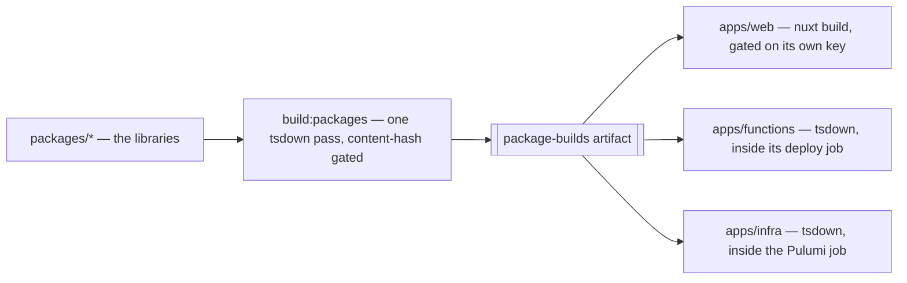

# Workspace Layout

Every workspace member lives under `packages/`, and three of them are not packages. The Nuxt app, the Azure Functions app and the Pulumi program are **entrypoints**: nothing in the workspace imports them, none is published, and each is driven by its own framework rather than by the shared tsdown factory. Everything else is a library that exists to be imported.

The tree cannot say which is which, so every tool that wants one group has to enumerate the other. The result is a single exclusion — "everything except the app" — restated in four syntaxes across the root manifest, three workflows and four tool configs: `--filter "!@esposter/web"` in six root scripts, `--ignore-pattern "apps/web/**"` on both oxlint invocations, `--project "!@esposter/web"` for the test run, an `exclude` entry in the TypeDoc config, and a content-hash cache key that hashes `packages/` and then **subtracts** `apps/web` back out. None of them is wrong. They are all the same fact, written down a dozen times, and a second app would have to be added to every one of them by hand.

## The decision

**Two product roots, split by direction of dependency.**

- **`apps/*` — the repo runs it.** Nothing in the workspace depends on it, it is always `private: true`, and its build belongs to its own toolchain. `apps/web` (Nuxt), `apps/functions` (Azure Functions), `apps/infra` (Pulumi).
- **`packages/*` — the repo imports it.** Built by the shared tsdown factory into `dist`, published or private.

The two roots are the convention [Vite+](https://viteplus.dev) scaffolds, which matters less as an endorsement than as a hedge: this repo already runs four of the tools that toolchain bundles, so a layout it recognises costs nothing today and is one fewer thing to argue about if the toolchain is ever adopted ([what this takes from Vite+](/docs/proposals/refactors/workspace-layout/vite-plus)).

This is not a new taxonomy either. `scripts/dependencyGraph/getPackageRole.ts` already computes it from the manifests — a member with no runtime and no development edge pointing at it is labelled an entrypoint — and running that over the workspace today returns those three members and no others. The split declares in the tree what the graph derives, and a fact stated by the tree is one a `--filter` can name.

The Nuxt app is renamed with its directory, to `@esposter/web`, because every other member holds the invariant that a directory name is its package name's last segment. `azure-functions` becomes `apps/functions` on the same rule; which cloud runs it is stated by its manifest and its host configuration, not by its name.

## How the build fans out afterwards

The shared artifact carries libraries only, and each app builds in the workflow that ships it. Nothing imports an app's `dist` — that is what makes it an app — so today it is built once and then downloaded by every job that cannot read it: lint, typecheck, bench, the web build, every coverage shard. Building it where it is shipped takes that repeated payload off the common path and leaves each app's build happening on the days its own workflow runs.

The same boundary lets the two cache keys become plain statements of their inputs: the package key is a hash of `packages/`, and an app's key is that hash plus its own directory. The subtraction disappears because the thing it was simulating is now a directory. [The toolchain after the split](/docs/proposals/refactors/workspace-layout/toolchain) argues both against the bar in [monorepo tooling](/docs/architecture/monorepo-tooling).

## Scope

**Today** every member is under `packages/`, the root `scripts/` tree is not a workspace member at all, and the two Docker deployments for a self-hosted LiveKit sit loose at the repository root belonging to nothing.

**This changes** where three packages sit and what two of them are called, `pnpm-workspace.yaml`, and every tool config that names a moved path. It then deletes the exclusions those paths existed to work around, and makes `scripts/` a workspace member so the checks reach it the way they reach everything else ([the scripts package](/docs/proposals/refactors/workspace-layout/scripts-package)). The LiveKit deployments move under `apps/infra/docker/`, which gives them the owner that already provisions the service they configure.

**It does not change** any source file's contents, any import between packages (a workspace import goes by name, and only two names move), the published set or its versioning, the tsdown factories, the virrun backends, or what any check actually checks. No **product** package is added, merged or removed, and nothing published changes: the one member the workspace gains is `scripts/`, a private tree that already existed and already ran, joining the list that names it.

## What this does not fix

The layout is one cause among several, and the honest accounting matters more than the win:

- **The `virrun --` prefixes** are a platform sandbox decision. They are unaffected — and virrun itself needs no code change, because it discovers the Nuxt package from its config rather than from a path, so every `apps/web/.nuxt` in that package is a comment.
- **`crossOS` and the shell script pairs behind it** exist because Windows and POSIX disagree, which no directory fixes.
- **`scriptsComments`** exists because JSON has no comments.
- **The prose.** Well over a hundred hand-written files name `apps/web`, and nothing fails when one of them goes stale. That sweep is the third pull request and the largest share of the work.

## The pages

- [the move](/docs/proposals/refactors/workspace-layout/migration) — the branch and worktree it runs in, the rename set, the configs that must change with it, what the tests catch, and how it is cut for review.
- [the toolchain after the split](/docs/proposals/refactors/workspace-layout/toolchain) — every script, workflow and config that simplifies, and the CI argument for building an app in its own job.
- [the scripts package](/docs/proposals/refactors/workspace-layout/scripts-package) — making the root tooling tree a workspace member, and the four workarounds that retires.
- [what this takes from Vite+](/docs/proposals/refactors/workspace-layout/vite-plus) — where the convention comes from, what is already aligned for free, and what a toolchain migration would still have to answer.

## Key files

| File                                               | Role after the change                                                              |
| -------------------------------------------------- | ---------------------------------------------------------------------------------- |
| `pnpm-workspace.yaml`                              | Declares `apps/*`, `packages/*` and `scripts` — the tree every filter below reads  |
| `package.json`                                     | Root scripts; six stop naming the app and address `./packages/*` by path           |
| `vitest.config.ts`                                 | Projects glob over both roots; loses the hand-written entry for `scripts`          |
| `typedoc.config.js`                                | Entry points over `packages/*`; loses the app from its exclude list                |
| `.oxlintrc.json`                                   | The shared-tree import ban, whose override path moves with the app                 |
| `.github/actions/get-build-cache-keys/action.yaml` | The two content-hash keys; the app subtraction is replaced by a directory          |
| `.github/workflows/build-packages.yaml`            | Builds and caches the libraries; its install filter becomes a path                 |
| `.coderabbit.yaml`                                 | Review path filters that name the app's migrations directory                       |
| `scripts/dependencyGraph/getPackageRole.ts`        | Computes the entrypoint role the tree now declares — the evidence for the split    |
| `.agents/ledgers/README.md`                        | Sweep scopes are git pathspecs resolved by a test, so they move in the same commit |
