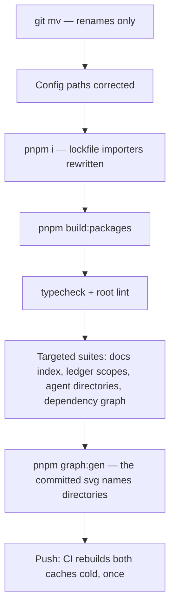

# The Move

The relocation is mechanical and enormous: the app alone is most of the repository's tracked files. Nothing about it requires judgement, which is exactly why it must be kept free of anything that does — every decision belongs in the two pull requests after it, so this one can be reviewed as the claim it makes, that nothing changed but paths.

## Where it runs

The move happens on its own branch in its own worktree, so a session working on the old paths is never interrupted:

```bash
git worktree add .agents/worktrees/workspace-layout -b refactor/workspace-layout
```

`.agents/worktrees/` is where this repository's worktrees live and is already excluded by every repo-wide walk ([agent configuration](/docs/architecture/agent-configuration)). A worktree is a full second checkout with no `node_modules` of its own, so it needs its own install before anything can be verified there, and on Windows the sandbox builds its layers against that path rather than the main one.

**A branch this shape does not age.** Every file under the old paths is a rename in it, so a concurrent edit to any of them conflicts, and the conflict is the worst kind: git resolves an exact rename cheaply but a rename _plus_ a content edit is a three-way merge over a path that no longer exists on one side. The sequencing that avoids it is to let the other session land first, then move, then merge the same day. Nothing else may be in flight against the app tree while the branch is open.

## The rename set

```text
apps/web             → apps/web         @esposter/web → @esposter/web
apps/functions → apps/functions   @esposter/functions → @esposter/functions
apps/infra           → apps/infra       @esposter/infra (unchanged)
livekit-server           → apps/infra/docker/livekit-server
livekit-monitor          → apps/infra/docker/livekit-monitor
```

Every other member stays where it is under `packages/`. Use `git mv` so the rename is recorded rather than inferred, and change no file's contents in the same commit.

## What has to move with it

These are the edits that keep the tree green — path corrections only, with no filter deleted and no script simplified. Those come next, in [the toolchain after the split](/docs/proposals/refactors/workspace-layout/toolchain).

| Where                                              | What changes                                                                      |
| -------------------------------------------------- | --------------------------------------------------------------------------------- |
| `pnpm-workspace.yaml`                              | `apps/*` added beside `packages/*`                                                |
| `package.json`                                     | The scripts naming the two renamed packages, and the `--ignore-pattern` paths     |
| `vitest.config.ts`                                 | `apps/*` added to `projects`                                                      |
| `tsconfig.json`                                    | `apps` added to the root program's `exclude`, beside `packages`                   |
| `eslint.config.js`                                 | `apps` added to `ignores` — an app lints itself with its own flat config          |
| `typedoc.config.js`                                | The app path it reads `.env` from, and the app it excludes                        |
| `.oxlintrc.json`                                   | Six `overrides` file globs naming the app's `server/`, `shared/` and `app/` trees |
| `.coderabbit.yaml`                                 | The migrations path filter and the doc paths quoted in its instructions           |
| `.github/workflows/`                               | The Functions deploy's `PACKAGE_PATH`, Pulumi's path trigger and `work-dir`       |
| `.github/actions/get-build-cache-keys/action.yaml` | The app path in the second key and in the comments explaining the subtraction     |
| `.agents/ledgers/README.md`                        | Eight `Scope` pathspecs naming the app tree                                       |

The last row is a test, not a courtesy: `scripts/ledgerScopes.test.ts` resolves every sweep scope against the working tree, precisely because a pathspec that matches nothing reports a swept tree instead of failing. A ledger scope left pointing at `apps/web` fails that suite on the move commit, which is the behaviour to want.

## What the checks catch, and what they do not



The install is the step that does the real work: pnpm rewrites the lockfile's importer keys to the new paths, which is a large but entirely derived diff. The suites in the fifth step are the ones that read paths as data rather than importing them — the docs tree's own Key Files check, the ledger scopes above, the agent directory pins, and the dependency graph's manifest walk. The committed `dependency-graph.svg` is generated from directory names and is regenerated rather than hand-edited.

Two things no check will catch. The **prose** naming old paths stays green forever, which is why it is its own pull request. And the **CI caches** miss once on the first push — both content-hash keys change because the paths inside the hash changed — so that run pays a full package build and a full app build, and every run after it is back to normal.

## How it is cut

Three pull requests, in order:

1. **The move.** Two commits: a pure `git mv`, then the config path corrections. The first commit leaves the tree broken on purpose — nothing resolves until the second — and CI runs on the branch head, not per commit. Reviewing it is reading the second commit and confirming the first is renames only, which `git diff --stat --summary` states directly.
2. **The toolchain.** Deleting the filters the split made redundant, and moving the two app builds into their deploy jobs. Small, and every line of it carries a decision — which is what makes it the one that wants a real review.
3. **The prose.** The hand-written trees that name `apps/web`: the docs, the skills, the ledger bodies, the READMEs. Split by tree to stay inside a review window, and reviewed for the sentences that need rewording rather than renaming — a page saying "the app package" is fine, a page saying "under `apps/web`" is a path.

The prose pass is **not** a sweep and gets no ledger. A sweep carries a standing convention across code that keeps arriving; a rename is done once and then cannot recur, so its progress belongs in a branch rather than in `.agents/ledgers/`.

## Key files

| File                                  | Role in the move                                                            |
| ------------------------------------- | --------------------------------------------------------------------------- |
| `scripts/ledgerScopes.test.ts`        | Resolves every sweep scope against the tree — fails on a ledger left behind |
| `apps/web/content/docs/index.test.ts` | Checks that every Key Files path in the docs exists                         |
| `scripts/agentDirectories.test.ts`    | Pins the agent-tree literals each tool config repeats                       |
| `dependency-graph.svg`                | Generated from the workspace manifests; regenerated by `pnpm graph:gen`     |
| `pnpm-lock.yaml`                      | Importer keys are the moved paths — rewritten by the install, never by hand |
