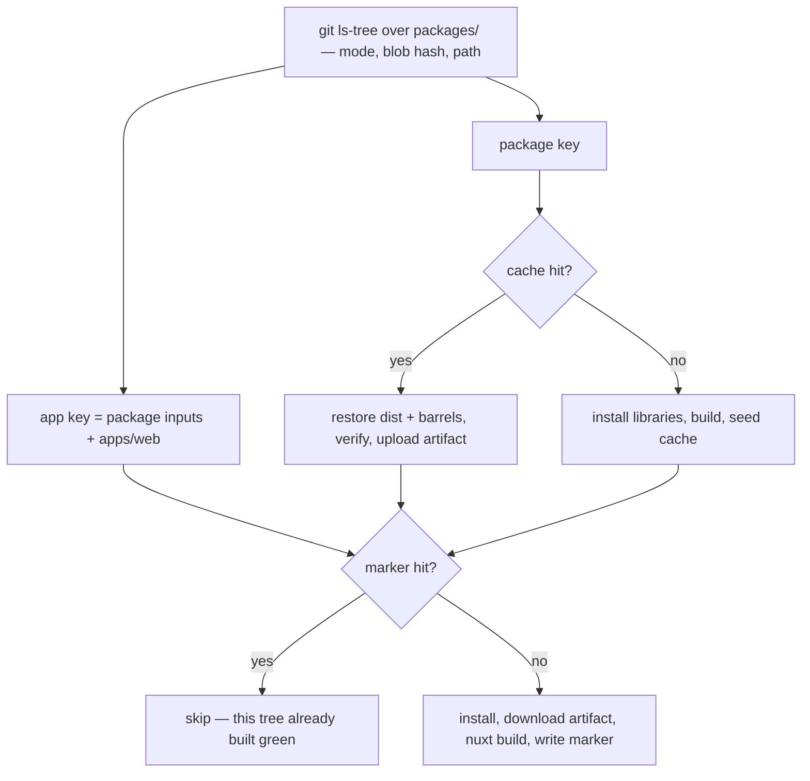

# The Toolchain After The Split

This is the pull request the refactor exists for. Every exclusion whose only job was to say "not the app" is deleted, because the tree says it instead — and what replaces them is not another filter but the plain thing each script and each workflow was reaching for: the directory it actually wants.

## Root scripts

**No script is renamed, and none has to be.** Every `:packages` script keeps its name and finally deserves it, because the selector underneath stops excluding an identity and starts naming a directory. pnpm already selects that way — `--filter "./packages/*"` resolves a directory glob against the workspace:

| Script               | Selector today                                       | Selector after                  |
| -------------------- | ---------------------------------------------------- | ------------------------------- |
| `build:packages`     | `--filter "!@esposter/app"`                          | `--filter "./packages/*"`       |
| `typecheck:packages` | `--filter "!@esposter/app"`                          | `--filter "./packages/*"`       |
| `watch:packages`     | `--filter "!@esposter/app"`                          | `--filter "./packages/*"`       |
| `test:packages`      | `--project "!@esposter/app"`                         | `--project "packages/*"`        |
| `lint:packages`      | `--ignore-pattern "packages/app/**"` plus the filter | the positional `packages` alone |
| `lint:fix:packages`  | `--ignore-pattern "packages/app/**"` plus the filter | the positional `packages` alone |

The two lint scripts are the clearest case: they already pass `packages` as the path to lint, then subtract a subdirectory of the path they just named. Once the app is not under it, the subtraction is the empty statement it always wanted to be. Every one of these is now an **inclusion**, so a library added later is inside it and an app added later is outside it, with nothing edited either way.

`test:packages` reaches that form because Vitest's `--project` patterns are wildcards over a project's _name_, and its `*` compiles to `.*` — a pattern crosses a `/` like any other character. So the shared Vitest factory names each project by its **workspace-relative directory**, and the app's config, which builds its own project through `defineVitestProject` rather than the factory, names itself the same way. `--project` then addresses the tree exactly as `--filter` does.

### One script per addressable set

An app is addressed by its own name rather than by everyone else's absence, so each gets the scripts it needs — `build:web`, `build:functions`, `build:infra`, `test:web`, `test:infra` — every one of them a single directory named once:

```bash
pnpm build:packages     # --filter "./packages/*"    — the libraries, topologically
pnpm build:functions    # --filter "./apps/functions" — what the Functions deploy ships
pnpm test:packages      # --project "packages/*"     — every library suite
pnpm test:web           # --project "apps/web"       — the Nuxt suite, the slow one
```

That is what makes the CI section below possible: a workflow calls the script for the thing it is shipping, instead of calling a build of everything and using a third of it. The set is symmetric rather than long — one entry per app beside the one entry for the libraries — and each new script replaces a filter that would otherwise have had to learn a new name.

## Configs

| Config                   | What goes                                                                                              |
| ------------------------ | ------------------------------------------------------------------------------------------------------ |
| `typedoc.config.js`      | The app leaves the `exclude` list — its entry points are `packages/*`, which no longer contains an app |
| `eslint.config.js`       | Ignores both product roots for one reason, that a member lints itself with its own flat config         |
| `vitest.config.ts`       | Projects become a glob per root; the hand-written entry for `scripts` goes with the next pull request  |
| `getVitestConfiguration` | Names each project by its workspace-relative directory, so `--project` addresses the tree              |
| `.oxlintrc.json`         | Nothing is deleted — the app-tree overrides move with the app and keep doing their job                 |

## CI



The shape is the one that already runs; what changes is that neither key subtracts anything. Today the package key is a hash of `packages/` with `packages/app` removed from it, because no consumer of that cache builds the app. After the move the app is not in the hashed tree, so the package key is a hash of `packages/`, and an app's key is that hash plus that app's own directory — which is the rule a second app follows without any of this being touched.

Both `verify-package-builds` and the artifact path list keep globbing `packages/*`, and both become exactly right by doing nothing: the set they discover is the set the cache holds, with no app in it to have been an exception.

### An app builds in the job that ships it

The Functions deploy and the Pulumi job restore the shared artifact today and find their own `dist` inside it, because `build:packages` builds every member. After the split it builds libraries, and each of those jobs runs its own `build:functions` or `build:infra` on top of the artifact it already downloads, into an install it already performs.

**This is a saving on the common path, and the reason is what an app's `dist` is.** Nothing imports it — that is the definition of an entrypoint, and the whole basis of the split — so it is deploy payload and nothing else. Today it is built into an artifact that lint, typecheck, bench, the app build and every coverage shard download, none of which can read it. Two builds and their bytes are therefore repeated across the whole fan-out of every run, to be used by the two jobs that run on a deploy.

Against the bar in [monorepo tooling](/docs/architecture/monorepo-tooling), that is exactly the shape it counts against: work repeated where it is not read. Removing it shortens `build:packages` on every cache miss, shrinks the artifact for every job downstream of it, and leaves each app's build happening once, in the workflow that ships it, on the days that workflow runs.

The cost is one line long and worth stating plainly: a deploy no longer finds its `dist` prebuilt, so it pays its own small tsdown build unconditionally instead of inheriting one from a cache hit. Deploys are the rare path and the build is seconds. Nothing new is skipped, so the failure worth fearing — a job reporting green over work it did not do — is untouched.

Correctness gains something too. A deploy stops reading its payload out of a cache entry keyed for someone else's purpose: that entry exists so library consumers can skip a build, and the day an app's inputs stop being inside its key is the day a deploy ships a stale artifact and passes. After this, each workflow builds what it ships from the source it checked out.

**The alternative is worth recording, because it is the tempting one.** The apps could stay in the shared artifact by adding `apps/functions` and `apps/infra` to the key inputs and `apps/*/dist` to the paths. That keeps the deploy's free `dist` — at the price of keeping the unread payload in every other job's download, and of putting an enumeration of app names back into the definition this refactor exists to remove, in the one place where getting it wrong is silent. Two named directories in a cache key is exactly the shape of the filters being deleted upstairs.

No cache gate is proposed for those two builds. Gating something measured in seconds behind a content hash spends more on the gate than the build.

## Key files

| File                                                   | Role after the change                                                       |
| ------------------------------------------------------ | --------------------------------------------------------------------------- |
| `package.json`                                         | Root scripts, addressing libraries by path                                  |
| `.github/actions/get-build-cache-keys/action.yaml`     | Both keys, each a plain statement of its inputs                             |
| `.github/actions/verify-package-builds/action.yaml`    | Discovers buildable libraries by their tsdown config — unchanged, now exact |
| `.github/workflows/deploy-function-app.yaml`           | Builds the Functions app it deploys, on top of the library artifact         |
| `.github/workflows/Pulumi.yaml`                        | Builds the infra program it runs, on top of the library artifact            |
| `typedoc.config.js`                                    | Entry points over the libraries, with no app to exclude                     |
| `packages/configuration/src/getVitestConfiguration.ts` | The shared factory, naming each project by its directory                    |
