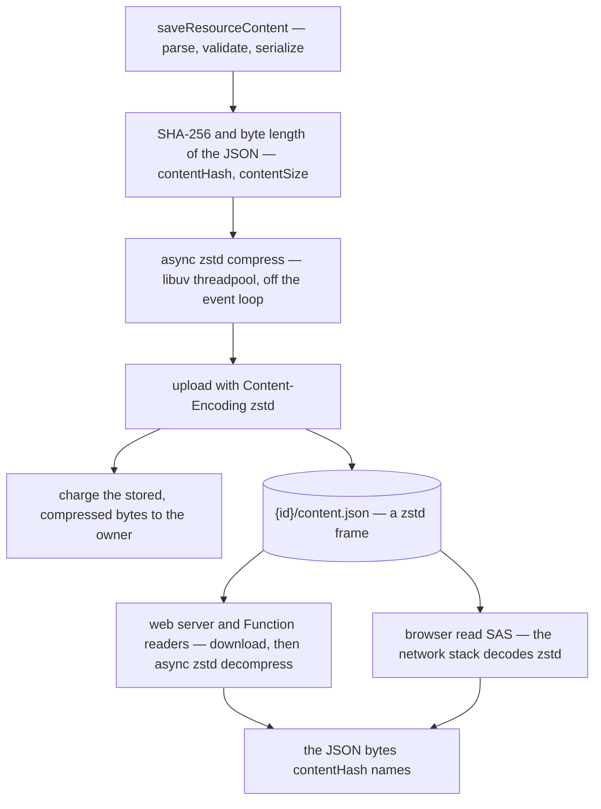

# Compressed content at rest

A resource's working copy, `{id}/content.json`, is the one stored document in the app that is not compressed. Retained versions are zstd keyframes and deltas ([resource version store](/docs/resource/resource-version-store)), and the staged save already gzips on the wire ([file uploads](/docs/architecture/file-uploads)). The working copy is plain JSON, and it is also the copy that is read the most. So it is charged at full size against the owner's quota, downloaded at full size by every server-side reader, and downloaded at full size by the browser for every large document ([large documents](/docs/architecture/large-documents)). JSON compresses by about an order of magnitude: a Sheet's rows repeat the same keys and shapes on every line, which is what the staged save's gzip already shows.

This proposal stores the working copy as a **standalone zstd frame, with the blob's `Content-Encoding` set to `zstd`**. Nothing about the document changes: its hash, its size for transport and its schema all still describe the JSON. Only the bytes at rest change.

## Scope

**Today:** the content blob is written as JSON text by `useUpload` from `saveResourceContent`, and is read four ways:

- by the web server, through `readSerializedResourceContent`, for the inline read, revisions, blueprint capture and dataset reads;
- by the delta commit, `readResourceContentDelta`, as the baseline its dictionary is;
- by the browser, through a read SAS, for a document past one request body;
- by the `sendTodoReminderHandler` Azure Function, to re-check a reminder against the live content.

**This adds:**

- one writer that compresses the serialized document and uploads it with `Content-Encoding: zstd`;
- one reader in `@esposter/db`, shared by the web server and the Function app, that downloads and decompresses;
- the browser read left as it is: the network stack decodes the stored `Content-Encoding` before `fetch` hands back the body, so the page still receives the JSON bytes it hashes and parses today;
- a one-off backfill that rewrites every existing content blob compressed, then is deleted.

**Unchanged:** retained versions, which are already compressed; attachments and assets, which are formats someone else wrote and mostly compressed already; and the staged upload. The staged upload stays gzip because the browser's `CompressionStream` has no zstd, and the server re-serializes what it validates rather than storing the upload.

## The write and the reads



## Decisions

**zstd, because both readers can decode it.** The [compression standard](/docs/architecture/compression) picks zstd wherever the repo chooses the bytes, and gives way only to a codec a counterparty has fixed. The browser is the counterparty here, and zstd is in its codec set. Every current engine decodes `Content-Encoding: zstd` natively (Chrome and Edge 123, Firefox 126, Safari 26.3), and the repo targets current engines only, so there is no gzip fallback and no browser-side decoder to ship. Blob Storage serves a blob's stored `Content-Encoding` on every read, so a SAS download needs no parameter for it.

**The window is pinned at 8 MB.** RFC 9659 forbids an HTTP zstd encoder from producing a frame that needs a window larger than 8 MB, and decoders are only required to support that much. The writer therefore sets `ZSTD_c_windowLog` to 23 explicitly, rather than inheriting whatever its level defaults to. It is a property of the stored format, not a tunable ([compression](/docs/architecture/compression), notes). No dictionary is used, since a browser decoding a `Content-Encoding` has none.

**A low level, named once.** The working copy is rewritten on every autosave, so its level is chosen for speed, not for the last few percent of ratio. That makes it a different decision from `DEFAULT_COMPRESSION_LEVEL`, which the version store spends once per retained version. A `CONTENT_COMPRESSION_LEVEL` constant near zstd's default is the starting point, and the bench below confirms it.

**What each number describes.** `contentHash` stays the hash of the JSON, since it is what a client compares its own bytes against. `contentSize` stays the JSON's length, since it sizes the transport and the server's cost to parse. The storage charge becomes the compressed length, because the ledger counts stored bytes and a blob's `BlobCreated` event reports the stored length. So the quota meter drops by the ratio, and the reconcile still agrees with the charge.

**Latest shape only.** Every reader assumes the frame and there is no plain-JSON branch ([persisted data — latest shape only](/docs/architecture/persisted-data-latest-shape-only)). Content is the owner's data and must never reset, so the population written before the change is rewritten once by `pnpm backfill:compress-content`, which is deleted after it runs in production, as the page prescribes.

## What it costs in compute

The save gains one compression, and every server read gains one decompression. Neither runs on the event loop: `node:zlib`'s asynchronous calls run on the libuv threadpool, so they take CPU but no request waits behind them.

- **The compression** runs at the speed of the passes the save already makes over the same bytes (`JSON.stringify` and SHA-256, both on the event loop). zstd's own benchmark puts a low level at hundreds of MB/s per core, so a typical document costs microseconds and a document at `MAX_RESOURCE_CONTENT_SIZE` a fraction of a second, against the seconds its validation already takes there.
- **The decompression** is about three times faster than the compression, and it replaces a download an order of magnitude larger. For an Azure-to-Railway read, that makes a server read cheaper overall, not dearer.
- **The browser** decodes in its network stack, not on the page's main thread, and a large Sheet crosses the wire at about a tenth of its size. On the owner's connection, that is the largest saving here.

The net is a small, bounded CPU cost that no request waits on, in exchange for storage, quota, egress and read latency all falling by the ratio.

## Failure semantics

- **The compression fails:** the save throws before anything is uploaded, so no blob is written. It unwinds the way a failed upload already does: the version bump rolls back with its transaction, and a cleared binding stays cleared, which is the value that can never be wrong.
- **The backfill is interrupted:** it is idempotent and resumable. It skips a blob whose properties already say `zstd`, and it writes only under an `ifMatch` on the etag it read, so a save that lands during the rewrite wins, and the blob is left to that save's own compressed write.
- **The quota:** each rewritten blob raises a `BlobCreated` event with its new length, and the reconcile moves the owner's counter by the difference. Nothing charges the backfill separately.
- **The deploy window:** a server running the old code cannot read a compressed blob, and the new code cannot read a plain one. The backfill therefore runs straight after the deploy that ships the readers, and reads that fail in between are failed requests the owner retries, not lost data.

## Tests and bench

- One `saveResourceContent` test: the stored blob carries `Content-Encoding: zstd`, and its bytes decompress to the serialized document. The existing router suites already save and read content back through both ends.
- One test for the shared reader over a frame and over a missing blob (a 404 is "no content yet").
- A bench beside the writer, over a scaling axis of Sheet-shaped documents, comparing candidate levels. Its committed report is what settles `CONTENT_COMPRESSION_LEVEL`.

## Files

New:

```text
packages/db/src/services/azure/container/readResourceContentBlob.ts   ← download + async decompress, 404 → undefined
apps/web/server/services/resource/writeResourceContentBlob.ts          ← async compress + upload with Content-Encoding zstd
apps/web/server/services/resource/writeResourceContentBlob.bench.ts    ← the level, over document size
apps/web/scripts/backfill/compressContent.ts                           ← one-off, deleted after the production run
```

Existing files the work changes:

| File                                                                 | Role after the change                                                |
| -------------------------------------------------------------------- | -------------------------------------------------------------------- |
| `apps/web/server/services/resource/saveResourceContent.ts`           | writes through `writeResourceContentBlob`, charges the stored length |
| `apps/web/server/services/resource/readSerializedResourceContent.ts` | reads through the shared reader                                      |
| `apps/web/server/services/resource/readResourceContentDelta.ts`      | takes its dictionary from the shared reader                          |
| `apps/functions/src/handlers/sendTodoReminderHandler.ts`             | reads the reminder's content through the shared reader               |
| `packages/db-schema/src/schema/resources.ts`                         | `contentSize` documented as the JSON's length, not the blob's        |
| `apps/web/content/docs/architecture/compression.md`                  | the working copy joins the zstd sites, with the browser's decode     |
| `apps/web/content/docs/architecture/large-documents.md`              | a large read downloads the frame and receives the JSON               |
| `apps/web/content/docs/resource/storage-quotas.md`                   | content is charged at its stored, compressed size                    |

## Sources

- [Zstandard](https://github.com/facebook/zstd) (Meta) — the benchmark table: at its fastest levels zstd compresses at hundreds of MB/s and decompresses at over a GB/s per core, well ahead of zlib at a similar ratio. That is the basis of the compute estimate above.
- [RFC 9659 — Window Sizing for Zstandard Content Encoding](https://www.rfc-editor.org/rfc/rfc9659.html) (IETF) — an HTTP zstd encoder must not need a window larger than 8 MB, which is the pinned `windowLog`.
- [zstd content-encoding](https://caniuse.com/zstd) (Can I use) — native decoding in Chrome and Edge 123, Firefox 126 and Safari 26.3, the engines the no-fallback decision rests on.
- [Zlib: threadpool usage and performance considerations](https://nodejs.org/api/zlib.html#threadpool-usage-and-performance-considerations) (Node.js) — every zlib API except the explicitly synchronous ones runs on the libuv threadpool, which is why the compression costs CPU but not the event loop.
