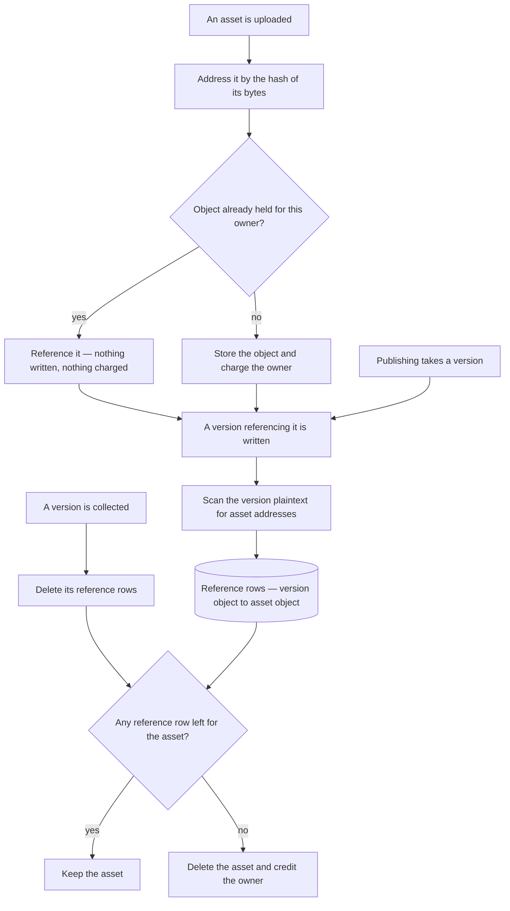

# Content-Addressed Assets

Publishing an immutable snapshot clones **every asset the content references** and rewrites each url to point at the clone — one storage round trip per asset, paid on the publish request ([publishing](/docs/architecture/publishing)). It is done that way because an asset is addressed by where it was uploaded, so a published snapshot pointing at the working copy's assets would break the moment the owner replaced or deleted one.

Content addressing removes the reason. An asset addressed by the hash of its bytes cannot be replaced in place — a different image is a different address — so a snapshot and the working copy can safely reference the same object, and there is nothing to clone and no url to rewrite.

This is a second phase of the [resource version store](/docs/resource/resource-version-store), sharing its substrate and none of its risk: versions ship on content addressing while assets keep their current paths, and nothing about the store depends on this landing.

## What it removes

The clone walk over content, the per-asset copy, the url rewriting that follows it, and the whole class of failure they create together. That failure is not hypothetical: an unpublish sweeping assets concurrently with a publish leaves a live publication whose images are gone, and the recovery for it is a re-clone and a re-upload after the transaction has already committed. With a shared object, an unpublish cannot sweep an asset the working copy still references, so the race has nothing to race over.

## What it costs

Reference tracking, and this is the entire difficulty. A version's references are a column on a row; an asset's references live **inside content**, so nothing can answer "is this object still needed" from the database as it stands.

The answer is an explicit table: one row per content-object-to-asset-object reference, written when a version is stored, by scanning that version's plaintext for asset urls. The scan already exists — it is what the clone walk does today — so this moves the walk from publish time to version-write time and does it once rather than once per publish.

The gate is the same one the version store uses, applied one level down: an object survives while a row names it. What differs is that the naming rows are derived by a scan rather than written directly, which is why this is the phase with the sharp edge — a scan that misses a reference deletes an asset that is still in use, and the failure is a broken image in a published artifact rather than an error anyone sees.

That is what makes it separable and what makes it second. It wants the scan to be exhaustive, tested against every content type that can embed an asset url, and shipped behind a period where assets are reference-counted but never actually collected, so an under-counting bug shows up as an object nothing deletes rather than as an object deleted too early.

## Why not now

The version store stands on its own and paid for itself immediately. This phase is a larger blast radius for a smaller win: it removes real complexity and real per-publish latency, but it touches publishing, unpublishing, the asset upload path and the deletion sweep at once, and its correctness rests on a scan rather than on a column. Sequencing it behind a store that is already proven in production is the cheaper order.
