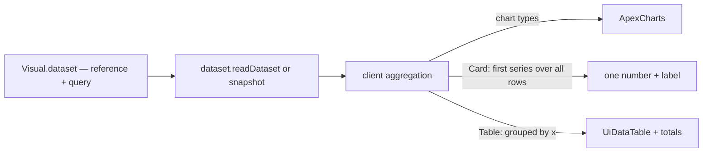

# Dashboard Card and Table Visuals

Every dashboard visual is an ApexCharts chart — `VisualType` runs from Area to Treemap — bound to a dataset through one query of an x column and aggregated series ([dashboard data binding](/docs/resource/dashboard-data-binding)). The two visuals a report is most often opened for are missing: **the number** ("412 responses", "average rating 4.3") and **the exact values** behind a chart. In Power BI those are the Card — a measure's value as a large callout with its label — and the Table — rows and columns with headers and a totals row, for "reviewing and comparing detailed data and exact values rather than visual representations".

## What it adds

`VisualType` gains `Card` and `Table`, listed first in the visual picker since they are the plainest. Neither is an ApexCharts chart, so each renders through its own component while keeping everything else a visual has: its grid layout item, its dataset binding and snapshot on publish, its per-visual refresh, its loading and error states and the row-cap warning.

- **Card** — one number, large, with its label under it. Bound, it reads the query's first series (a column and an aggregation — count, sum, average, minimum, maximum) over **every** row, ignoring the x column, since a card has no category axis; the label defaults to "_aggregation_ of _column_" and is editable. Unbound, it shows the demo value, as an unbound chart shows demo data. Numbers format through the app's number formatter with the same compact form (12K) Power BI's display units default to.
- **Table** — the query's grouped result as a `UiDataTable`: the x column's values as rows, one column per series, sortable by header, with a totals row that sums a series whose aggregation is count or sum (and leaves an average or extreme blank, since a total of averages is not an average). It is the same aggregation the chart visuals already compute on the client, so a Table beside a Bar over the same binding shows the Bar's exact values.
- **Chart options do not apply.** The visual's edit dialog hides the chart settings for these two kinds and shows only the label (Card) or nothing extra (Table); the chart-interaction features ([dashboard chart interaction](/docs/resource/dashboard-chart-interaction)) stay chart-only.

## What is deliberately not in it

- **No multi-card, categories, callout images or conditional formatting** (the modern Power BI card's layout options). One number per Card; a second number is a second Card on the grid.
- **No matrix (pivot) visual.** A Table grouped by one column covers the exact-values need; a pivot is the Sheet's job.
- **No cross-highlighting from a Table row.** Linked highlighting belongs to the charts.

## Key files

| File                                                                   | Role after the change                                  |
| ---------------------------------------------------------------------- | ------------------------------------------------------ |
| `apps/web/shared/models/dashboard/data/VisualType.ts`                  | gains `Card` and `Table`                               |
| `apps/web/app/components/Dashboard/Visual/Index.vue`                   | dispatches the two non-chart kinds to their components |
| `apps/web/app/services/dashboard/VisualTypeItemCategoryDefinitions.ts` | the picker's entries, the two plainest first           |

## Sources

- [Microsoft Learn — card visual in Power BI](https://learn.microsoft.com/en-us/power-bi/visuals/power-bi-visualization-card) — a measure's value as the card's callout, and display units abbreviating large numbers by default.
- [Microsoft Learn — table visualizations in Power BI](https://learn.microsoft.com/en-us/power-bi/visuals/power-bi-visualization-tables) — headers and a totals row, and when a table beats a chart: exact values across several measures per category.
