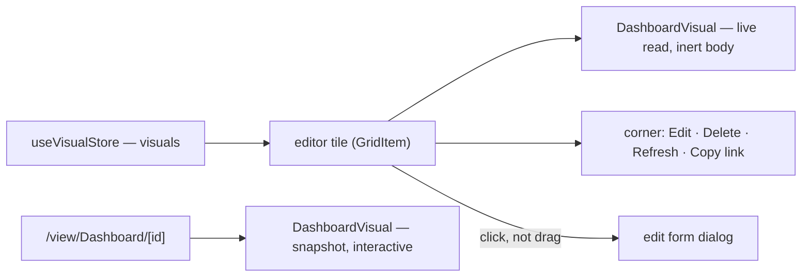

# Dashboard Live Canvas

The Dashboard editor's grid draws every tile as `DashboardVisualPreview` — a stock icon picked by `VisualTypeDemoIconMap` for the tile's visual type. The chart itself, over the data its binding reads ([dashboard data binding](/docs/resource/dashboard-data-binding)), is drawn only by `DashboardVisual`, which only the published `/view/Dashboard/[id]` page mounts. So an owner who binds a bar chart to a survey's responses sees a bar-chart icon, and the one way to see the bars is to publish the dashboard and open its public page. The type is described as "compose charts and visuals over your data", and the editor never shows the data.

Power BI's report editing view is the same canvas the reader sees: "once you add data, you can add fields to a new visualization in the canvas", and changing the type of a selected visual redraws it in place.

## What it adds

- **Each editor tile renders `DashboardVisual`** in place of `DashboardVisualPreview` — the real chart over the binding's live read, its skeleton while the read is pending, its error state with Retry when the read fails, the row-cap footnote, and the demo data an unbound visual already shows on the published page. The tile's corner keeps Edit and Delete beside the visual's own Refresh and Copy link.
- **The chart body is inert while editing.** The tile owns a press — a drag moves it and a click opens its edit form (`onClickExceptDrag`) — so the chart under it takes no pointer events in the editor; zoom, brushing, the ruler and annotation ink are the reader's, on the published page, as [dashboard chart interaction](/docs/resource/dashboard-chart-interaction) describes. The corner buttons and the error state's Retry stay reachable above that layer.
- **An edit redraws its tile on save**, since the tile reads the same visual the store writes; a tile resized by the grid redraws at its new height through the resize observer `DashboardVisual` already has.
- **The stock icons go.** `DashboardVisualPreview` and `VisualTypeDemoIconMap` have no other consumer, and the icon a type shows in the visual-type select comes from `VisualTypeItemCategoryDefinitions`, not from them.

## Notes

- Visuals over the same source share one read: `useVisualPropsData` resolves through `useDataset`, keyed by the reference, so a dashboard of six charts over one sheet reads it once.
- Nothing is persisted differently. The editor still saves the dashboard content; only what a tile draws changes.

## Key files

| File                                                             | Role after the change                                                |
| ---------------------------------------------------------------- | -------------------------------------------------------------------- |
| `apps/web/app/components/Dashboard/Visual/Preview/Container.vue` | renders `DashboardVisual` for the tile's visual under an inert layer |
| `apps/web/app/components/Dashboard/Editor/Content.vue`           | passes each tile its visual rather than only its id and type         |
| `apps/web/app/components/Dashboard/Visual/Index.vue`             | the one renderer for the editor and the published page               |
| `apps/web/app/components/Dashboard/Visual/Preview/Index.vue`     | deleted                                                              |
| `apps/web/app/services/dashboard/demo/VisualTypeDemoIconMap.ts`  | deleted                                                              |

## Sources

- [Microsoft Learn — Report view in Power BI Desktop](https://learn.microsoft.com/en-us/power-bi/create-reports/desktop-report-view) — the editing canvas draws visuals over the added data, and a selected visual's type is changed in place.
