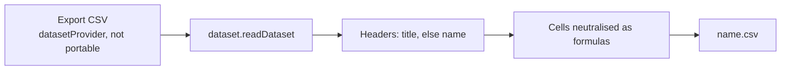

# Dataset CSV Export

What a survey owner reaches for first — a file of the answers to open in Excel or send on — is not there; Google Forms puts **Download responses (.csv)** in the response page's own menu. The answers already leave the survey as a dataset, which a Sheet imports and a Dashboard binds ([datasets](/docs/architecture/dataset)), and a Program serves its funnel status the same way. A file is one more reader of that same read, so it is built once for every dataset provider rather than once per type.

## Two exports, two capabilities

A resource has two kinds of thing to take out, and each already has its generic seam:

| What leaves         | Capability          | The command                                    | Who has it                                                                     |
| :------------------ | :------------------ | :--------------------------------------------- | :----------------------------------------------------------------------------- |
| The resource itself | **Portable**        | Import and Export, one entry per format        | Sheet, Email and the TodoList's print today; Note and Flowchart by their specs |
| The data it serves  | **DatasetProvider** | **Export CSV**, one command for every provider | Survey and Program, by this spec                                               |

Portable moves a resource's _content_ — a survey's model, not its answers — so responses are never a Portable format. A Sheet is both, and its Portable CSV export already writes its rows with the column choice and filters the export dialog offers, so a dataset provider that is also Portable keeps its own export and gets no second command.

## What it adds

- **One command.** The resource page's overflow menu shows **Export CSV** for every type that declares `datasetProvider` and not `portable`, read off `ResourceDefinitionMap` by `checkHasCapability` as the Import and Export commands are. Nothing is added per type.
- **One read.** The command runs `dataset.readDataset` for the open resource, the read a Dashboard binding makes, and writes its columns and rows. A dataset over the row cap exports what was read and says so in the warning the blade shows, rather than implying the file is complete ([dataset row-cap warning](/docs/resource/dataset-row-cap-warning)). The file is named after the resource.
- **Columns read the way a person reads them.** `DatasetColumn` gains an optional `title`, the header a file prints in place of the column's `name` when set; the survey dataset sets it to each question's title, so the file reads "How did you hear about us?" rather than `question3`. The survey dataset also gains its submission time as its first column, and in an Identified survey the respondent after it ([survey response modes](/docs/resource/survey-response-modes)) — columns a Dashboard binding can use too, a chart of responses over time among them. A checkbox question's answers join into one cell separated by `;` and a space.
- **Every cell is neutralised as a formula.** A dataset may hold text typed by anonymous respondents on a public page, opened by the owner in a spreadsheet, and the command cannot know which provider's text is trusted, so it treats all of it as untrusted. A cell starting with `=`, `+`, `-`, `@`, a tab or a line break is quoted with a tab placed before that first character — the one mitigation OWASP reports surviving an Excel save and reopen. `escapeUntrustedCsvCell` already does this for the [program's participant links](/docs/resource/program-resource), a sibling of `escapeCsvCell` rather than a change to it, since the Sheet's own export must round-trip the owner's formulas-as-text unchanged.

No procedure is added: the export is a client transform of what `dataset.readDataset` already returns.

## What is deliberately not in it

- **No live-synced spreadsheet** (Google Forms' linked Sheet). A Sheet can import the dataset today; a live link is [realtime dataset refresh](/docs/resource/deferred/realtime-dataset-refresh).
- **No other file formats.** A dataset is rows and columns, and CSV opens everywhere; an XLSX writer for datasets would duplicate the Sheet's, which a Sheet importing the dataset already reaches.

## Key files

| File                                                                               | Role after the change                                                 |
| ---------------------------------------------------------------------------------- | --------------------------------------------------------------------- |
| `apps/web/app/components/Resource/Blade/Header.vue`                                | the Export CSV command for a dataset provider with no Portable export |
| `apps/web/shared/models/dataset/DatasetColumn.ts`                                  | gains the optional `title` a file prints as its header                |
| `apps/web/server/services/dataset/surveyResponses/getSurveyModelDatasetColumns.ts` | sets each question's title                                            |
| `apps/web/server/services/dataset/surveyResponses/readSurveyResponsesDataset.ts`   | adds the submission time and, when Identified, the respondent         |
| `apps/web/app/services/resource/sheet/csv/escapeUntrustedCsvCell.ts`               | the formula neutralising every cell is written through                |

## Sources

- [Google Forms Help — view and manage form responses](https://support.google.com/docs/answer/139706) — downloading all responses as a CSV from the response page's menu.
- [OWASP — CSV injection](https://community.owasp.org/attacks/CSV_Injection) — the formula trigger characters and the tab-inside-quotes prefix that survives Excel re-saving.
