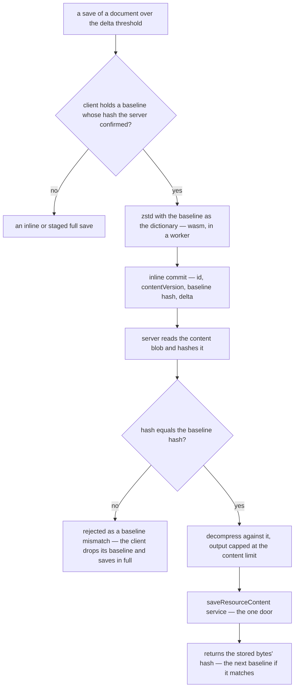

# Delta Content Saves

[Staged content saves](/docs/architecture/file-uploads) make a large document savable. They do not make it cheap: every autosave of a large Sheet still gzips and uploads the whole document, although the owner changed one cell. This phase sends only what changed, and it does so without knowing anything about any resource type.

**Why now:** staged saves have shipped, and a Sheet near the content limit gzips to megabytes — every autosave of it uploads that much again, whatever the edit.

## How it works

The [resource version store](/docs/resource/resource-version-store) already stores a version as a zstd frame compressed with an earlier version's plaintext as the dictionary. The encoder's long-range matching turns a near-duplicate document into a few hundred bytes, with no diff format and no per-type structure. This phase moves the same trick onto the wire: the client compresses the new serialization with **the last stored serialization** as the dictionary, and the server, which holds that same document as the content blob, reverses it.

- **The baseline is the server's bytes, never the client's.** The content blob holds the serialization of the _parsed_ document, and a content schema's transforms (string normalization, for one) can make it differ from what the client sent. So every save — inline, staged or delta — returns the SHA-256 of what it stored. The client keeps the bytes it sent as its baseline only when their hash equals that one; otherwise its next save goes in full, and the one after that has a baseline again.
- **A delta always fits inline.** The delta is proportional to the edit, so it travels through the existing tRPC transport, as a binary input on the non-batching `httpLink` that the client's split link already routes non-JSON inputs to. The server's content-type check keeps it off every other route.
- **A mismatch is not an error the owner sees.** Another device's save, a restore, or a blueprint deploy each move the content blob. The server answers a mismatch with a distinct code, and the client retries in full inside the same queued save.
- **The server can short-circuit.** A column holding the stored bytes' hash on the `resources` row would let a mismatch be refused before the blob is read. That is optional, and worth adding only if the extra read shows up.

### The browser codec

`node:zlib`'s zstd does not exist in the browser, so this phase needs a WebAssembly zstd build that supports dictionaries. The encode is the only real work in the phase:

- **Loaded lazily.** It is imported with `await import` on the delta path only, the pattern the Sheet's xlsx codecs already follow, so no page that never saves a large document pays for it.
- **Run in a worker.** Compressing a document of tens of megabytes against a dictionary of the same size is too much work for the main thread.
- **Parameters shared, not restated.** The window must cover the dictionary plus the document. `keyframe-store` already derives that (`getWindowLog`, used by `encodeObject`), so the derivation is extracted into a pure helper both sides import rather than copied.
- **Priced before it is adopted.** The WebAssembly module's size is checked against the bundle-size snapshot first.

## What it does not change

The server still reads, parses, validates and writes the whole document on every save, in-region and off the owner's connection. This phase saves the owner's upload, not the server's work. Making server cost proportional to the edit needs per-type chunked storage or an operation log. That is the collaboration machinery [resource collaboration](/docs/resource/deferred/document-collaboration) defers and [offline editing](/docs/resource/rejected/offline-editing) rejects, and it is out of scope here.

## Key files

| File                                                                  | Role after the change                                                     |
| --------------------------------------------------------------------- | ------------------------------------------------------------------------- |
| `apps/web/app/store/resource/index.ts`                                | keeps the confirmed baseline and chooses delta, inline or staged          |
| `apps/web/server/trpc/procedure/resource/createResourceProcedures.ts` | gains the delta commit; every save returns the stored bytes' hash         |
| `apps/web/server/services/resource/saveResourceContent.ts`            | reports the hash of the bytes it stored                                   |
| `packages/keyframe-store/src/services/getWindowLog.ts`                | the window derivation the browser encoder shares                          |
| `apps/web/app/plugins/trpc.ts`                                        | unchanged — the split link already sends binary inputs through `httpLink` |

## Sources

- [RFC 9842 — Compression Dictionary Transport](https://www.rfc-editor.org/rfc/rfc9842.html) (IETF) — a previous version of a resource used as a zstd or Brotli dictionary, identified by the SHA-256 of its contents, so the newer version crosses as a delta. The RFC covers responses only. This phase applies the same idea to requests, with the same hash identifying the baseline.
- [Behind the feature: the hidden challenges of autosave](https://www.figma.com/blog/behind-the-feature-autosave/) (Figma) — whole-file serialization on every save stalls a large document, and Figma writes only the changes since the last save. This phase does the same, with the compressor finding the changes instead of the editor recording them.
