# Flowchart Connectors

Edges in the Flowchart editor are Vue Flow's defaults: a bezier curve with no arrowhead and no label. A flowchart's lines are directed — the arrow is what says which step comes next — and a decision's branches are read by their labels ("yes", "no"). Today neither can be drawn, and a selected edge has no panel, so the only way to remove one is Backspace, which nothing on screen names.

## What it adds

- **Direction.** Every new edge carries `markerEnd: MarkerType.ArrowClosed`, set once through the canvas's `default-edge-options` so an edge drawn by hand and one created in code are the same.
- **Right angles.** New edges use the `smoothstep` type — orthogonal segments with rounded corners, the look flowcharts are drawn in — also through the default options. An edge's type is already persisted as one of Vue Flow's connection-line types, so no schema change is needed for it.
- **Labels.** A double click on an edge edits its label inline, and the edge's properties panel has the same field. `GraphEdge` gains `label` (a string, capped like a node's label) and `markerEnd`, and `graphEdgeSchema` validates both.
- **A panel for a selected edge.** The properties panel that appears for one selected node appears for one selected edge too, with the label, the path type (curved, right-angled, straight) and a named **Delete connector** — the same answer the node panel gives to "how do I remove this".

```mermaid
flowchart LR
  DRAW[drag from a handle] -->|default-edge-options| EDGE["edge: smoothstep · arrow · empty label"]
  EDGE -->|double click| LABEL[inline label]
  EDGE -->|select| PANEL[properties panel<br/>label · path · delete]
  PANEL -->|update:edges| SAVE[autosave]
  LABEL -->|update:edges| SAVE
```

The published view renders labels and markers from the stored edges with no change of its own.

## What is deliberately not in it

- **No edge colours, widths or dash styles.** The node colour exists to group steps; a styled line is decoration a flowchart does not need to be read.
- **No waypoints** (dragging a segment to reroute it). Right-angled routing between four handles covers ordinary charts.

## Key files

| File                                                       | Role after the change                       |
| ---------------------------------------------------------- | ------------------------------------------- |
| `apps/web/shared/models/flowchartEditor/data/GraphEdge.ts` | gains `label` and `markerEnd`               |
| `apps/web/app/components/Resource/Flowchart/Editor.vue`    | the default edge options                    |
| `apps/web/app/components/FlowchartEditor/Panel/Index.vue`  | shows for a selected edge as well as a node |

## Sources

- [Vue Flow — edges](https://vueflow.dev/guide/edge.html) — `label`, `markerEnd` and the `smoothstep` type on an edge.
- [Wikipedia — Flowchart](https://en.wikipedia.org/wiki/Flowchart) — flowlines as arrows showing the order of operations.
