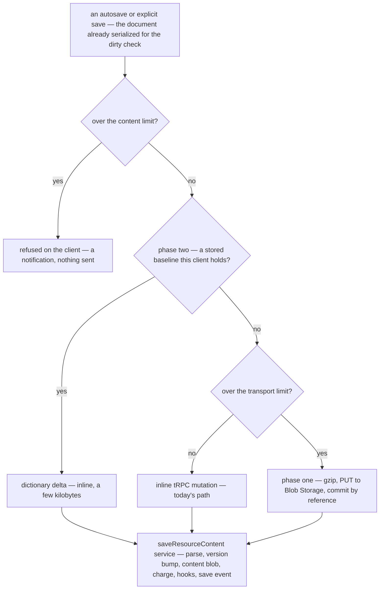

# Large Content Saves

A resource's content can be no larger than one tRPC request body. That is a stated rule, not an accident: `MAX_RESOURCE_CONTENT_LENGTH` is defined as `MAX_REQUEST_SIZE`, because every content write is one request carrying the whole document. So a Sheet imported from a multi-megabyte CSV loads fine, since the import is parsed in the browser, but its first autosave can never land.

What the owner then sees is worse than a refusal. `nuxt-security`'s request size limiter is wired to `MAX_REQUEST_SIZE` in `configuration/security.ts`, and it answers an oversized POST with a 413 **before it reads the body**. The browser is still uploading the rest when the socket closes, so the request fails as `ERR_CONNECTION_RESET`, with no status code, no message, and a save-failed marker that never clears.

This proposal separates the two limits that are currently one constant:

- **The transport limit** — how much one tRPC body may carry. It stays `MAX_REQUEST_SIZE`, and it keeps protecting every route.
- **The content limit** — how large a document a resource may be. It becomes its own constant, no longer tied to any request or file limit. `MAX_FILE_REQUEST_SIZE` is not involved: it bounds attachments, which are a different thing.

Neither number is chosen here. The transport limit becomes the security module's documented default, and the content limit takes the reference product's published ceiling for a spreadsheet. Each is cited beside its constant, as [staged content saves](/docs/proposals/resource/large-content-saves/staged-saves) sets out, along with the one server-memory measurement that could lower the second.

## Scope

The work is two phases, each a self-contained spec:

- [Staged content saves](/docs/proposals/resource/large-content-saves/staged-saves) — **the fix.** A save under the transport limit goes inline exactly as today. A larger one is gzipped in the browser, uploaded straight to Blob Storage through a reserved SAS (a shared access signature: a signed, short-lived write URL), and committed by a small tRPC call that names it. A save over the content limit is refused on the client, before anything is sent. It covers every resource type at once, because the one server door every save goes through does not change.
- [Delta content saves](/docs/proposals/resource/large-content-saves/delta-saves) — **the optimisation, gated on the fix and on a measurement.** The client compresses the new document with the last stored one as the zstd dictionary: the same trick the [resource version store](/docs/resource/resource-version-store) already plays on stored versions, moved onto the wire. A near-identical document then crosses as a few kilobytes, whatever its size.

## Why this shape

The decision rests on three facts from the code as it stands:

- **Streaming the body through tRPC buys nothing.** `saveResourceContent` parses the whole document with the type's content schema before anything else happens, so the server holds all of it in memory however the bytes arrived ([streamed tRPC content saves](/docs/resource/rejected/streamed-trpc-content-saves)).
- **The version store deltas only what it stores.** `keyframe-store` is handed whole documents on the server and runs on `node:zlib`. It never touches the wire, so the client still sends everything on every save. Phase two is what makes the wire proportional to the edit.
- **The upload plumbing already exists.** Reserved SAS minting (`generateReservedUploadFileSasEntities`), block upload (`uploadFileToSas` over `uploadBlocks`), quota holds and ledger releases are all in place for file assets. Phase one points them at one more blob name per resource and adds no Azure resource.

The alternatives each fail a test that this design passes. Raising the limit keeps the server in the data path and loosens every route ([raised request body limit](/docs/resource/rejected/raised-request-body-limit)). A generic JSON Patch is generic only in its format ([JSON Patch content saves](/docs/resource/rejected/json-patch-content-saves)). An op log or a CRDT is the collaboration machinery that [resource collaboration](/docs/resource/deferred/document-collaboration) defers and [offline editing](/docs/resource/rejected/offline-editing) rejects.

## When this ships

The phases rewrite into the as-built pages that own each surface, and this folder is deleted:

- [File uploads](/docs/architecture/file-uploads) gains the content path beside the attachment path, since both are the same SAS flow with a different commit.
- [Storage quotas](/docs/resource/storage-quotas) gains the staging blob: reserved like any upload, released by the commit.
- [Resource save state](/docs/resource/resource-save-state) gains the too-large refusal.
- [Sheet resource](/docs/resource/sheet-resource) states the content limit an import is checked against.
- The `trpc` skill gains one rule: a body that can outgrow `MAX_REQUEST_SIZE` is committed by reference, never carried under a raised limit.

## Sources

- [Valet Key pattern](https://learn.microsoft.com/en-us/azure/architecture/patterns/valet-key) (Microsoft Azure Architecture Center) — a scoped, short-lived token lets the client write straight to storage and takes the transfer off the application. The page also says a key cannot bound the size written, so the application checks the size after the upload, which phase one does on the commit.
- [Claim-Check pattern](https://learn.microsoft.com/en-us/azure/architecture/patterns/claim-check) (Microsoft Azure Architecture Center) — the large payload goes to a store and the small message carries a reference to it. The page asks for a content hash on the reference, a named owner of payload deletion, and a conditional choice between inline and external. Phase one takes all three.
- [Behind the feature: the hidden challenges of autosave](https://www.figma.com/blog/behind-the-feature-autosave/) (Figma) — serializing a whole large file on every save stalls the editor, and Figma persists only the changes since the last save. That is the direction phase two takes, without per-type change tracking.
