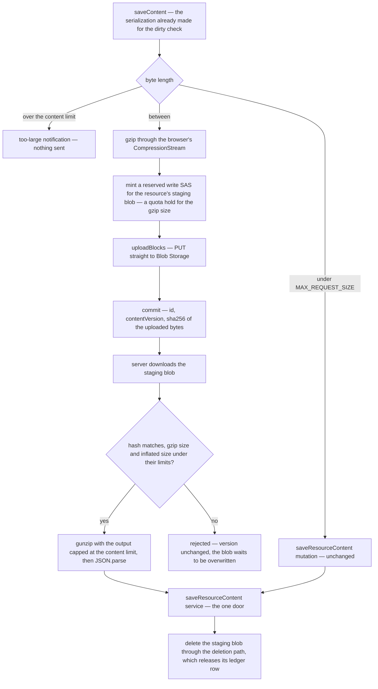

# Staged Content Saves

Every save today is one tRPC mutation carrying the whole document. This phase keeps that path for every save that fits in one body, which is nearly every save of nearly every resource type, and adds a second transport for the ones that do not. Both transports end at the same server door, so everything downstream stays as it is: the version bump, the content blob, the storage charge, the after-save hooks and the save event.

## How it works

The resource store already serializes the document for its dirty check (`saveContent` in `app/store/resource/index.ts`), so the size is known before anything is sent. The byte length of that serialization chooses the transport:

| Serialized size                              | Transport                                                               |
| -------------------------------------------- | ----------------------------------------------------------------------- |
| under `MAX_REQUEST_SIZE`                     | inline — the existing `saveResourceContent` mutation, unchanged         |
| from `MAX_REQUEST_SIZE` to the content limit | staged — gzip, PUT to Blob Storage, commit by reference                 |
| over the content limit                       | refused on the client with a too-large notification; no request is sent |



### The client side

- **Compression is native.** The browser's `CompressionStream` gzips the serialization with no dependency. JSON of tabular data is highly repetitive and usually shrinks several-fold, so the upload is a fraction of the document.
- **The upload reuses the file-asset path.** The gzip bytes become a `Blob` handed to `uploadFileToSas`, with `getSingleFileSasEntities` adapting the one SAS URL. `uploadBlocks` already splits the PUT into blocks, and its progress callback can drive the save-state indicator.
- **The commit carries the hash.** It is the SHA-256 of the exact bytes uploaded, computed with `crypto.subtle` before the PUT. The claim-check pattern asks for this, and here it also settles the race described under the staging blob below.
- **The staged save is one unit of the save queue.** Saves of one resource already run single-flight under the resource id (`executeSaveContentMutation`), so the SAS request, the PUT and the commit run inside that one queued call. A second save issued meanwhile waits, and carries the `contentVersion` the first one wrote back, exactly as an inline save does today.

### The server side

Two procedures join `createResourceProcedures`, each an owner procedure with its own input schema file under `shared/models/db/resource/`:

- **A SAS query** mints the write target through `generateReservedUploadFileSasEntities`, the upload chokepoint, so the hold is taken against the owner's quota with the gzip size as the declared size. It takes no file name from the client: the blob name is fixed per resource.
- **A commit mutation** takes the resource id, the `contentVersion` and the hash. It downloads the staging blob and checks, in order:
  1. The hash matches.
  2. The downloaded size is under the gzip ceiling.
  3. Gunzip with `maxOutputLength` set to the content limit, so an archive that inflates past the ceiling stops at it rather than filling the heap.

  It then parses the JSON and calls the `saveResourceContent` service with the same version check the inline mutation uses. That check is today a closure written inline in the inline mutation. It is extracted once and shared by both mutations, never copied.

Because the server reads the bytes it commits, this path closes the gap [file uploads](/docs/architecture/file-uploads) describes for attachments. There, a SAS carries no length constraint and the declared size bounds only an honest client. Here, the commit measures the real bytes, and content over the limit never becomes a resource's document.

### The staging blob

The staging blob's name is **fixed per resource**, as a sibling of the content blob under the resource's `{id}/` directory. A fixed name is what lets the design need no cleanup machinery:

- **An abandoned upload leaves at most one orphan per resource.** The next large save overwrites it, and purge takes it with the rest of `{id}/`. There is no lifecycle rule, no sweep, and no scheduled job. A lifecycle rule would have been worse than unnecessary: nothing in the repo consumes `BlobDeleted`, so a blob the platform deleted would keep its ledger charge forever ([storage quotas](/docs/resource/storage-quotas)).
- **A successful commit deletes it through the deletion path** (`deleteStorageBlobs`), which releases its ledger row in the same operation, so a committed save charges the owner for the content blob alone.
- **Two devices saving the same large resource share the name.** The hash settles it: a commit whose hash does not match what it downloads was overwritten by the other device, and it is rejected. The rejected client's next save carries a stale `contentVersion` and meets the existing stale-content flow, which is the same outcome two devices meet on the inline path today.

A reserve over a name whose ledger row is already settled is the one ledger behaviour this depends on. Implementation starts by confirming what `reserveStorageBytes` does there. If it inserts rather than upserts, making it take the existing row over is part of this phase.

### The limits, and where their numbers come from

Neither number is ours to invent. Each is taken from a published source and cited beside its constant, so it changes only when that source does:

- **The transport limit is the security module's documented default.** `nuxt-security` documents `maxRequestSizeInBytes` as 2,000,000 bytes, following OWASP's advice to bound request size. Today `MAX_REQUEST_SIZE` is a near-miss of that value, written as a power-of-two megabyte. It becomes the documented figure, cited, and the inline/staged threshold reads the same constant, so the client can never choose a transport the server's limiter would refuse. The host adds no limit of its own: Railway, which serves the app, sets no request body size, only a five-minute window for a body to finish uploading, which a staged save never uses because its bytes go to Blob Storage.
- **The content limit is the reference product's ceiling.** Google Sheets caps a spreadsheet at 100 MB, whether created in it or converted into it, and the ux skill follows the reference product where the domain matches. The Sheet is the resource type that reaches this size, so its reference product sets the one generic ceiling. It lives as a new constant in `shared/services/resource/constants.ts`, with its source cited in the comment above it.
- **One check comes before shipping.** At the ceiling, a save holds the raw string, the parsed object and the content schema's parsed copy at once, and several saves can be in flight. Implementation measures the heap cost of one save at the ceiling against the memory of the Railway service. If the service cannot hold that, the constant is set to what it can hold, and the comment above it names the measurement that set it instead of Google's figure. Either way the number has a stated source.

`MAX_RESOURCE_CONTENT_LENGTH` — the cap every content schema's free-form strings and lists take — is re-derived from the content limit instead of from `MAX_REQUEST_SIZE`, and the comment above it, which says a content write is one request, is rewritten to say what the ceiling is for. `MAX_FILE_REQUEST_SIZE` bounds attachments and is out of scope.

The content limit's client-side check is what makes the reset unreachable from our own client.

### Reading a large document back

`readResourceContent` returns the whole document in a tRPC response. Responses pass no size limiter, so a large document reads back today without change. Moving the read onto a SAS as well is a follow-up only if measurement shows the round trip through the server hurting at the content limit.

## Failure and retry

| Failure                                   | Outcome                                                                                                       |
| ----------------------------------------- | ------------------------------------------------------------------------------------------------------------- |
| SAS refused — the owner is out of storage | the save fails with the quota message, as any upload does; nothing was written                                |
| PUT fails partway                         | the save fails; the hold expires on its own; any partial blob is overwritten by the next large save           |
| Commit rejected on hash or size           | version unchanged; the save-failed state shows, and a retry re-stages from the current document               |
| Commit loses the version check            | the stale-content flow, identical to an inline save's                                                         |
| Commit succeeds, staging delete fails     | the save stands; the blob and its charge remain until the next large save or purge, and the failure is logged |

## Key files

| File                                                                        | Role after the change                                                             |
| --------------------------------------------------------------------------- | --------------------------------------------------------------------------------- |
| `apps/web/app/store/resource/index.ts`                                      | `saveContent` chooses the transport by the serialization's byte length            |
| `apps/web/server/trpc/procedure/resource/createResourceProcedures.ts`       | gains the SAS query and the commit; the version check is shared by both mutations |
| `apps/web/server/services/resource/saveResourceContent.ts`                  | unchanged — the door both transports reach                                        |
| `apps/web/server/services/storage/generateReservedUploadFileSasEntities.ts` | mints and reserves the staging write target                                       |
| `apps/web/server/services/storage/reserveStorageBytes.ts`                   | takes a reserve over the staging name's settled row                               |
| `apps/web/app/services/file/uploadFileToSas.ts`                             | uploads the gzip bytes                                                            |
| `apps/web/shared/services/resource/constants.ts`                            | holds the content limit; `MAX_RESOURCE_CONTENT_LENGTH` derives from it            |

New files, following the one-export-per-file layout:

```text
apps/web/shared/models/db/resource/
  GenerateUploadContentSasEntityInput.ts
  SaveStagedResourceContentInput.ts
apps/web/shared/services/resource/
  getStagingContentBlobName.ts
```

## Verification

- **Router tests** over the mocks: a staged commit with a matching hash writes the content blob, bumps `contentVersion`, deletes the staging blob and releases its ledger row. A hash mismatch, a gzip over its ceiling and an inflation past the content limit each reject with the version unchanged.
- **Store test**: a serialization under `MAX_REQUEST_SIZE` calls the inline mutation, one above it takes the staged path, and one over the content limit notifies and sends nothing.
- **By hand**: import a CSV of several megabytes into a Sheet under `pnpm dev`. The autosave lands, and the storage meter moves by one content blob, not two.

## Sources

- [Request Size Limiter](https://nuxt-security.vercel.app/middleware/request-size-limiter) (nuxt-security) — the documented 2,000,000-byte default for a request body, which becomes `MAX_REQUEST_SIZE`, and the limiter this path must never trip.
- [Public networking specs and limits](https://docs.railway.com/networking/public-networking/specs-and-limits) (Railway) — the host sets no body size limit, only a five-minute window for a body to finish uploading, so the security module's default is the only transport limit in the request path.
- [Size limits in Google Drive](https://support.google.com/drive/answer/37603) (Google) — a spreadsheet up to 100 MB, the reference product's ceiling the content limit takes.
- [Valet Key pattern](https://learn.microsoft.com/en-us/azure/architecture/patterns/valet-key) (Microsoft Azure Architecture Center) — the key cannot bound the size written, so the application checks the size once the upload completes, which is what the commit's size checks do.
- [Claim-Check pattern](https://learn.microsoft.com/en-us/azure/architecture/patterns/claim-check) (Microsoft Azure Architecture Center) — the content hash on the reference, the named owner of payload deletion (the commit), and the per-message choice between inline and external.
