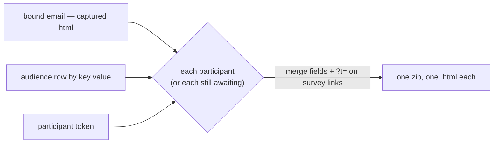

# Program Email Invites

A [Program](/docs/resource/program-resource) binds an audience, an email and a survey, and generating participants downloads a file of each participant's tokened survey link for another mailer's merge. The email binding does nothing: `ProgramResource.emailId` is picked on the Setup blade and read nowhere. The email that was written to invite these participants — with a [survey invite button](/docs/resource/webpage-survey-invite-blocks) pointing at the bound survey, and [merge fields](/docs/resource/email-personalization) from its own dataset — is exported on its own, where its survey button carries no token and so opens an Identified survey the respondent cannot answer.

Qualtrics sends a survey invitation to a contact list with each contact's personal link placed into the message, and a reminder to the contacts who have not finished.

## What it adds

- **Export invites** on the Status blade, beside Generate participants. It reads the bound email's content — its compiled `html`, which every email save captures ([email web view](/docs/resource/email-web-view)), so no editor is mounted — the audience dataset, and the participants, and downloads one zip of one `.html` per participant, named after their key value:
  - every `{{column}}` token is filled from that participant's audience row through `substituteMergeFields`, so the email's merge fields work when the email binds the same audience;
  - every link to the bound survey's view (`RoutePath.View(Survey, surveyId)`) gains that participant's `?t=` token, so the invite button the email already has becomes their personal link. An email with no such link is refused before anything is read, saying the invite has no link to the survey.
- **Export reminders** beside it: the same export over the participants whose status is Awaiting.
- **Both need the three bindings and generated participants**, and say which is missing rather than exporting an empty zip.
- **The zip core is shared.** `exportPersonalizedHtml` takes the compiled html and one substitution per file rather than the live editor, so the Email type's own personalized export and this one are one writer.

## What is deliberately not in it

- **No send.** Delivery stays outside the platform until [email sending](/docs/resource/deferred/email-sending) un-defers, which is when the program becomes the unit a send runs over; these files are what that send will deliver.
- **No tracking of opens or clicks.** Responded is the one status that joins back, through the token.

## Key files

| File                                                                | Role after the change                                         |
| ------------------------------------------------------------------- | ------------------------------------------------------------- |
| `apps/web/app/components/Resource/Program/Status.vue`               | Export invites and Export reminders                           |
| `apps/web/app/services/emailEditor/exportPersonalizedHtml.ts`       | the zip core over compiled html, shared with the Email export |
| `apps/web/app/services/emailEditor/substituteMergeFields.ts`        | fills each participant's audience row                         |
| `apps/web/app/composables/emailEditor/useExportPersonalizedHtml.ts` | passes the email's own compiled html                          |
| `apps/web/shared/models/resource/program/ProgramResource.ts`        | the `emailId` binding the export reads                        |

## Sources

- [Qualtrics — Personal links](https://www.qualtrics.com/support/survey-platform/distributions-module/email-distribution/personal-links/) — a personal link per contact, placed into an invitation by a mail merge.
- [Qualtrics — Distributions basic overview](https://www.qualtrics.com/support/survey-platform/distributions-module/distributions-overview/) — invitations and reminders as distributions of one survey to a contact list.
