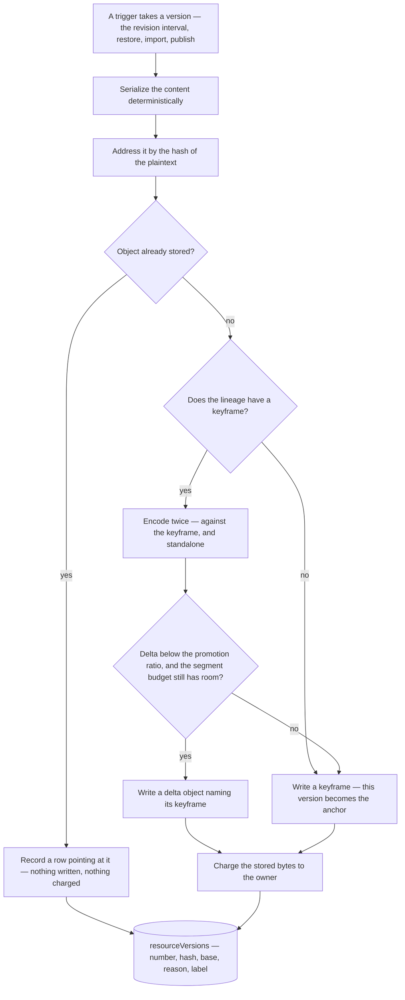

# Resource Version Store

A retained version of a resource is a full copy of its content blob. The revision ring buffer keeps a fixed cap in the tens of them, and the published channel prunes nothing, so a resource can occupy more than twenty times the size of the document it holds — and every one of those copies is charged to the owner through the ledger ([storage quotas](/docs/resource/storage-quotas)).

That is the mechanism working as designed ([resource snapshots](/docs/resource/resource-snapshots)), and it is still wrong in two ways. The **cost** is wrong: successive versions of one document differ only by the edit between them, so storing them as independent copies pays for the overwhelming majority that did not change. The **explanation** is wrong: an owner editing one resource watches a bar labelled as their resources' usage climb while, as far as they can tell, nothing got bigger. Neither is fixable by tuning the retention cap, which only trades recovery depth for storage.

This proposal keeps every trigger, channel and retention rule exactly as they are, and changes what a version _is_ on disk: a content address plus, usually, a few hundred bytes of difference against a nearby full copy.

## The decision

**Store versions as content-addressed objects that are either keyframes or deltas.** Serialize deterministically, address by the hash of the plaintext, and encode each version either as a self-contained compressed object — a keyframe — or as a compression delta against a keyframe, whichever the encoder finds cheaper by a stated margin. Reconstructing any version costs at most two object reads and two decompressions — the keyframe, whose plaintext is the dictionary, and then the delta against it — with no chain to walk and no version depending on the one written before it.

The compressor is zstd from `node:zlib`, given a previous version as its dictionary. That is a delta with none of the ceremony: no diff format, no per-type structural knowledge, no schema coupling. It behaves identically for a Sheet's tabular JSON, a ProseMirror document and a GrapesJS project, and it preserves a field a newer schema stopped declaring, because it never parses anything.

### Why not a CRDT

A conflict-free replicated data type earns its cost by capturing **intent** from an editor that emits operations. Two resource types have such an editor — Note is ProseMirror, and Sheet already models its edits as command objects. Every other type hands the store a complete new document, because SurveyJS, GrapesJS, the vjsf forms and the dashboard grid all serialize wholesale. For those, adopting a CRDT means reconstructing operations the editor already discarded, and paying tombstone growth and a per-type data model to do it.

A delta already captures the edit optimally for a document handed over whole. The CRDT question is a **collaboration** question, and it is answered elsewhere: concurrent editing is deferred with the rest of multi-user access ([resource collaboration](/docs/resource/deferred/document-collaboration)), and queued divergent writes are rejected outright ([offline editing](/docs/resource/rejected/offline-editing)). Adopting the machinery here would pay that price without buying either feature. If co-editing is ever built it lands on the working copy, and leaves this store untouched.

## How a version is written

The gate that matters is the promotion ratio. A version whose delta is not meaningfully smaller than its own standalone compression has drifted too far from the anchor to be worth anchoring, so it becomes the next anchor. That holds reads at two objects forever and bounds how far a delta can sit from the content it reconstructs, without a fixed keyframe interval that would be wrong for both slowly-edited and wholesale-rewritten documents.

The ratio alone bounds one delta rather than a segment, and a long run of cheap edits accumulates as many of them as it likes under one keyframe. So the same gate carries a **segment budget**: the bytes already anchored to the current keyframe are part of the decision, and a delta that would push them past the budget promotes instead of being written ([store design](/docs/proposals/resource/resource-version-store/store-design)). Storage is then bounded by the two rules together, whatever the edit pattern does.

## What it costs, measured

A synthetic Sheet — twelve string columns, a working session of twenty versions, thirty cell edits between each — encoded at the parameters [store design](/docs/proposals/resource/resource-version-store/store-design) settles on:

| Document | Twenty versions today | Twenty versions stored | Worst encode |
| -------- | --------------------- | ---------------------- | ------------ |
| 57 KB    | 1.2 MB                | 47 KB                  | 13 ms        |
| 602 KB   | 12.3 MB               | 108 KB                 | 8 ms         |
| 6.3 MB   | 128.4 MB              | 537 KB                 | 62 ms        |

Two orders of magnitude, and the ratio grows with document size because a large document's edits are no larger than a small one's. The single-edit case is starker still: one cell changed in a 602 KB sheet encodes to about a hundred bytes.

These are one-off measurements over a fixed synthetic corpus, recorded to justify the design rather than to be maintained. The committed benchmark and the stored-size snapshot described in [the package](/docs/proposals/resource/resource-version-store/package) are what keep them honest afterwards.

## What this fixes for the owner

Charging the stored bytes rather than a copy of the document makes the meter say something true and intuitive: editing one cell costs about a hundred bytes, and the number stops moving in ways the owner cannot account for. No billing exemption is needed, and version history stays a feature the owner pays for and can reason about, rather than one hidden from the ledger to keep it explicable.

## Scope

**Today** a version is a blob at a snapshot path, its reason and label ride as blob metadata, the history listing walks the blob prefix, eviction publishes a deletion event, and the ledger charges every copy in full.

**This adds** a workspace package holding the store, a `resourceVersions` table, and the reconstruction path. It **removes** snapshot blob naming, snapshot blob metadata, and the prefix walk behind the history listing — a version's identity moves into a row, so listing becomes a query. Eviction keeps the deletion event it already publishes, and stops guessing: it hands that path the exact set of objects nothing references instead of a version number computed a fixed distance behind the newest.

**It does not change** which triggers take a version, the ring-buffer cap, the published channel's no-pruning rule, the restore flow the owner sees, or where the working copy lives. The working copy stays a plain blob, so opening a resource is one read exactly as it is now.

Migration is out of scope: existing snapshots are discarded rather than converted.

## The pages

- [store design](/docs/proposals/resource/resource-version-store/store-design) — the object format, the promotion policy, reconstruction, garbage collection, complexity and failure modes.
- [package](/docs/proposals/resource/resource-version-store/package) — the workspace package that holds it, its API, and its test and benchmark plan.
- [integration](/docs/proposals/resource/resource-version-store/integration) — the schema, the app changes, the charging path, and what is deleted.
- [content-addressed assets](/docs/proposals/resource/resource-version-store/content-addressed-assets) — the second phase the same substrate unlocks, which retires publish-time asset cloning.

## Key files

| File                                                                       | Role                                                                   |
| -------------------------------------------------------------------------- | ---------------------------------------------------------------------- |
| `apps/web/server/services/resource/snapshot/takeResourceRevision.ts`       | takes a revision and charges a full copy — becomes a store write       |
| `apps/web/server/services/resource/snapshot/getSnapshotContentBlobName.ts` | the snapshot blob path — deleted, a version is addressed by its hash   |
| `apps/web/server/services/resource/snapshot/getSnapshotMetadata.ts`        | reason and label as blob metadata — deleted, both become columns       |
| `apps/web/server/services/resource/snapshot/readSnapshotHistory.ts`        | the prefix walk behind the history listing — becomes a query           |
| `apps/web/server/services/resource/saveResourceContent.ts`                 | the one content write, and where the idle-window trigger fires         |
| `packages/db/src/services/storage/chargeStorageLedgerEntry.ts`             | the charge a version pays, now for stored bytes rather than for a copy |
| `packages/db-schema/src/schema/resources.ts`                               | holds `revisionVersion`, the counter a version row is numbered by      |
