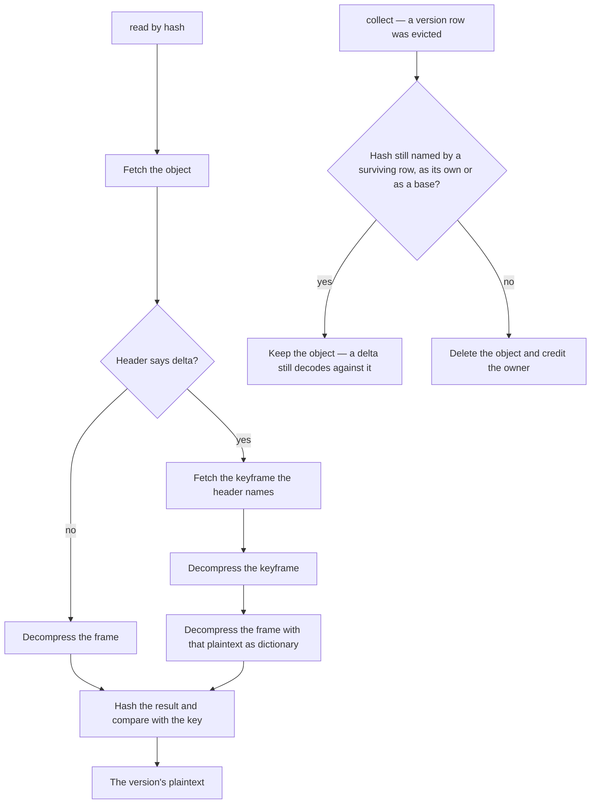

# Store Design

The store holds immutable objects addressed by the hash of their plaintext. An object is either a **keyframe**, compressed on its own, or a **delta**, compressed against exactly one keyframe. Nothing else exists: there are no chains, no generations and no rewriting, so an object once written is never touched again until it is collected.

## The determinism contract

The store takes bytes and returns bytes. It never parses, never serializes, and never sees a schema. That is what makes one implementation correct for every resource type, and it puts one obligation on the caller: **the same content must serialize to the same bytes**, or the address changes and deduplication silently stops working. `JSON.stringify` over a Zod-parsed value satisfies this, because Zod builds its output by iterating the schema's own key order rather than the input's ([serialization](/docs/architecture/serialization)).

The obligation is the caller's rather than the store's on purpose. A store that serialized would have to know every content type, and would re-serialize a field a newer schema stopped declaring straight out of the archive that exists to recover it.

## The object format

An object is a small header followed by a zstd frame:

```text
magic      4 bytes   identifies the format
version    1 byte    the framing version, so a future encoder is recognisable rather than misread
flags      1 byte    keyframe or delta
windowLog  1 byte    the window the encoder used
reserved   1 byte
baseHash  32 bytes   the keyframe this delta decodes against; absent on a keyframe
payload    n bytes   the zstd frame
```

The header carries two things the reader cannot otherwise know. The **base hash** makes an object self-describing, so reconstruction needs nothing but the object itself — a row that has drifted from the object it names cannot produce a wrong answer, only a missing one. The **window log** is required because zstd refuses a frame whose window exceeds the decompressor's declared maximum, and the encoder picks that window per input; storing it means a decoder never has to guess high and never fails on a frame that was legal when written.

## Addressing and deduplication

The key is the hex SHA-256 of the plaintext. SHA-256 is hardware-accelerated on every platform this runs on and is in `node:crypto`, so the whole store carries no cryptographic dependency; measured, it costs low single-digit milliseconds on a multi-megabyte document, which is noise beside the compression beside it.

Keying on the plaintext rather than on the stored bytes is what makes deduplication exact: two versions with identical content resolve to one object regardless of which keyframe either would have been encoded against. It also makes the store **write-once** — an existing key is never overwritten, so a second writer of the same content records a row and writes nothing. A version that repeats content the store already holds is therefore free, in bytes and in charge.

## Writing a version

The lineage — one resource's history — supplies two things about its current anchor: the hash, and the delta bytes already anchored to it. Writing plaintext against that anchor is:

1. Hash the plaintext. If the object exists, record the row and stop; nothing is written and nothing is charged.
2. Compress standalone.
3. With no anchor yet, write the standalone form as a keyframe. This version becomes the anchor.
4. Otherwise read and decode the anchor, and compress the plaintext again with the anchor's plaintext as the dictionary.
5. If the delta is at or below the promotion ratio of the standalone size **and** the bytes already anchored plus this delta stay within the segment budget, write the delta. Otherwise write the standalone form as a keyframe, and this version becomes the new anchor.

The **promotion ratio** is the drift knob, and one third of the standalone size is the proposed default. A version whose difference from the anchor no longer compresses to meaningfully less than the version itself has drifted far enough that anchoring it buys little and costs a second read forever; making it the next anchor restores the margin for everything after it. Because promotion is driven by measured drift rather than by a counted interval, a document edited in small steps keeps one anchor for a long run, and a document rewritten wholesale promotes immediately — both without configuration.

The **segment budget** is the storage knob, and the keyframe's own compressed size is the proposed default. The ratio bounds each delta against its own standalone size, which says nothing about how many of them a segment holds: a run of small edits satisfies it indefinitely, so segment storage would grow with version count and the storage guarantee below would be false. Budgeting the accumulated bytes instead of counting deltas is what keeps the bound in bytes — a length limit would cap the count while a hundred near-ratio deltas still cost a hundred times what the count suggests. The total is derived from the rows rather than stored, exactly as the anchor is ([integration](/docs/proposals/resource/resource-version-store/integration)), so the budget adds a summed column to a read the write path already makes and no state that can disagree with the rows.

Step 4 is the only read on the write path. It is avoidable within a process by caching anchor plaintexts by hash, which is safe precisely because objects are immutable: a cache keyed by content address can never be stale, only absent. Correctness never depends on it, so a multi-instance server needs no coordination.

## Reading a version



The depth is fixed at two by construction, so reconstruction is constant in the number of versions and linear only in the size of the document. The verification step is cheap — the hash is already computed on every write path — and it converts the one failure this format can suffer, a truncated or mismatched object, into a detectable error rather than a plausible-looking wrong document.

## Garbage collection

An object survives while any version row names it, **either as its own hash or as its base**. Both are columns on the row, so retention is a single indexed query and never an object read: collection takes the hashes an eviction released, subtracts those still named by a surviving row in either column, and deletes the remainder.

Denormalising the base hash onto the row is what makes this true. Without it, deciding whether a keyframe is still needed would mean reading every surviving delta's header, which is a walk of the whole lineage on every eviction.

Because the promotion policy anchors deltas to a keyframe that is itself a version, an anchor is only collectable once its own row and every delta anchored to it are gone. A ring buffer therefore sheds its oldest segment whole, which is the behaviour that keeps a bounded window bounded.

## Complexity

Sizes below are of the document; `k` is the number of versions an eviction releases. Object round trips are what dominate, so they are counted separately from CPU.

| Operation               | Object reads | Object writes | CPU                            |
| ----------------------- | ------------ | ------------- | ------------------------------ |
| Read the working copy   | 1            | 0             | one decompression              |
| Read a keyframe version | 1            | 0             | one decompression              |
| Read a delta version    | 2            | 0             | two decompressions             |
| Write, content repeated | 1            | 0             | one hash                       |
| Write a delta           | 2            | 1             | one hash, two compressions     |
| Write, promoting        | 2            | 1             | one hash, two compressions     |
| Evict and collect       | 0            | 0             | two indexed queries, k deletes |

Nothing here scales with history depth. Storage per anchored segment is the keyframe plus the deltas anchored to it, and the segment budget caps that sum directly — so a segment costs at most one compressed copy plus the budget, whatever happens inside it. The promotion ratio does not carry that bound on its own: it is a per-delta test, and a long enough run of edits that pass it would otherwise grow the segment with the version count.

## Compression parameters

The defaults are measured rather than inherited, over the synthetic corpus described in [the proposal](/docs/proposals/resource/resource-version-store):

**Level 12.** Level 19 buys a marginally smaller delta for an unacceptable encode: on a multi-megabyte document it ran into whole seconds, against tens of milliseconds at level 12, on a path a user is waiting behind. Below level 12 the ratio degrades sharply and non-monotonically — level 9 produced a larger delta than level 3 on one input — because the lower levels give up on long-range matches that are exactly what a near-duplicate document is made of.

**A window derived from the input.** The window must span the dictionary and the input together or the encoder cannot match across them, and the failure is silent and severe: at a fixed small window a multi-megabyte document encoded to hundreds of kilobytes where a window large enough for both produced a few. The window is therefore computed per write from the combined size and clamped into a sane range, and recorded in the header so the decoder can admit the frame.

Both are defaults rather than constants in the algorithm — the store takes them as options, so a benchmark can sweep them without editing the implementation.

## Failure modes

**A missing keyframe** makes its deltas unreadable, which is the one way this format can lose more than one version at a time. Two things prevent it. Collection never deletes an object still named as a base, which is enforced by query rather than by ordering. And a keyframe is written before any delta that names it, so no row can reference a base that was never durable.

**A write that lands without its row** leaves an orphan object: bytes stored, nothing pointing at them, nobody charged. It is self-healing rather than swept — the next write of the same content finds the object already there and adopts it, and nothing else can ever address it. This is deliberate: a periodic sweep to reclaim orphans would be the scheduled job the architecture avoids ([no manual recovery](/docs/architecture/no-manual-recovery)), and the failure it would clean up costs storage we never billed.

**A row that lands without its object** cannot happen: the object is written first, and the row is what makes a version visible. A trigger that fails between the two leaves no version, which is the correct outcome for a version that was never stored.

**A corrupted or truncated object** is caught by the verification on read, so it surfaces as a failed reconstruction of one version rather than as a document that looks right and is not.
