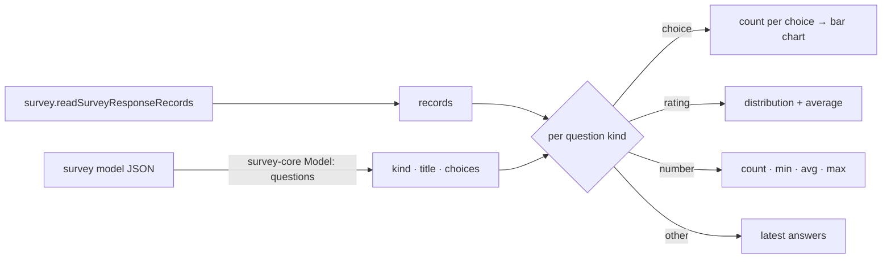

# Survey Response Summary

The Responses blade is a table of raw responses, one column per question, with a detail dialog and delete ([survey response management](/docs/resource/survey-response-management)). Seeing what the responses _say_ — how many picked each option, the average rating — means creating a Dashboard, binding a visual to the survey's dataset and choosing an aggregation per question ([dashboard data binding](/docs/resource/dashboard-data-binding)). Google Forms answers that on the response page itself: a **Summary** tab of one chart per question, shown as soon as there is one response, beside the Individual view.

## What it adds

The Responses blade gains a `UiTabs` pair, **Summary** and **Individual**. Individual is today's table and detail dialog, unchanged. Summary is a column of cards, one per question in the survey's own order, each drawn by what kind of question it is:

| Question kind (SurveyJS)                | Card                                                                             |
| --------------------------------------- | -------------------------------------------------------------------------------- |
| `radiogroup`, `dropdown`, `boolean`     | bar chart of count per choice, with percentages                                  |
| `checkbox`, `tagbox`                    | bar chart of count per choice; percentages of respondents, so they can pass 100% |
| `rating`                                | bar chart per rating value, and the average                                      |
| `text` with a numeric input type        | count, minimum, average, maximum                                                 |
| `text`, `comment`, and every other kind | the latest answers as a list, with a link to the Individual tab                  |

Each card's heading is the question title and "_n_ responses" (answered, not submitted, so a skipped optional question reads honestly).

- **No new read.** The summary is computed on the client from the records `survey.readSurveyResponseRecords` already returns, and the question list — kinds, titles and choice labels — comes from parsing the survey's model with `survey-core`'s `Model`, which the respondent page already loads. Choice values are shown by their labels, not their stored values.
- **Charts are the dashboard's engine.** The bars render through ApexCharts, which the Dashboard already ships, with the same theme options; no chart dependency is added.
- **The row cap applies as everywhere.** A survey past the dataset row cap shows the "showing _n_ of _m_" warning above the summary ([dataset row-cap warning](/docs/resource/dataset-row-cap-warning)), since the summary is computed from what was read.
- **Empty** — before the first response, the tab is the existing empty state with the share link.

## What is deliberately not in it

- **Not SurveyJS Dashboard.** It is SurveyJS's proprietary analytics component, licensed per developer; the four card kinds above cover what Google Forms' summary shows with code we already own.
- **No cross-filtering** ("show only respondents who answered Yes"). That is the Dashboard's job, and the survey is already a dataset it binds to.
- **No per-question question view** (Google Forms' Question tab). The Individual table sorts and searches by column, which is the same lookup.

## Key files

| File                                                    | Role after the change                                    |
| ------------------------------------------------------- | -------------------------------------------------------- |
| `apps/web/app/components/Resource/Survey/Responses.vue` | the Summary and Individual tabs                          |
| `apps/web/app/components/Dashboard/Visual/Index.vue`    | the ApexCharts setup whose theme options the cards reuse |

## Sources

- [Google Forms Help — view and manage form responses](https://support.google.com/docs/answer/139706) — the Summary tab of charts per question, shown once there is a response, beside the Individual tab.
- [SurveyJS licensing](https://surveyjs.io/licensing) — the Form Library is MIT while Dashboard is proprietary, which is why the summary is built on our own charts.
