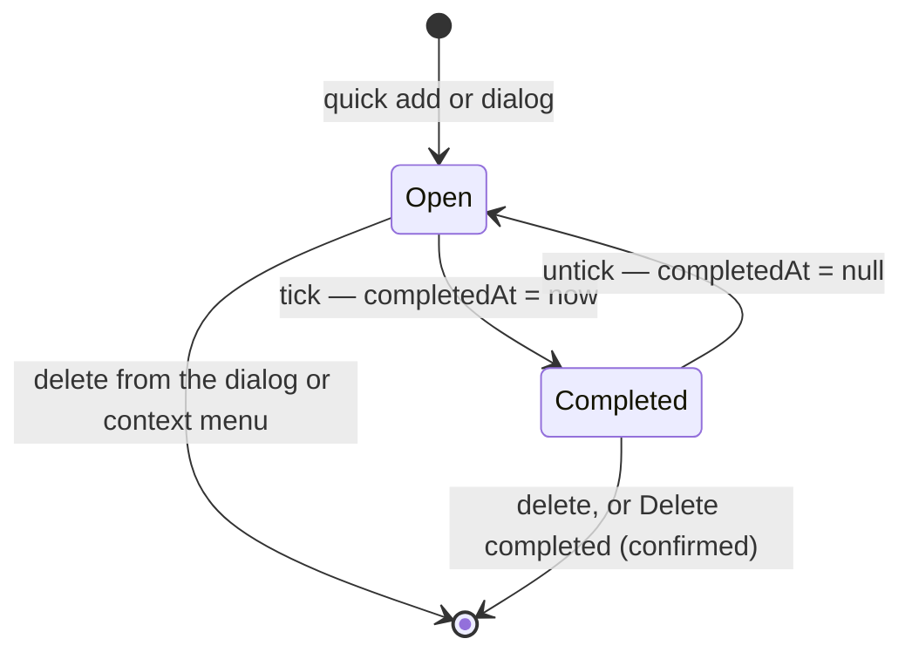

# Completion

The second sub-spec of [TodoList to a todo product](/docs/proposals/resource/todo-list). Today a TodoList item has no completion state, so finishing a todo means deleting it — the record that it was done is gone, and a slip of the delete loses a task that was never finished. [TodoList due reminders](/docs/resource/todolist-due-reminders) already names the gap: "a completion state, once it exists, becomes a third drop condition".

## How it works

`TodoListItem` gains `completedAt: Date | null`, null while open. One field carries both facts a completed row shows — that it is done, and when — so there is no `isCompleted` boolean to fall out of step with the date.

- **Ticking** the row's checkbox sets `completedAt` to now and saves through the store's one write path; ticking a completed row clears it. Both are one click with no confirmation, since each undoes the other (`ux` skill: an act the app can undo asks nothing).
- **The list splits in two.** Open items keep their order at the top. Completed items gather under a **Completed · n** heading at the foot, newest completion first, each with a struck-through title and a metadata line reading _Completed_ and the date through `NuxtTime`. The heading is a `UiCollapsible`, open by default as Microsoft To Do's is, so a tick never makes a task vanish from sight; whether it is collapsed is the viewer's convenience, kept per resource in `localStorage` and never in the content.
- **Deleting** stays where it lives today, in the task's detail dialog (`StyledEditFormDialog`'s remove), and joins the row's context menu. The Completed heading carries one overflow action, **Delete completed**, which confirms with the count in its answer ("Delete 12 tasks") because nothing in the list brings them back — the working copy's [version history](/docs/resource/resource-snapshots) can, but that is recovery, not undo.
- **The Calendar blade** keeps showing completed todos on their due date, drawn struck through, since the calendar answers "what was due when".

## The tick's motion

The animation says what happened and where the task went — the one job motion has in the [design sources](/docs/architecture/design-sources) (Apple's guidance: motion shows where something came from or went, and never decorates a frequent act):

1. **The check draws.** The circle fills with the accent and the check mark strokes in, an SVG path whose `stroke-dashoffset` runs to zero over `--ui-motion-short`.
2. **The title strikes through** over the same beat, left to right.
3. **The row leaves** after a short hold, so the reader sees the tick land before the row moves: it collapses its height in the open group and enters the Completed group, the rest of the list closing the gap with a FLIP move (`<TransitionGroup>`'s move class over `--ui-motion-medium`).

Every duration is a motion token, and the tokens are the one reader of `prefers-reduced-motion` (`--ui-motion-unit` goes to zero), so a reduced-motion reader gets the same state change with no travel. The hold is also the undo window for a mis-tick: unticking during it cancels the move.

## Reminders

A completed item is a third drop condition at both ends of the reminder pipeline. `scheduleTodoReminders` enqueues nothing for an item whose `completedAt` is set, and the fire-time check in `sendTodoReminderHandler` drops a reminder whose item is completed when it fires — which covers a todo completed after its reminder was enqueued, without cancelling the scheduled message, as the pipeline's fire-time-verification model already intends.

## What is deliberately not in it

- **No archive state** — the Completed section is where done things go; a third state is a second place for the same item ([rejected](/docs/resource/rejected/todo-archive-state)).
- **No completion sound.** Microsoft To Do plays one; the app has no sound layer outside the games, and one chime is not a reason to start one.
- **No auto-purge of old completions.** A list's completed items are the user's record; the resource-level recycle bin is the only timer.

## Key files

| File                                                                  | Role after the change                                                    |
| --------------------------------------------------------------------- | ------------------------------------------------------------------------ |
| `apps/web/shared/models/resource/todoList/TodoListItem.ts`            | gains `completedAt`                                                      |
| `apps/web/app/store/resource/todoList/index.ts`                       | gains a toggle through the one write path, unwinding the item on failure |
| `apps/web/app/components/Resource/TodoList/Items.vue`                 | the open group, the Completed group and the row motion                   |
| `apps/web/app/components/Resource/TodoList/Calendar.vue`              | draws completed events struck through                                    |
| `apps/web/server/services/resource/todoList/scheduleTodoReminders.ts` | skips completed items                                                    |
| `apps/functions/src/handlers/sendTodoReminderHandler.ts`              | drops a reminder whose item completed after it was enqueued              |

## Sources

- [Microsoft To Do — screen reader guide to tasks](https://support.microsoft.com/en-us/accessibility/todo/use-a-screen-reader-to-work-with-tasks-in-to-do) — completing by the checkbox, un-completing by ticking again, completed and open tasks both shown by default.
- [Todoist — view completed tasks](https://www.todoist.com/help/articles/view-completed-tasks-in-todoist-J19h2s) — restoring a completed task by unchecking it where it is listed, rather than from a separate archive.
- [Apple Human Interface Guidelines — motion](https://developer.apple.com/design/human-interface-guidelines/motion) — the tick's motion tells where the task went and stays brief on a frequent act.
