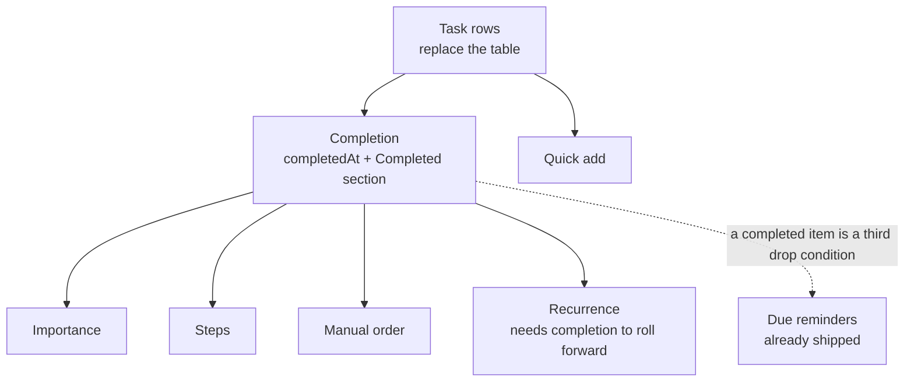

# TodoList to a Todo Product

The TodoList resource is a `UiDataTable` over `{ name, notes, dueAt, type }` items ([resource explorer](/docs/resource/explorer)), with a Calendar blade and due-date web push ([TodoList due reminders](/docs/resource/todolist-due-reminders)). It has no idea of _done_: the only way to finish a todo is to delete it, which throws away the record that it was done and is the opposite of what every todo product does. The table itself is a spreadsheet's shape — a type column whose enum has one member, a column rendering each item's rich-text notes in full, a sort header — where a todo list is a column of short rows you tick.

This proposal takes the reference product's core and nothing past it. [Microsoft To Do](https://to-do.office.com/) is the reference: its list page is a quick-add field over rows of a round checkbox, the title, one line of metadata and a star, with finished tasks gathered under a **Completed** heading at the bottom. Its smart lists (My Day, Important, Planned across every list), tags, categories, attachments and list sharing are left out — each is decided on its own page below.

## Scope

| Today                                                  | After                                                                                                                                                                                       |
| ------------------------------------------------------ | ------------------------------------------------------------------------------------------------------------------------------------------------------------------------------------------- |
| A data table with type, name, rendered notes, due date | Task rows: checkbox, title, a metadata line, a star ([task rows](/docs/proposals/resource/todo-list/task-rows))                                                                             |
| Finishing a todo deletes it                            | A tick completes it, animated, into a collapsed Completed section ([completion](/docs/proposals/resource/todo-list/completion))                                                             |
| Adding opens the full edit dialog                      | A pinned "Add a task" field; Enter adds, the dialog is for detail ([quick add](/docs/proposals/resource/todo-list/quick-add))                                                               |
| Order is whatever the sort header says                 | Starred tasks float with a sort ([importance](/docs/proposals/resource/todo-list/importance)); your own order by dragging ([manual order](/docs/proposals/resource/todo-list/manual-order)) |
| One level: a todo                                      | A checklist of steps inside a todo, counted on its row ([steps](/docs/proposals/resource/todo-list/steps))                                                                                  |
| A due date fires once                                  | A repeat rule rolls the due date forward on completion ([recurrence](/docs/proposals/resource/todo-list/recurrence))                                                                        |

Every sub-spec writes through the one path the store already has — mutate `items`, then `saveTodoList()` with its per-item unwind on failure — so none of them adds a procedure, a table or an Azure resource. All of it is content-blob shape plus client UI.



The order is the build order: rows first, because every later spec draws on the row; completion second, because importance sorts open items, steps count done steps, and recurrence is triggered by completing. Quick add depends only on rows.

## Data model after every sub-spec

```text
TodoListItem
  id, name, notes, dueAt          ← today
  completedAt: Date | null        ← completion
  isImportant: boolean            ← importance
  steps: TodoListStep[]           ← steps  (id, name, completedAt)
  recurrence: Recurrence | null   ← recurrence
  type                            ← removed by task rows (a one-member enum)
```

The array order of `items` already is the list's order — `saveItem` restores a deleted item to its index for exactly that reason — so manual order adds no field.

Each field is added in its own sub-spec's change. Content written before a change fails to parse under the new schema, which the [latest shape only](/docs/architecture/persisted-data-latest-shape-only) standard accepts for resource content; landing the fields in as few releases as possible keeps that to one reset of the working copy rather than several.

## Decided elsewhere

- [Smart lists across todo lists](/docs/resource/deferred/todo-smart-lists) — My Day, Important and Planned span every list, so they are a cross-resource content query the [global calendar](/docs/resource/deferred/global-calendar) already deferred.
- [An archive state beside completion](/docs/resource/rejected/todo-archive-state) — rejected, because the Completed section is where a finished item already lives.

## Key files

| File                                                                  | Role after the change                                                        |
| --------------------------------------------------------------------- | ---------------------------------------------------------------------------- |
| `apps/web/shared/models/resource/todoList/TodoListItem.ts`            | the item class and schema every sub-spec adds a field to                     |
| `apps/web/app/store/resource/todoList/index.ts`                       | the one write path — mutate `items`, save, unwind the item on failure        |
| `apps/web/app/components/Resource/TodoList/Items.vue`                 | the Items blade, rebuilt as task rows                                        |
| `apps/web/app/components/Resource/TodoList/EditForm.vue`              | the detail dialog's form: name, notes, due date, then star, steps and repeat |
| `apps/web/server/services/resource/todoList/scheduleTodoReminders.ts` | the reminder diff, which skips completed items                               |

## Sources

- [Microsoft To Do — steps, importance, notes](https://support.microsoft.com/en-us/todo/add-steps-importance-notes-tags-and-categories-to-your-tasks) — steps with a "2 of 3" counter on the row, the star and sort by importance.
- [Microsoft To Do — screen reader guide to tasks](https://support.microsoft.com/en-us/accessibility/todo/use-a-screen-reader-to-work-with-tasks-in-to-do) — repeat set from the detail view.
- [Microsoft To Do — create, edit, delete and restore tasks](https://support.microsoft.com/en-us/office/create-edit-delete-and-restore-tasks-30346281-30d4-4d6b-a6fa-55beca8d38a3) — delete living in the task's detail view.
