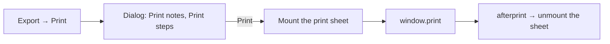

# Print List

A sub-spec of [TodoList to a todo product](/docs/proposals/resource/todo-list), built on [task rows](/docs/resource/todolist-task-rows). A TodoList declares no capability — it cannot be published, exported or shared — so the only way its work leaves the screen today is a screenshot. Microsoft To Do's list menu answers that with **Print list**, and nothing more: no export format, no public link.

## What it changes

- **The TodoList becomes Portable, with one export-only format: Print.** It joins `PortableResourceType` and gains one entry in `PortableFormatMap`, so **Print** sits in the resource page's Export menu beside every other type's exports rather than in a menu of the blade's own ([resource model](/docs/architecture/resource)). A browser's print dialog also saves a PDF, so this is the list's export as much as its print.
- **The format's export opens a small dialog of toggles**, as To Do's does: **Print notes**, off by default, and **Print steps** once [steps](/docs/proposals/resource/todo-list/steps) ship. **Print** closes it and calls `window.print()`. The dialog is a new `ResourceTodoListPrintDialog`. The export runs from the Export menu, outside any component, so it opens the dialog through a small `useTodoListPrintDialogStore`, as the Sheet's export opens `useSheetPortableDialogStore`. `ResourceDialogsComponentMap` holds one component per type, so the TodoList's entry becomes a `ResourceTodoListDialogs` mounting the edit dialog, the print dialog and the print sheet together, as `ResourceSheetDialogs` does.
- **What prints is the list as the reader sees it**: the list's name as the heading, then each open todo in the order on screen — the viewer's sort, through the same `sortTodoListItems` the Items blade draws with ([importance](/docs/resource/todolist-importance)) — its title, its due date through `NuxtTime`, and its notes under it when the toggle is on — with an empty circle before each title to tick on paper. Completed todos follow under a **Completed** heading, struck through, as the section on screen does.
- **The printed sheet is its own element**, a new `ResourceTodoListPrintSheet` rendered only while printing is asked for: teleported to the body with `hidden print:block`, while the app's shell carries `print:hidden` for as long as it is mounted, so the page prints the list and none of the chrome. The notes are the schema's already-sanitized HTML, and every link in them already opens a new tab ([nested interactions](/docs/architecture/nested-interactions)).



## What is deliberately not in it

- **No CSV or Markdown export yet.** Portable makes either one more entry in the same map, but To Do offers neither and no one has asked for one; printing to PDF already makes a file.
- **No email list.** To Do reaches email only through sharing, which is the [smart lists](/docs/resource/deferred/todo-smart-lists)' and sharing's territory.

## Key files

| File                                                            | Role after the change                          |
| --------------------------------------------------------------- | ---------------------------------------------- |
| `apps/web/shared/services/resource/ResourceDefinitionMap.ts`    | the TodoList declares `portable`               |
| `apps/web/app/services/resource/PortableFormatMap.ts`           | the Print format, opening the dialog           |
| `apps/web/app/services/resource/ResourceDialogsComponentMap.ts` | maps the TodoList to `ResourceTodoListDialogs` |
| `apps/web/app/services/resource/todoList/sortTodoListItems.ts`  | the order the sheet prints the open todos in   |

The files it creates:

```text
apps/web/app/
  components/Resource/TodoList/Dialogs.vue    ← the edit dialog, the print dialog and the sheet
  store/resource/todoList/printDialog.ts      ← whether the print dialog and sheet are open
```

## Sources

- [Microsoft To Do — printing lists](https://support.microsoft.com/en-us/office/printing-lists-in-microsoft-to-do-a8075c8d-6403-4b13-82d0-1ba5a8e01d33) — "Turn on or off the toggles next to Print steps and Print notes. Select Print list", from the list's three-dot menu.
