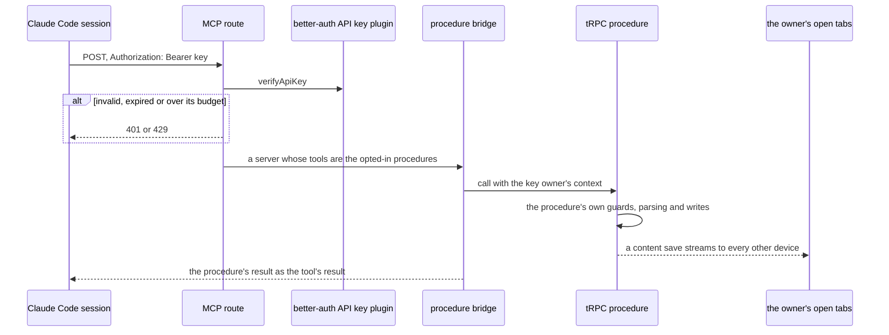

# Agent Access

Part of [TodoList agent follow-ups](/docs/proposals/resource/todolist-agent-follow-ups). Every read and write in the app is a tRPC procedure that already describes itself the way [write once](/docs/architecture/write-once) asks, which is everything an agent's tool needs. A Claude Code session has no session cookie, and should not have one, since a cookie is the whole account in a browser. It needs a credential and a way to call the procedures the owner means an agent to reach.

This is written once, per [write once](/docs/architecture/write-once): one endpoint, one bridge from procedures to tools, one credential. After it ships, exposing any operation to an agent is a line on its procedure, and nothing in this spec changes.

## The credential

An **API key** from better-auth's own plugin, `@better-auth/api-key`, never a token table of ours. Key storage and verification are security-shaped, which the [dependency admission](/docs/architecture/dependency-admission) stop list keeps in a library:

- **Stored hashed**, shown once when it is created, and listed afterwards by its name and first few characters.
- **Created, listed and deleted in the user settings**, under **API keys**, through the plugin's client. Deleting one is how a leaked key is revoked.
- **Rate-limited per key** by the plugin, with a window and budget set to what a drain loop spends rather than the plugin's default of ten a day.
- **Never a session.** The plugin's `enableSessionForAPIKeys` stays off, so a key opens nothing in the app's ordinary tRPC route. It is verified only by the MCP endpoint, and reaches only the procedures that opt in there.
- **Its table is ours to declare.** The plugin's `apikey` model is a table in `@esposter/db-schema`, named `apiKeys`, and the adapter's schema check suite covers it, so a field the plugin adds fails a test rather than a sign-in.

## The endpoint

A new Nitro POST route under the server's API directory serves the Model Context Protocol over its Streamable HTTP transport in stateless mode. Each POST builds a server, handles one JSON-RPC message and returns. The transport requires the endpoint to answer GET too, for a server that pushes messages unprompted. This one never does, so the router's 405 for any method other than POST is the answer the transport allows.

The transport also requires the server to validate `Origin`, so a web page cannot drive the endpoint from a reader's browser. Its only callers are command-line clients, which send no `Origin`, so any request that carries one is refused before the key is looked at.

## The bridge

- **A procedure opts in through its meta.** The tRPC root declares a meta type with one optional key, `mcp: { description }`, and a procedure that should be a tool says so: `.meta({ mcp: { description: "…" } })`. The description is the one thing a procedure has no other place for, since an agent chooses a tool by what it is told the tool is for.
- **The bridge walks the router once per request.** Every query or mutation whose meta has `mcp` becomes a tool. Its name is its path with the dots turned to underscores (`todoList_addFollowUp`), its input schema is the procedure's own input, and calling it calls the procedure through tRPC's own call path, so its middleware, parsing, guards and rate limit all run as they do for the browser.
- **The key owner is the caller.** The route verifies the key, reads its owner's user row, and builds the context with a session payload the authed middleware uses instead of reading a cookie. That payload's device is the key's own, `agent-<key id>`, so the owner's open tabs take the agent's writes as another device's and show them live.
- **Two invariants, held by a test.** Every opted-in procedure has exactly one input and it is an object, since an MCP tool's input schema must be one, and no two opted-in paths map to the same tool name, since turning dots to underscores would merge `a_b.c` with `a.b_c`. A suite walks the router and fails on either.

Where a browser procedure is the wrong shape for an agent, the answer is a procedure shaped for the agent, never a branch in the bridge. The follow-up tools are four such procedures ([capture](/docs/proposals/resource/todolist-agent-follow-ups/capture), [drain](/docs/proposals/resource/todolist-agent-follow-ups/drain)): a whole-list save at a content version is a poor interface for adding one todo, so `addFollowUp` reads, changes and saves the list on the server, and retries against a save the owner made in between.

The procedures hold the line between the owner's todos and a session's. A session can add, tick and hand back, never delete or edit, and `completeFollowUp` and `handBackFollowUp` enforce that on the item they read: an id naming no todo, or a todo with no `origin`, fails the call before anything is saved, so a key cannot tick or annotate a todo the owner wrote.

## Dependencies

- `@modelcontextprotocol/sdk` serves the transport and the tool registry. It tracks an outside spec, so it is kept and bumped, never absorbed.
- `@better-auth/api-key` owns the keys. It is better-auth's own plugin, versioned with it.

## Key files

| File                                                                | Role after the change                                                         |
| ------------------------------------------------------------------- | ----------------------------------------------------------------------------- |
| `apps/web/server/auth.ts`                                           | registers the API key plugin, with sessions for keys left off                 |
| `apps/web/server/trpc/index.ts`                                     | the meta type every procedure may opt into MCP with                           |
| `apps/web/server/trpc/middleware/getRateLimitedMiddleware.ts`       | takes a session the context already holds before reading one from the cookie  |
| `apps/web/server/trpc/context.ts`                                   | carries that session for a call the MCP route makes                           |
| `apps/web/server/services/auth/drizzleAdapterConfiguration.test.ts` | runs better-auth's schema check with the plugin, covering the `apiKeys` table |
| `packages/db-schema/src/schema.ts`                                  | registers `apiKeys`                                                           |
| `apps/web/app/pages/user/settings.vue`                              | the API keys section                                                          |
| `apps/web/package.json`                                             | gains `@modelcontextprotocol/sdk` and `@better-auth/api-key`                  |

## Sources

- [Model Context Protocol — transports](https://modelcontextprotocol.io/specification/2025-06-18/basic/transports) — one endpoint path taking POST, a GET that may answer 405, optional sessions, and the requirement to validate `Origin`.
- [Better Auth — API key plugin](https://www.better-auth.com/docs/plugins/api-key) — hashed keys shown once, per-key rate limits, `verifyApiKey`, and sessions for keys as an opt-in this spec leaves off.
