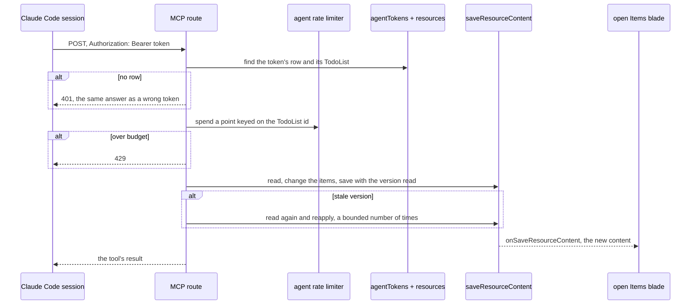

# Agent Access

Part of [TodoList agent follow-ups](/docs/proposals/resource/todolist-agent-follow-ups). Every write to a resource today comes from a signed-in browser session: `saveResourceContent` takes an authed context, and the only credential the app issues is a better-auth session cookie. A Claude Code session has no cookie and should not have one, since a cookie is the whole account. It needs a credential that can do exactly one thing: read and write one TodoList.

## The token

The model is the [webhook](/docs/esbabbler/webhooks)'s, which is already the app's one machine credential: a secret bound to a single target and revoked by rotating it. It departs from the webhook in one place, how the secret is kept.

- **One token per TodoList, at most.** A new `agentTokens` table holds `resourceId` (unique, cascading on delete), `tokenHash`, and `createdAt`. The owner of the list is read from the resource row, never stored twice.
- **Minted from the list.** The resource page's overflow menu gains, on a TodoList only, **Connect an agent**, a dialog that creates the token if there is none, shows it once with a copy button beside the one line of plugin setup it goes into ([capture](/docs/proposals/resource/todolist-agent-follow-ups/capture)), and offers **Rotate** and **Disconnect**. Reopened later, it says when the list was connected; a lost token is replaced by rotating. Rotate mints a new token and invalidates the old one; Disconnect deletes the row. Both ask first, as every destructive action does.
- **Procedures on the TodoList router**, owner-only: `createAgentToken` and `rotateAgentToken` on the slow budget, since they mint a credential as `createWebhook` does, and are the only ones that return the token; `readAgentToken`, which returns whether one exists and its `createdAt`, and `deleteAgentToken` on the standard one.
- **Sent as a header, not in a URL.** A webhook's token rides in its URL because the sender can only be given a URL. An MCP client can send headers, so the token travels as `Authorization: Bearer …` and never lands in a request log.

The token is stored as its SHA-256 hash, not as the webhook's is. A webhook's token must stay readable because its url is what a member copies again; this token is copied once, into a credential store ([capture](/docs/proposals/resource/todolist-agent-follow-ups/capture)). The list's content lives in blob storage rather than the database, so a database read that exposed the token would hand out a write the read alone does not give. The token is random and long, so a plain hash is enough and the lookup stays one indexed equality.

## The endpoint

A Nitro route at `/api/todo-list/mcp` serves the Model Context Protocol over its Streamable HTTP transport in stateless mode: each POST builds a server with the four tools, handles one JSON-RPC message and returns. Nothing is held between requests, so the route scales like any other. The transport requires the endpoint to answer GET too, for a server that pushes messages unprompted; this one never does, so GET answers 405, which the transport allows.

The transport also requires the server to validate `Origin`, so a web page cannot drive the endpoint from a reader's browser. Its only callers are command-line clients, which send no `Origin`, so any request that carries one is refused before the token is looked at.

- **Authorisation** hashes the bearer token, finds the row whose `tokenHash` matches and loads its resource. A missing row and a wrong token get the same 401, as a webhook's 404 does. The resource's owner becomes the authed context's user, with a synthetic device id of `agent:<resourceId>`, so the owner's own browser does not skip the write as its own.
- **Rate limiting** is a new limiter beside the webhook's, keyed on the TodoList id rather than on a caller, for the same reason: one runaway loop exhausts its own list's budget and nobody else's ([rate limiting](/docs/architecture/rate-limiting)).
- **Writes are read, change, save.** A tool reads the current content and its `contentVersion`, applies its change to the items, and saves through `saveResourceContent` with that version. That one door brings everything a browser save brings: parsing against the content schema, a revision for [version history](/docs/resource/resource-snapshots), rescheduled [due reminders](/docs/resource/todolist-due-reminders), and the save event. A stale version means the owner saved in between, so the tool reads again and reapplies its change, up to a small fixed number of times, then fails the tool call rather than write over the owner.
- **The open page follows along.** `onSaveResourceContent` already streams every save from another device into the open list, and the agent's device id is another device. A follow-up added by a session appears in the owner's open tab with nothing new on the client. If the owner's own save was in flight against the version the agent replaced, that save goes stale and shows the existing [conflict surface](/docs/resource/resource-page-parity), as a save from a second browser would.

## The tools

Each tool is scoped by the token to its one list, so none takes a list id.

| Tool                  | Input                                    | Does                                                                                                                           |
| --------------------- | ---------------------------------------- | ------------------------------------------------------------------------------------------------------------------------------ |
| `add_follow_up`       | name, notes, optional due date, `origin` | appends an open todo at the foot of the list, as quick add does                                                                |
| `list_follow_ups`     | repository                               | the open todos whose `origin.repository` matches and which are not handed back, in the list's manual order                     |
| `complete_follow_up`  | id, a line on what was done              | ticks it through the same completion the checkbox uses, so a recurring one rolls forward, and appends the line to its notes    |
| `hand_back_follow_up` | id, the reason                           | marks it for the owner and appends the reason to its notes ([drain](/docs/proposals/resource/todolist-agent-follow-ups/drain)) |

Names, notes and dates are validated by the same `todoListItemSchema` the browser's saves are, so a tool can write nothing the list could not already hold. There is deliberately no delete and no edit of a todo the owner wrote: a session can add, tick and hand back, and anything else is the owner's. `complete_follow_up` and `hand_back_follow_up` enforce that on the item they read: an id naming no todo, or a todo with no `origin`, fails the call before anything is saved, so a token cannot tick or annotate a todo the owner wrote.

## Dependencies

The MCP TypeScript SDK (`@modelcontextprotocol/sdk`) serves the transport. It is a new direct dependency of the app and owes the [dependency admission](/docs/architecture/dependency-admission) check; the protocol's framing and schema negotiation are not worth owning by hand.

## Key files

| File                                                                  | Role after the change                                                           |
| --------------------------------------------------------------------- | ------------------------------------------------------------------------------- |
| `packages/db-schema/src/schema/webhooksInMessage.ts`                  | the machine credential `agentTokens` is modelled on                             |
| `packages/db-schema/src/schema/resources.ts`                          | the resource an agent token cascades from                                       |
| `apps/web/server/trpc/routers/todoList.ts`                            | the owner-only token procedures                                                 |
| `apps/web/server/services/resource/saveResourceContent.ts`            | the write every tool ends in                                                    |
| `apps/web/server/trpc/procedure/resource/createResourceProcedures.ts` | `onSaveResourceContent`, which carries an agent's write to the open page        |
| `apps/web/server/services/rateLimiter/webhookRateLimiter.ts`          | the per-target limiter the agent limiter sits beside                            |
| `apps/web/app/components/Resource/Blade/Header.vue`                   | the overflow menu's `Item` list, which gains **Connect an agent** on a TodoList |
| `apps/web/package.json`                                               | gains `@modelcontextprotocol/sdk`                                               |
