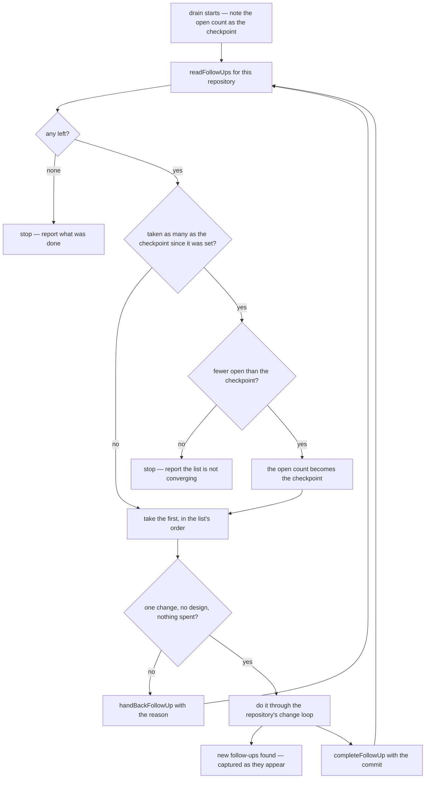

# Drain

Part of [TodoList agent follow-ups](/docs/proposals/resource/todolist-agent-follow-ups), built on [capture](/docs/proposals/resource/todolist-agent-follow-ups/capture). Captured follow-ups are only half the loop: something has to do them. The drain is a skill in the follow-ups plugin that a session runs in a repository, and it keeps going until that repository has no follow-ups left.

## The loop

- **One follow-up per change.** The session does the follow-up the way the repository says any change is done: in Esposter, the finishing ritual, the checks, a commit by pathspec and a queue push; elsewhere, whatever that repository's own instructions say. The follow-up is ticked only after the commit exists, and the line written on it names the commit.
- **The order is the owner's.** `readFollowUps` returns the list's manual order, so dragging a follow-up to the top of the list is how the owner says what goes first.
- **Fresh reads every turn.** The list is read again after every follow-up, never cached, so a follow-up the owner ticked, deleted or reordered in the browser while the drain ran is respected on the next turn.

## Handing back

The drain takes only what it may do alone. A follow-up is handed back when doing it would need:

- a design decision, or a choice between readings the notes leave open;
- anything that spends outside the repository's review queue: opening a pull request, pushing a protected branch, a paid service, a destructive change to shared infrastructure;
- more than one change.

`handBackFollowUp` sets `handedBackAt` and appends the reason to the notes. The todo stays in the owner's list as an ordinary open todo, so it is read with everything else, and it no longer appears in `readFollowUps`, so the drain does not take it again. When the owner has answered it, clearing the handback from the edit dialog returns it to the drain.

## The stop rule

The drain stops in exactly two cases:

1. **Nothing is left.** `readFollowUps` returns nothing: every follow-up for the repository is done or handed back.
2. **The list is not shrinking.** Draining one follow-up can capture new ones, and new ones can capture more. The drain notes the open count when it starts, as its checkpoint. Once it has taken that many follow-ups, if the open count is not lower than the checkpoint, the work is producing follow-ups as fast as it closes them and more turns will not converge. It stops and says so, leaving everything open for the owner to read. If the count is lower, the new count becomes the checkpoint and the check repeats after that many more, so a drain that shrank once cannot grow unchecked afterwards.

This is the same convergence test every loop in the repository uses: each pass should find less than the one before ([engineering loops](/docs/architecture/engineering-loops)).

## Running it unattended

A drain can run while the owner is away, which is what makes it worth having. It runs in whatever permission mode its session has, and it relies on the repository's own safety net rather than one of its own. In Esposter, every change it pushes lands on the review queue and passes the collector's review before reaching `develop` ([review collector](/docs/infra/review-collector)). The drain adds no approval step, since its commits are the same kind a session makes when asked directly.

In Esposter, the drain joins the list of what a session runs next when nothing is asked, after a red collector run and before an area owed a product review. The owner wrote each follow-up down, or accepted a session writing it, so it outranks work the session would pick for itself.

## Notes

- A long drain runs in one session, so its context grows with every follow-up and relies on automatic compaction. A fresh session per follow-up, started by the [agent console](/docs/infra/claude-interface/agent-console)'s host, would keep each one clean. That is a later step, once a drain has been seen to degrade.
- A follow-up's due date still reminds. A drain that finishes one before its date ticks it, so a follow-up the owner dated as a deadline stops reminding once it is done.

## Key files

| File                                                      | Role after the change                                       |
| --------------------------------------------------------- | ----------------------------------------------------------- |
| `apps/web/content/docs/architecture/engineering-loops.md` | the drain is a step in what runs next when nothing is asked |
| `.agents/skills/review-queue/SKILL.md`                    | how each drained change is committed and pushed in Esposter |
| `apps/web/app/components/Resource/TodoList/EditForm.vue`  | clearing a handback returns a follow-up to the drain        |
