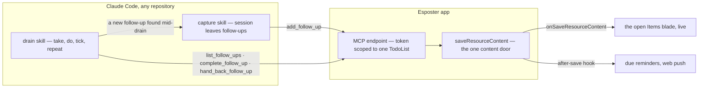

# TodoList Agent Follow-ups

Built on [due reminders](/docs/resource/todolist-due-reminders) and [task rows](/docs/resource/todolist-task-rows). The TodoList is the one Esposter product in daily use, and the reason is structural rather than a matter of polish: it holds state that outlives any session, it acts on a clock through its reminders, and it reaches a phone through web push. A Claude Code session has none of those three. Its own checklist is lost when it ends, and a follow-up it noticed and left alone — "the same guard is missing in the sibling router", "the docs page still names the old flag" — survives only in scrollback. Today, carrying one into the list is a copy by hand into a browser tab, so most are lost.

This proposal connects the two in both directions, with no model inside Esposter. The model stays in the terminal. Esposter stores the follow-ups and shows them, and its existing reminders and live sync do the rest:

- **Capture.** A session writes each follow-up it leaves unfinished into the owner's TodoList, tagged with the repository and the session that found it.
- **Drain.** A session in a repository takes that repository's open follow-ups one at a time, does each through the repository's own change loop, and ticks it, until none is left. A follow-up found while draining is captured in the same way, so the loop runs until the work converges.

## Why this and not more products

The owner keeps one TodoList, holding everything to do, and works at a desk nine times in ten. That rules out the other candidates for the next piece of product work: the cross-list views stay deferred because their trigger never fires with one list ([smart lists](/docs/resource/deferred/todo-smart-lists), [global calendar](/docs/resource/deferred/global-calendar)), and phone capture or natural-language dates save little for someone at a desk ([quick add](/docs/resource/todolist-quick-add)). At the desk, the place a todo is born is a terminal session, so the missing piece is the route from that terminal to the list.

It also avoids the platform decision that [AI resource generation](/docs/resource/deferred/ai-resource-generation) waits on. That page defers the first LLM dependency inside Esposter. This proposal adds none: every model call is the user's own Claude Code session, and Esposter serves plain tools over data it already stores.

## Scope

| Works today                                                                 | This proposal adds                                                                        |
| --------------------------------------------------------------------------- | ----------------------------------------------------------------------------------------- |
| A TodoList edited in the browser, saved through `saveResourceContent`       | A second writer: an MCP endpoint on the app, authorised by a token scoped to one TodoList |
| Saves from another device stream into the open list over a subscription     | The endpoint writes through the same door, so an agent's write appears live the same way  |
| Due reminders scheduled from every content save                             | Nothing — a follow-up with a due date reminds like any todo                               |
| A todo carries a name, notes, steps, a due date, a star and a recurrence    | An optional `origin`: the repository and the Claude Code session that wrote it            |
| The repository's change loop: finishing, checks, commit, queue push, review | A drain that feeds that loop one follow-up at a time, and a stop rule for the drain       |

## The sub-specs

- [Agent access](/docs/proposals/resource/todolist-agent-follow-ups/agent-access) — the token, the MCP endpoint and its four tools, the rate limit, and how an agent's write reaches the open page.
- [Capture](/docs/proposals/resource/todolist-agent-follow-ups/capture) — the `origin` field, the Claude Code plugin that carries the endpoint and the session id into every repository, and what counts as a follow-up.
- [Drain](/docs/proposals/resource/todolist-agent-follow-ups/drain) — the loop, what it may and may not do on its own, handing a follow-up back to the owner, and the stop rule that keeps it converging.

They ship in that order, and each is useful alone: access lets any MCP client read and add todos, capture ends the loss of follow-ups, and the drain turns the captured list into work done.

## What is deliberately not in it

- **A model inside Esposter.** No summarising, ranking or generating in the app. A session does the thinking; the app keeps the state.
- **Running sessions from the app.** The drain runs in a session the user started. Starting a fresh session per follow-up from the [agent console](/docs/infra/claude-interface/agent-console) host is possible later, but it needs the host running and is not required for the loop to work.
- **A second list for agents.** Follow-ups go into the one list the owner already reads, filtered by `origin` when a session asks for them, so the owner never has two places to look.
- **Repository work that needs a design.** A follow-up is sized for one change. Anything needing a decision stays where the repository puts it — in Esposter, a proposal ([engineering loops](/docs/architecture/engineering-loops)).

## Key files

| File                                                       | Role after the change                                                      |
| ---------------------------------------------------------- | -------------------------------------------------------------------------- |
| `apps/web/shared/models/resource/todoList/TodoListItem.ts` | gains the optional `origin`                                                |
| `apps/web/server/services/resource/saveResourceContent.ts` | unchanged; the endpoint's writes go through it                             |
| `apps/web/content/docs/architecture/engineering-loops.md`  | the drain joins the list of what a session runs next when nothing is asked |

## Sources

- [Model Context Protocol — transports](https://modelcontextprotocol.io/specification/2025-06-18/basic/transports) — the Streamable HTTP transport the endpoint serves: one endpoint path taking POST, a GET that may answer 405, optional sessions, and the requirement to validate `Origin`.
- [Claude Code — plugin manifest reference](https://code.claude.com/docs/en/plugins-reference) — a plugin bundling an HTTP MCP server, hooks and skills, a `userConfig` value marked `sensitive` kept in the platform's secure credential store, and `${user_config.KEY}` substituted into an HTTP server's `headers`.
