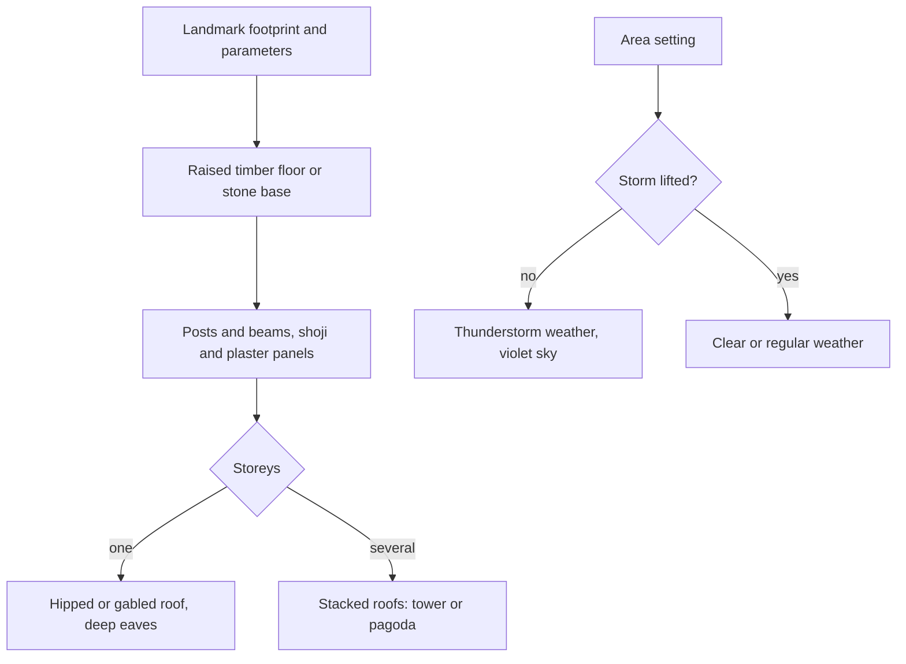

# Inazuma

This region is built on [terrain](/docs/proposals/teyvat/terrain), [vegetation](/docs/proposals/teyvat/vegetation), [water](/docs/proposals/teyvat/water) and [sky and time](/docs/proposals/teyvat/sky-and-time), authored by the [reference board](/docs/proposals/teyvat/reference-board)'s method. Inazuma is the nation of the Electro Archon, its culture drawn from Edo-period Japan. It is an archipelago: each island has its own character, and they are divided by sea and a storm that closes the nation to outsiders. It is the first region made of separate islands, so the sea between them is as much a part of it as the land.

## Decisions

- **The storm is an area setting.** Inazuma's permanent thunderstorm, and Yashiori Island's own storm, are weather that each area can switch on or off. In the game they lift when a quest completes. Here they are lifted by default and restored from the hour and weather control, so the islands can be seen both ways.
- **Each island has its own palette.**
  - Narukami Island: sakura pink, red maple and dark cedar under a violet storm sky
  - Kannazuka: scorched ground and forges
  - Yashiori Island: grey earth and the ribs of a colossal serpent's skeleton, landmark-tier bone meshes
  - Watatsumi Island: pale sand, purple and pink coral, and floating jellyfish lights under a sky tinted like the sea
  - Seirai Island: dark rock under storm
  - Tsurumi Island: grey fog and bare trees
- **The Inazuma building kit.**
  - a raised timber floor on posts or a stone base
  - post-and-beam walls with shoji and plastered panels
  - a hipped or gabled tiled roof with deep eaves, sometimes stacked into towers

  Torii gates, stone lanterns, shrines and pagodas are kit pieces of their own. The Grand Narukami Shrine with its sacred sakura, and Tenshukaku above Inazuma City, are landmark-tier and matched pose by pose.

- **Enkanomiya is a layer with its own sky.** It lies beneath Watatsumi Island, is entered at its gate, and is lit by an artificial sun, Dainichi Mikoshi, rather than by the [sky](/docs/proposals/teyvat/sky-and-time)'s clock. Its white stone ruins are a kit of their own.

## How it works



## Areas

The catalogue holds Inazuma's areas as the game names them: Narukami Island, Kannazuka, Yashiori Island, Watatsumi Island, Seirai Island, Tsurumi Island, Enkanomiya and the Three Realms Gateway Offering. Subareas include Inazuma City, Ritou, the Grand Narukami Shrine, Mt. Yougou, Chinju Forest, Byakko Plain, Konda Village, the Kamisato Estate, Tatarasuna, the Kujou Encampment, Nazuchi Beach, Jakotsu Mine, Musoujin Gorge, Sangonomiya Shrine, Bourou Village, Suigetsu Pool, Amakane Island, Asase Shrine, Koseki Village, Moshiri Ceremonial Site, Oina Beach, and Enkanomiya's Dainichi Mikoshi, Evernight Temple, The Serpent's Heart and The Serpent's Bowels.

## Build order

1. **Ritou and Narukami Island**, where the game lands: Inazuma City, Tenshukaku and the Grand Narukami Shrine.
2. **Kannazuka and Yashiori Island**, with the serpent's bones.
3. **Watatsumi Island**, then **Seirai** and **Tsurumi**.
4. **Enkanomiya**, as a layer.

## Capture checklist

Ritou's harbour, Inazuma City's main street, Tenshukaku from the plaza, the Grand Narukami Shrine and its sakura, a torii line on Mt. Yougou, Tatarasuna's forge, the serpent's ribs on Yashiori, Sangonomiya Shrine, Tsurumi in fog, and Dainichi Mikoshi from Enkanomiya's plaza.

## Key files

| File                                                             | Role after the change                      |
| :--------------------------------------------------------------- | :----------------------------------------- |
| `apps/web/app/services/agentConsole/world/createSimplexNoise.ts` | The detail noise each island's biome tunes |

New files:

```text
apps/web/app/assets/teyvat/inazuma/
apps/web/app/services/teyvat/kits/inazuma/   ← building, shrine, torii and Enkanomiya ruin generators
```

## Sources

- [Inazuma](https://genshin-impact.fandom.com/wiki/Inazuma) and [Enkanomiya](https://genshin-impact.fandom.com/wiki/Enkanomiya), Genshin Impact Wiki: the nation's areas and subareas, and Enkanomiya beneath Watatsumi Island, entered through a pool beside Sangonomiya Shrine.
- [Weather](https://genshin-impact.fandom.com/wiki/Weather), Genshin Impact Wiki: the permanent thunderstorms over Inazuma and Yashiori Island, each lifted by a quest, and the fog on Tsurumi Island.
- [Teyvat](https://en.wikipedia.org/wiki/Teyvat), Wikipedia: Inazuma drawn from Japan's Edo period, and Enkanomiya's design from ancient Greece.
