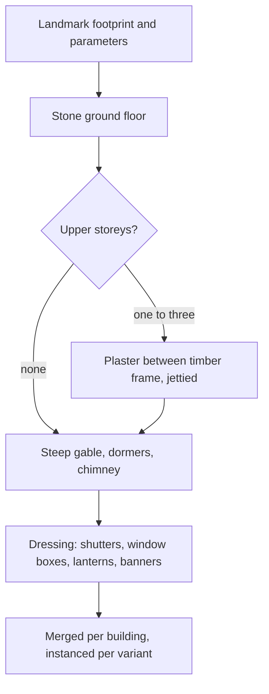

# Mondstadt

This region is built on [terrain](/docs/proposals/teyvat/terrain), [vegetation](/docs/proposals/teyvat/vegetation), [water](/docs/proposals/teyvat/water) and [sky and time](/docs/proposals/teyvat/sky-and-time), authored by the [reference board](/docs/proposals/teyvat/reference-board)'s method. Mondstadt is where the game begins: the nation of the Anemo Archon, its culture drawn from Germany and Switzerland. It is a land of open grass that the wind keeps moving, low wooded hills, a great lake with the city on an island in it, and sea cliffs to the west. To the south rises Dragonspine, a snowbound mountain around a colossal spike driven into it from the sky. It is the first region because the [rendering style](/docs/proposals/teyvat/rendering-style)'s Windrise scene already stands in it.

## Decisions

- **The strongest wind in Teyvat.** Mondstadt's base wind is the highest of any region, and gusts visibly roll across the meadows. This is the [vegetation](/docs/proposals/teyvat/vegetation) wind field at its most visible, and Stormterror's Lair raises it to a gale.
- **A bright, cool palette.** Saturated spring greens, white limestone, slate and terracotta roofs under a clear high blue. Dandelions and windwheel asters in the meadows, and cecilia flowers on Starsnatch Cliff. The grade and the shade colour are tuned against the reference board at noon and at dusk.
- **The Mondstadt building kit.** A building is a footprint with parameters:
  - a stone ground floor
  - one to three upper storeys of white plaster in a dark timber frame, with jettied overhangs
  - a steep gabled roof with dormers and a chimney
  - dressing: window boxes, shutters, lanterns, banners

  Windmills are their own kit, a stone tower with sails that turn in the wind field. The city wall, the gate bridge and the cathedral are landmark-tier pieces built from the kit's parts and matched pose by pose.

- **Species.** Broad oaks, with Windrise's great oak as a landmark, apple trees, pines on the slopes, grape rows at Dawn Winery, and dense old forest in Wolvendom and Whispering Woods.
- **Dragonspine is a snow biome with ruins.** It has snow ground, ice, frozen falls, snow and snowstorm weather, and the Entombed City's ruins. Skyfrost Nail is a landmark-tier spike mesh, and Starglow Cavern and Wyrmrest Valley are surface caves and hollows.

## How it works



## Areas

The catalogue holds Mondstadt's areas as the game names them: Starfell Valley, Galesong Hill, Windwail Highland, Brightcrown Mountains, Windrest Peak and Dragonspine. Subareas include Mondstadt City, Cider Lake, Starfell Lake, Windrise, Springvale, Dawn Winery, Whispering Woods, Wolvendom, Stormterror's Lair, Thousand Winds Temple, Starsnatch Cliff, Cape Oath, Falcon Coast, Dadaupa Gorge, Brightcrown Canyon, Stormbearer Mountains, Stormbearer Point, Musk Reef, Millhaven, Dornman Port, and Dragonspine's Skyfrost Nail, Entombed City, Starglow Cavern, Wyrmrest Valley and Snow-Covered Path.

## Build order

1. **Starfell Valley** around Windrise, which grows out of the rendering-style scene: Starfell Lake, Whispering Woods and the road to the city.
2. **Mondstadt City** on its island: the gate bridge, the walls, the cathedral, the plaza of the Anemo Archon's statue and the windmills. It is matched landmark by landmark.
3. **Windwail Highland and Springvale**, then **Dawn Winery** and **Galesong Hill**.
4. **Stormterror's Lair** and **Brightcrown Mountains**.
5. **Dragonspine**, once snow weather exists.
6. The remaining areas in the catalogue's order.

## Capture checklist

The reference board's routine applies to each of these first: Windrise's oak and statue, the city gate bridge, the cathedral front, the Anemo Archon statue plaza, a windmill, a Springvale house, Dawn Winery's manor, Stormterror's Lair from the approach, Thousand Winds Temple, Starsnatch Cliff, and Skyfrost Nail from the Entombed City.

## Key files

| File                                                             | Role after the change                                    |
| :--------------------------------------------------------------- | :------------------------------------------------------- |
| `apps/web/app/services/agentConsole/world/createSimplexNoise.ts` | The detail noise Mondstadt's meadow and hill biomes tune |

New files:

```text
apps/web/public/teyvat/mondstadt/    ← shapes, paint, landmarks
packages/teyvat/src/kits/mondstadt/   ← building, windmill and wall generators
```

## Sources

- [Mondstadt](https://genshin-impact.fandom.com/wiki/Mondstadt), [Windrise](https://genshin-impact.fandom.com/wiki/Windrise) and [Dragonspine](https://genshin-impact.fandom.com/wiki/Dragonspine), Genshin Impact Wiki: the nation and its areas, Windrise's oak sheltering a Statue of The Seven, and Dragonspine's snow.
- [Teyvat](https://en.wikipedia.org/wiki/Teyvat), Wikipedia: the German and Swiss cultural designs behind Mondstadt, and Dragonspine's inspiration in the Matterhorn.
- [Weather](https://genshin-impact.fandom.com/wiki/Weather), Genshin Impact Wiki: snow and snowstorms on Dragonspine, and no rain in the city.
