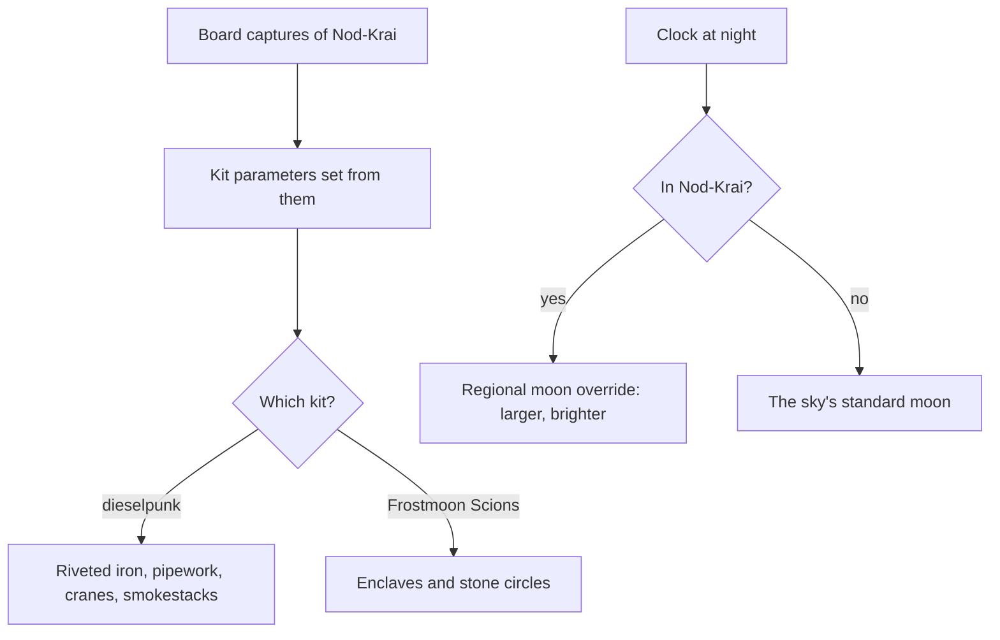

# Nod-Krai

This region is built on [terrain](/docs/proposals/teyvat/terrain), [vegetation](/docs/proposals/teyvat/vegetation), [water](/docs/proposals/teyvat/water) and [sky and time](/docs/proposals/teyvat/sky-and-time), authored by the [reference board](/docs/proposals/teyvat/reference-board)'s method. Nod-Krai is an autonomous region at the southern edge of Snezhnaya, an archipelago formed from the material left over when the Three Moons were made. Its culture is fictional, drawn from the Baltic with dieselpunk machinery. People from all over Teyvat gather there, the Fatui run a stronghold there, and its indigenous Frostmoon Scions worship a moon goddess. It is the newest of the nations' neighbours in the game, and the least documented, so its page commits to the mechanism and leaves its look to the board.

## Decisions

- **The moon is part of its sky.** Nod-Krai's deep connection to the moons makes the moon a larger, brighter element of its night sky, a regional override of the [sky](/docs/proposals/teyvat/sky-and-time)'s moon. Its captures at night set how large and how bright.
- **An archipelago of distinct isles.** Lempo Isle, Hiisi Island and Paha Isle are separate islands with their own outlines in the [world map](/docs/proposals/teyvat/world-map), joined by the Moontide Sea. The sea between them is part of the region, as it is for Inazuma.
- **Two kits: the dieselpunk and the Scions'.** The first builds the ports, towns and Fatui works: riveted iron, pipework, cranes, smokestacks and timber sheds. The second builds the Frostmoon Scions' enclaves and stone circles. Both are parameterised only after the board's captures exist, since no earlier region's kit carries over.
- **Statues of the New Moon.** Nod-Krai's statues stand where other regions have Statues of The Seven. They are a landmark kind of their own and act as waypoints in [exploring](/docs/proposals/teyvat/exploring).

## How it works



## Areas

The catalogue holds Nod-Krai's areas as the game names them: Lempo Isle, Hiisi Island, Paha Isle, the Moontide Sea, the Lunar Highlands, Wavechaser Plain, Ashveil Peak, Dunanna Pit, Voidsea Outlook and the Dark Side of the Moon. Subareas include Nasha Town, the Frostmoon Enclave, Blue Amber Lake, Silvermoon Hall, Golden Hall, Favonius Keep, Cliffwatch Camp, the Nuur Stone Circle, the Pillar of Embla, Piramida, Traveler's Crater and Starsand Shoal.

## Build order

1. **Nasha Town** and its isle, where the game enters.
2. **The Frostmoon Enclave** and the Scions' sites.
3. **The other isles** and the Moontide Sea, then the rest in the catalogue's order.

## Capture checklist

Nasha Town's port and main street, a Statue of the New Moon, the Frostmoon Enclave, Blue Amber Lake, a Fatui works, the moon at night from each isle, and the sea between the isles.

## Key files

| File                                                             | Role after the change                     |
| :--------------------------------------------------------------- | :---------------------------------------- |
| `apps/web/app/services/agentConsole/world/createSimplexNoise.ts` | The detail noise each isle's ground tunes |

New files:

```text
apps/web/app/assets/teyvat/nod-krai/
packages/teyvat/src/kits/nod-krai/   ← dieselpunk and Frostmoon Scion generators
```

## Sources

- [Nod-Krai](https://genshin-impact.fandom.com/wiki/Nod-Krai), Genshin Impact Wiki: an autonomous region at Snezhnaya's southern tip, an archipelago from the Three Moons' remnant material, the Frostmoon Scions, the Fatui stronghold, the Statues of the New Moon, and its areas and subareas.
- [Teyvat](https://en.wikipedia.org/wiki/Teyvat), Wikipedia: Nod-Krai's fictional culture drawn from the Baltic Sea area with dieselpunk elements.
