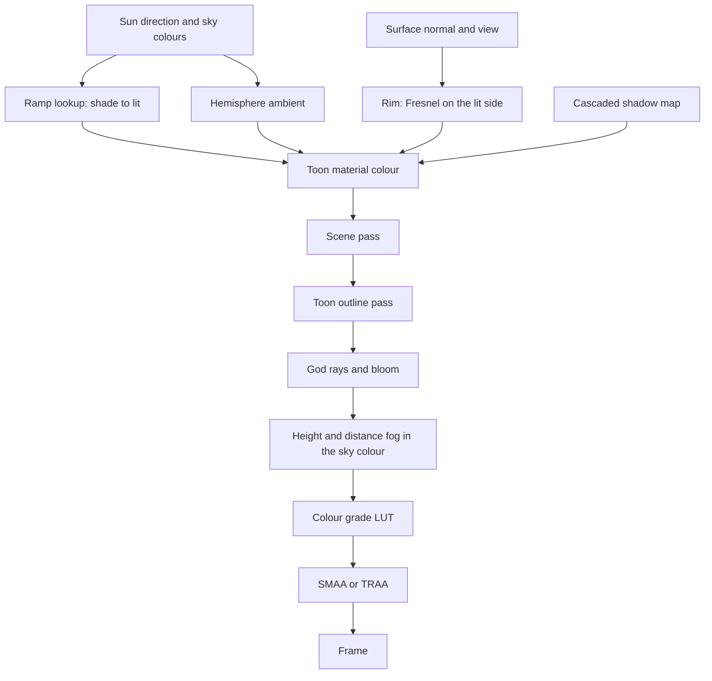

# Rendering style

This page is the first build of the [Teyvat](/docs/proposals/teyvat) program, on the modules of its [engine architecture](/docs/proposals/teyvat/engine-architecture). Genshin's world does not read as anime because of its models. It reads that way because of how light lands on them. Surfaces step from lit to shade across a narrow painted band instead of a physical falloff. Shadow is a colour, a cool blue-violet, rather than black. Edges catch a rim of sky light, and distance dissolves into a haze the colour of the sky. This page sets that look once, in materials and passes every later page draws with. It is first shown in Windrise, the valley where the game's world opens: a great oak on a grassy rise, with a Statue of The Seven in its shade.

## Decisions

- **One toon material for the environment.** Every surface uses one node material built on `MeshToonNodeMaterial`. Its diffuse term is a lookup into a ramp, a short gradient from shade colour to lit colour with a narrow soft step, rather than a Lambert curve. The ramp is a TSL function of the light's angle, so a region or the hour can retint it as a uniform and no texture is baked. A second ramp gives a specular band for wet stone and metal.
- **Shadow is a colour, not an absence.** Cast shadow and the ramp's dark side both resolve to a shade colour set per region and per hour: cool by day and deep blue at night. They are never multiplied toward black. Ambient light is a hemisphere of sky above and bounce below, read from the [sky](/docs/proposals/teyvat/sky-and-time)'s current colours.
- **A rim picks out silhouettes.** A Fresnel term, masked to the lit side and tinted by the sky, lights the edges of trees, rocks and buildings against the background. This is the halo that separates layers in the game's landscapes.
- **Outlines are one post pass.** `ToonOutlinePassNode` draws an outline around every mesh using a toon material, with thickness scaled by depth so distant shapes do not become ink. Terrain and grass opt out through their material, since the game outlines objects and not ground.
- **Soft cascaded shadows.** Sunlight casts through three's `CSMShadowNode`, so near shadows stay crisp and far ones stay cheap. The cascade count follows the studio's own account of its shadow maps, and the far cascades are blurred into soft blotches as the game's distant shadows are.
- **The frame is finished in post.** A render pipeline runs the scene pass with outlines and then adds:
  - `BloomNode`, on the sun, the sky's bright edge, water glints and elemental light
  - `GodraysNode`, from the sun through foliage
  - a sky-tinted fog, by height and by distance
  - a `Lut3DNode` colour grade per region
  - `SMAANode` for anti-aliasing, or `TRAANode` where motion allows
- **Quality steps down, never out.** When frames run over budget the look loses cost first: shadow resolution, then god-ray samples, then pixel ratio. The ramp, rim and outline stay at every setting, because they are the style.

## How it works



## Scope

**Today:** the app renders WebGPU only in the [fluid simulator](/docs/fluid-simulator), a single page composable with no shared material or pass.

**This adds:**

1. **The renderer.** A `TresCanvas` whose `renderer` factory builds `WebGPURenderer`, with the render pipeline set as its output. Where WebGPU is unavailable, the renderer falls back to WebGL2 on its own, and no second path is written.
2. **The material and the passes** above, as node graphs in the engine package's TSL folder, each a single-purpose module.
3. **The Windrise scene, mounted as the console's world.** It takes the place of the voxel world in the console at `/genshin`. A grassy valley rising to a knoll, a great oak built by the same generator [vegetation](/docs/proposals/teyvat/vegetation) will scatter, and a Statue of The Seven in its shade, lit at one fixed afternoon hour. Grass, sky and water are placeholders until their pages ship, and each one is replaced in its own build.
4. **A tuning panel in development.** Three's inspector, as the fluid simulator already uses it, exposes the ramp, rim, outline, fog and grade, so the look is tuned against reference screenshots rather than guessed.

## Key files

| File                                                   | Role after the change                                                 |
| :----------------------------------------------------- | :-------------------------------------------------------------------- |
| `apps/web/app/composables/visual/useFluidSimulator.ts` | The render-pipeline and inspector setup the engine's renderer follows |
| `apps/web/app/components/AgentConsole/Index.vue`       | Mounts Teyvat in the voxel world's place                              |
| `oxlint.config.ts`                                     | Its type-aware exclusion covers the node graphs this page adds        |

New files:

```text
apps/web/app/components/Teyvat/Index.vue
apps/web/app/components/Teyvat/Windrise.vue
packages/teyvat/src/renderer/     ← the renderer factory and quality tier
packages/teyvat/src/post/         ← the post-processing chain
packages/teyvat/src/nodes/        ← the toon material, ramp, rim, fog and grade node graphs
```

## Notes

- **Characters are not styled here.** Character shading, with its face shadow map, hair highlights and material masks, belongs to the character page that phase three writes. The environment material stays the one the world uses.
- **The grade is a look, not a filter.** A region's LUT is authored against its reference screenshots, taken at a fixed hour with no weather, as the [reference board](/docs/proposals/teyvat/reference-board) sets out. It is never sampled from a screenshot's pixels.

## Sources

- [Console platform development in Genshin Impact](https://docswell.com/s/UnityJapan/KWRPQ5-210617-unity-dojo20211mihoyozhenzhongyi), Zhenzhong Yi, miHoYo, Unity Dojo 2021: the game's cascaded shadow maps with soft Poisson filtering, volumetric fog and god rays by ray marching, the passes this page recreates on the web.
- [Genshin Impact: Crafting an Anime Style Open World](https://www.gdconf.com/news/learn-about-making-genshin-impacts-open-world-gdc-2021), Haoyu Cai, GDC 2021: the anime style set for the environment rather than only its characters.
- [MeshToonNodeMaterial](https://threejs.org/docs/pages/MeshToonNodeMaterial.html) and [ToonOutlinePassNode](https://threejs.org/docs/pages/ToonOutlinePassNode.html), three.js: the toon material the environment material extends, and the outline pass that only toon materials receive.
- [CSMShadowNode](https://threejs.org/docs/pages/CSMShadowNode.html), [GodraysNode](https://threejs.org/docs/pages/GodraysNode.html), [BloomNode](https://threejs.org/docs/pages/BloomNode.html), [Lut3DNode](https://threejs.org/docs/pages/Lut3DNode.html), [SMAANode](https://threejs.org/docs/pages/SMAANode.html) and [TRAANode](https://threejs.org/docs/pages/TRAANode.html), three.js: the cascaded shadows and the post-processing chain.
- [Windrise](https://genshin-impact.fandom.com/wiki/Windrise), Genshin Impact Wiki: a valley around a great oak with the Statue of The Seven at its feet, the first scene.
