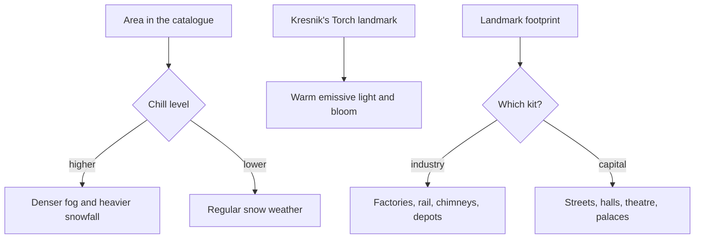

# Snezhnaya

This region is built on [terrain](/docs/proposals/teyvat/terrain), [vegetation](/docs/proposals/teyvat/vegetation), [water](/docs/proposals/teyvat/water) and [sky and time](/docs/proposals/teyvat/sky-and-time), authored by the [reference board](/docs/proposals/teyvat/reference-board)'s method. Snezhnaya is the nation of the Cryo Archon, its culture drawn from Russia. Technologically it is the most advanced nation in Teyvat, with massive factories and the Fatui's military. Every settlement keeps a Kresnik's Torch burning against the cold. It is the newest nation in the game, released in August 2026. Like Nod-Krai, its kits are parameterised from the board's captures rather than from an earlier region.

## Decisions

- **Cold is the standing weather.** Snow ground and ice cover most of the region, and snow and snowstorms are its regular weather, as on Dragonspine but across a nation. The game's chill zones are play, so here they only thicken fog and snowfall by level.
- **Warm light against the cold.** Each settlement's Kresnik's Torch is a landmark with warm emissive light and bloom, the brightest point in a pale scene. The region's shade colour is the coldest of any, which makes every torch, window and furnace stand out.
- **Industry and capital, two kits.** The industrial kit builds factories, rail lines, stations, chimneys and depots. The capital kit builds Snezhnograd's streets, halls and theatre, with the Zapolyarny Palace and the Pale Crown Palace as landmark-tier pieces. Both are tuned to the board.
- **Birch and tundra.** The vegetation species are white birch, which dominates White Birch Snowgrave, dark conifers on the peaks, and sparse tundra grass that shows through the snow in Volkodlak Tundra.

## How it works



## Areas

The catalogue holds Snezhnaya's areas as the game names them: Everfrozen Earth, Volkodlak Tundra, White Birch Snowgrave, Fellfrost Peak and Flamefeather Valley. Subareas include Snezhnograd, the Zapolyarny Palace, the Pale Crown Palace, The Korolevskiy Theater, Central Station, Druzhna HQ, Jack Frost Village, Morepesok, Okurov, Glupov, Sretomorozsk, Svetloledovka, the House of Hesperides, the Huntsman's Cabin, the Sanctuary of Grief, Tidesong Cavern and the Teeming Mire.

## Build order

1. **Everfrozen Earth** with Snezhnograd and its palace.
2. **Volkodlak Tundra** and **White Birch Snowgrave**.
3. **Fellfrost Peak** and **Flamefeather Valley**.

## Capture checklist

Snezhnograd's main street, the Zapolyarny Palace, The Korolevskiy Theater, Central Station, a factory, a village with its Kresnik's Torch at night, a birch forest in snow, Volkodlak Tundra, and a snowstorm on Fellfrost Peak.

## Key files

| File                                                             | Role after the change                        |
| :--------------------------------------------------------------- | :------------------------------------------- |
| `apps/web/app/services/agentConsole/world/createSimplexNoise.ts` | The detail noise of the tundra and the peaks |

New files:

```text
apps/web/public/teyvat/snezhnaya.json
packages/teyvat/src/kits/snezhnaya/   ← industrial and capital generators, Kresnik's Torch
```

## Sources

- [Snezhnaya](https://genshin-impact.fandom.com/wiki/Snezhnaya), Genshin Impact Wiki: the Cryo nation, Snezhnograd its capital, the Zapolyarny Palace, Kresnik's Torch in every settlement, its technology and factories, its areas and subareas, and its release on the twelfth of August 2026.
- [Weather](https://genshin-impact.fandom.com/wiki/Weather), Genshin Impact Wiki: Snezhnaya's chill zones at three levels of cold.
- [Teyvat](https://en.wikipedia.org/wiki/Teyvat), Wikipedia: Snezhnaya drawn from Russia, and the Fatui's headquarters.
