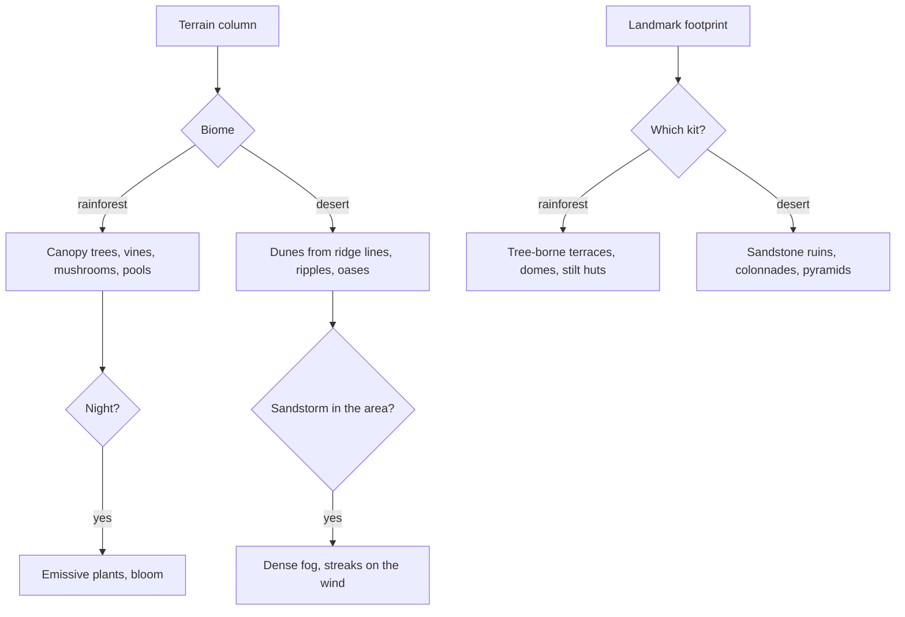

# Sumeru

This region is built on [terrain](/docs/proposals/teyvat/terrain), [vegetation](/docs/proposals/teyvat/vegetation), [water](/docs/proposals/teyvat/water) and [sky and time](/docs/proposals/teyvat/sky-and-time), authored by the [reference board](/docs/proposals/teyvat/reference-board)'s method. Sumeru is the nation of the Dendro Archon, its culture drawn from ancient India, Egypt and Persia, and the home of the Akademiya. As its people say, it is all rainforest and desert. The two halves are so different that they are two biomes with two kits, joined along a wall of cliffs.

## Decisions

- **The rainforest is dense, humid and alive at night.**
  - vegetation at its densest: giant trees whose crowns form a canopy, broad leaves, hanging vines, and giant mushrooms
  - rivers and still pools
  - a low green-gold haze in the fog
  - at night, plants and fungi glowing through emissive masks in their materials, which bloom lifts

  Rain and mist are its regular weather.

- **The desert is scale and wind.** Its dunes are heightfield features from authored ridge lines, with sand ground, ripples from noise, and wind carrying sand off the crests. Oases are water and palms. Sandstorms in the Desert of Hadramaveth come from [sky and time](/docs/proposals/teyvat/sky-and-time), and rain never falls here.
- **Two kits.** The rainforest kit builds Sumeru City's terraces, walkways and domed buildings grown into and around the colossal tree, plus village huts on stilts. The desert kit builds sandstone ruins, colonnades, obelisks, stepped pyramids and half-buried halls. The Mausoleum of King Deshret and Khaj-Nisut are landmark-tier.
- **Underground realms are layers.** Realms the game draws apart from the surface, such as the Realm of Farakhkert and the Ashavan Realm, are layers in the [world map](/docs/proposals/teyvat/world-map), with their own sky.

## How it works



## Areas

The catalogue holds Sumeru's areas as the game names them: Avidya Forest, Lokapala Jungle, Ardravi Valley, Vissudha Field, Vanarana, the Lost Nursery, Ashavan Realm, the Hypostyle Desert, the Land of Upper Setekh, the Land of Lower Setekh, the Desert of Hadramaveth, Gavireh Lajavard and the Realm of Farakhkert. Subareas include Sumeru City, Port Ormos, Gandharva Ville, Vimara Village, Pardis Dhyai, Apam Woods, Chinvat Ravine, Devantaka Mountain, Mawtiyima Forest, Old Vanarana, Aaru Village, Caravan Ribat, Sobek Oasis, Khaj-Nisut, the Mausoleum of King Deshret, Mt. Damavand, Tanit Camps, Vourukasha Oasis, Dunes of Steel and the Sands of Al-Azif.

## Build order

1. **Avidya Forest** with Sumeru City and its tree, and **Gandharva Ville**.
2. **Lokapala Jungle** and **Ardravi Valley**, then **Vanarana**.
3. **The desert**, from Caravan Ribat and Aaru Village across the Land of Upper Setekh, with the Mausoleum.
4. **The Desert of Hadramaveth**, once sandstorms exist, and then the remaining areas and layers.

## Capture checklist

Sumeru City from the gate and from the Akademiya, Port Ormos, a Gandharva Ville hut, the rainforest at night, Vanarana, the rainforest-to-desert cliff, Aaru Village, the Mausoleum of King Deshret from afar, Sobek Oasis, and a sandstorm in Hadramaveth.

## Key files

| File                                                             | Role after the change                 |
| :--------------------------------------------------------------- | :------------------------------------ |
| `apps/web/app/services/agentConsole/world/createSimplexNoise.ts` | The detail noise and the dune ripples |

New files:

```text
apps/web/app/assets/teyvat/sumeru/
packages/teyvat/src/kits/sumeru/   ← rainforest city, stilt hut and desert ruin generators
```

## Sources

- [Sumeru](https://genshin-impact.fandom.com/wiki/Sumeru), Genshin Impact Wiki: a landscape of rainforest and desert, its areas and subareas, and the Akademiya.
- [Weather](https://genshin-impact.fandom.com/wiki/Weather), Genshin Impact Wiki: no rain in deserts, and sandstorms in the Desert of Hadramaveth.
- [Teyvat](https://en.wikipedia.org/wiki/Teyvat), Wikipedia: Sumeru drawn from ancient India, Egypt and Persia.
