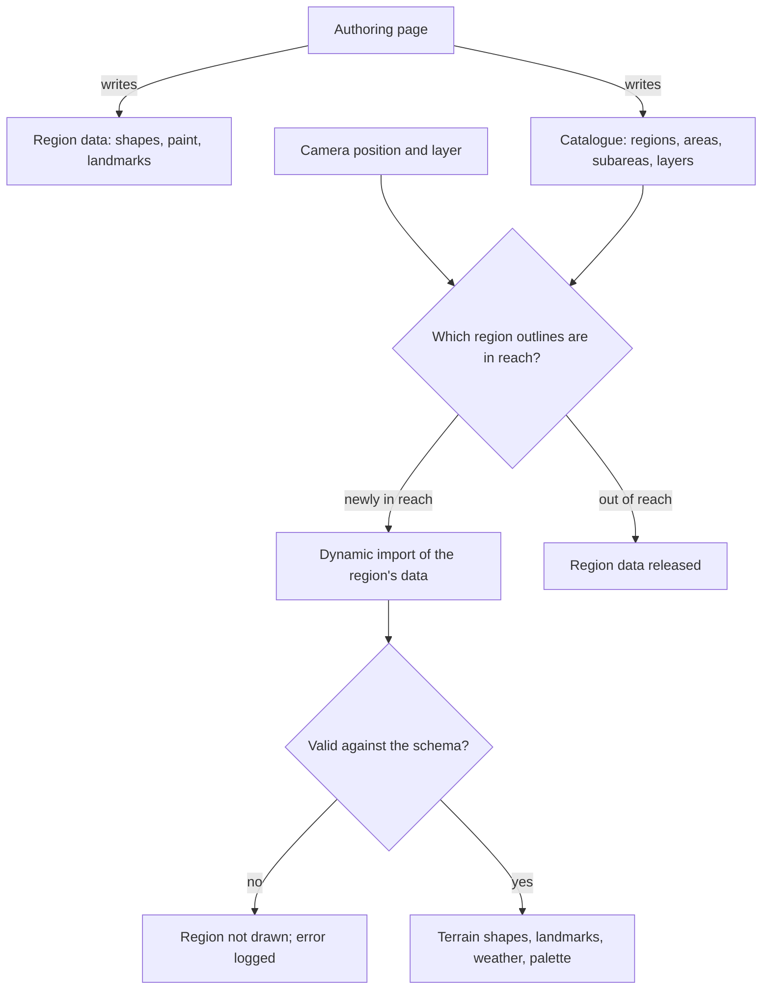

# World map

This page belongs to the [Teyvat](/docs/proposals/teyvat) program. Its data is drawn by the [reference board](/docs/proposals/teyvat/reference-board)'s authoring page. Every other page reads the world through it. [Terrain](/docs/proposals/teyvat/terrain) takes its shapes from it, the [sky](/docs/proposals/teyvat/sky-and-time) its weather, [vegetation](/docs/proposals/teyvat/vegetation) its biomes, and [exploring](/docs/proposals/teyvat/exploring) its waypoints. It is the one place a region is described, and it is organised as the game organises its own map.

## Decisions

- **Metres, one continent, one transform.** World units are metres, with x east, z south and y up. The official map's pixels map to world coordinates by one affine transform for the whole continent. The reference board's per-region measurements check it, and any mismatch is resolved in that transform, never by moving one region. Heights are metres above sea level.
- **The catalogue follows the game's hierarchy.** It runs region, then area, then subarea, then point of interest, with the names the game and its wiki use: Mondstadt's Starfell Valley holds Windrise, Liyue's Minlin holds Jueyun Karst, and so on. Each area has its outline polygon, the weather it can have, its biome palette, its grade, and its reference captures. An area is also the unit of streaming and of the region pages' build order.
- **Layers for places on their own map.** The surface is one layer. Places the game draws on a separate map, including Enkanomiya, the Chasm's underground mines and the Sea of Bygone Eras, are layers with their own terrain, sky and water settings, entered at their gates. Caves that the surface map shows stay part of the surface.
- **Landmarks are kits with parameters.** A landmark record gives its kind, its catalogue parent, its position, rotation and footprint, the region kit that builds it, the kit's parameters, and the captures it was matched against. Kinds are the Statue of The Seven, the Teleport Waypoint, the Domain entrance, buildings, bridges, towers, rock formations and landmark trees. A city is a set of landmarks along authored streets, not one monolith.
- **Waypoints and statues are ordinary landmarks.** They are placed like any building. They are also what [exploring](/docs/proposals/teyvat/exploring) jumps between, as the game fast-travels between them.
- **Data is validated and split by region.** The catalogue and each region's shapes and landmarks are JSON checked against Zod schemas at load. Each region is a separate chunk loaded by dynamic import when the camera comes within reach of its outline. Opening Mondstadt therefore never downloads Fontaine.

## How it works



## Scope

**Today:** nothing in the app describes a map.

**This adds:**

1. **The schemas** for the catalogue, the shapes, the paint and the landmarks, with the continent transform.
2. **The loader** that imports and drops regions by reach.
3. **The catalogue's names** for every region, area and subarea the game ships. The shapes and landmarks come region by region, with their pages.

## Key files

| File                                                       | Role after the change                                                 |
| :--------------------------------------------------------- | :-------------------------------------------------------------------- |
| `apps/web/app/services/agentConsole/world/getViewReach.ts` | The view-reach bound the region loader applies at a continent's scale |

New files:

```text
apps/web/app/models/teyvat/                 ← catalogue, shape, paint and landmark schemas
apps/web/app/services/teyvat/world/         ← continent transform, region loader
apps/web/app/assets/teyvat/catalogue.json
apps/web/app/assets/teyvat/<region>/        ← one folder of shapes, paint and landmarks per region
```

## Notes

- **Names are facts, and outlines are drawn.** The catalogue's names come from the game. Each outline is drawn by hand over the stencil, which is why no region's shape is imported from any map's data.
- **A schema failure hides one region, not the world.** A region whose data fails validation is not drawn and the rest of the continent loads, so a mistake in one region's authoring never blanks the page.

## Sources

- [Teyvat](https://genshin-impact.fandom.com/wiki/Teyvat), Genshin Impact Wiki: the nations and the borderlands, and each region's areas and subareas, which the catalogue's hierarchy takes.
- [Map](https://genshin-impact.fandom.com/wiki/Map), Genshin Impact Wiki: areas lit on the map by their Statue of The Seven, and Enkanomiya and the Chasm's underground mines unlocked as maps of their own, which is where the layers come from.
- [Teleport Waypoint](https://genshin-impact.fandom.com/wiki/Teleport_Waypoint) and [Statue of The Seven](https://genshin-impact.fandom.com/wiki/Statue_of_The_Seven), Genshin Impact Wiki: fast travel between waypoints and statues, one statue per area.
