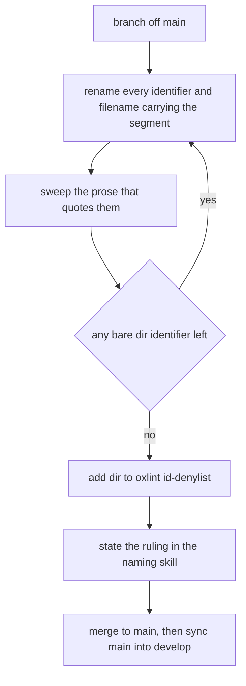

# Directory Rename

`Dir` is an abbreviation, and the naming convention has none: every identifier says `Directory`. virrun predates that ruling and carries the short form through most of the package — `upperDir`, `workDir`, `lowerDirs`, `bindDirs`, bare `dir` — plus the prose that names them in the virrun docs and a few skills. This is the plan for landing the rename as one change, outside the sweep windows, so that neither a sweep nor a review pays for it.

## What works today vs what this adds

Nothing behaves differently before or after: the rename touches identifiers and the prose that quotes them, never a value. It adds one enforcer — `dir` on oxlint's `id-denylist` — so the bare `dir` identifier cannot return once it is gone — the denylist matches whole identifiers, and the compound spellings are the greps' job below — and one line in the `naming` skill stating the ruling.

Until it lands, **every sweep leaves `*Dir` names alone**: a partial rename is two spellings of one thing, and the sweep commit that carried it would be unreadable as a sweep.

## How it runs

- **Every spelling of the segment, in identifiers and filenames alike.** `\b[A-Za-z]*[Dd]irs?\b` finds the camelCase (`upperDir`, `lowerDirs`), the bare `dir`, and the PascalCase (`OpaqueDir`); `\b[Dd]irs?[A-Z]` finds the prefix position (`DirSource`); and `git ls-files | grep -i dir` finds the file names, which no identifier grep reaches. The lowercase overlayfs mount words (`upperdir`, `workdir`, `lowerdir`) and the bwrap flags match too and stay: they are the kernel's and bubblewrap's vocabulary.
- **Identifiers, never values.** An enum member is renamed, its string value is not (`OverlayEntryKind.OpaqueDir = "opaqueDir"` becomes `OpaqueDirectory = "opaqueDir"`), because a value may already sit in a persisted manifest or a CLI argument. Check every enum value and Zod key the regex reaches before touching it.
- **Its own branch, merged straight to `main`.** The change is mechanical and reads as one diff, so it goes to `main` without a CodeRabbit slot rather than through the standing `develop` → `main` window, where it would fill a whole review with zero findings and bury the sweeps beside it. `main` is then synced back into `develop` the way the `git` skill describes.
- **The enforcer lands last.** `id-denylist` is a ratchet: it goes on only once no bare `dir` identifier is left, and the `naming` skill gains the ruling in the same change, so the rule and its enforcer are never on the tree without each other.

## Key files

| File                                                 | Role                                                                    |
| ---------------------------------------------------- | ----------------------------------------------------------------------- |
| `packages/virrun/src/models/exec/OverlayLayers.ts`   | The overlay layer shape most of the renamed names flow through          |
| `packages/virrun/src/models/source/DirSource.ts`     | A source kind whose type name and file name both carry the abbreviation |
| `.oxlintrc.json`                                     | Where `dir` joins `id-denylist` once the rename is complete             |
| `.agents/skills/naming/SKILL.md`                     | Where the ruling is stated                                              |
| `apps/web/content/docs/virrun/execution-backends.md` | Prose that names the overlay layers and is swept with the code          |

## Notes

- A one-time change: when it ships, this page and its roadmap item are deleted and nothing is written in their place — the shipped-log line in the virrun index is the only trace.
- The count of files it touches is what the identifier greps and the filename search above answer together on the day; it is not recorded here because it moves with every sweep that lands first.
