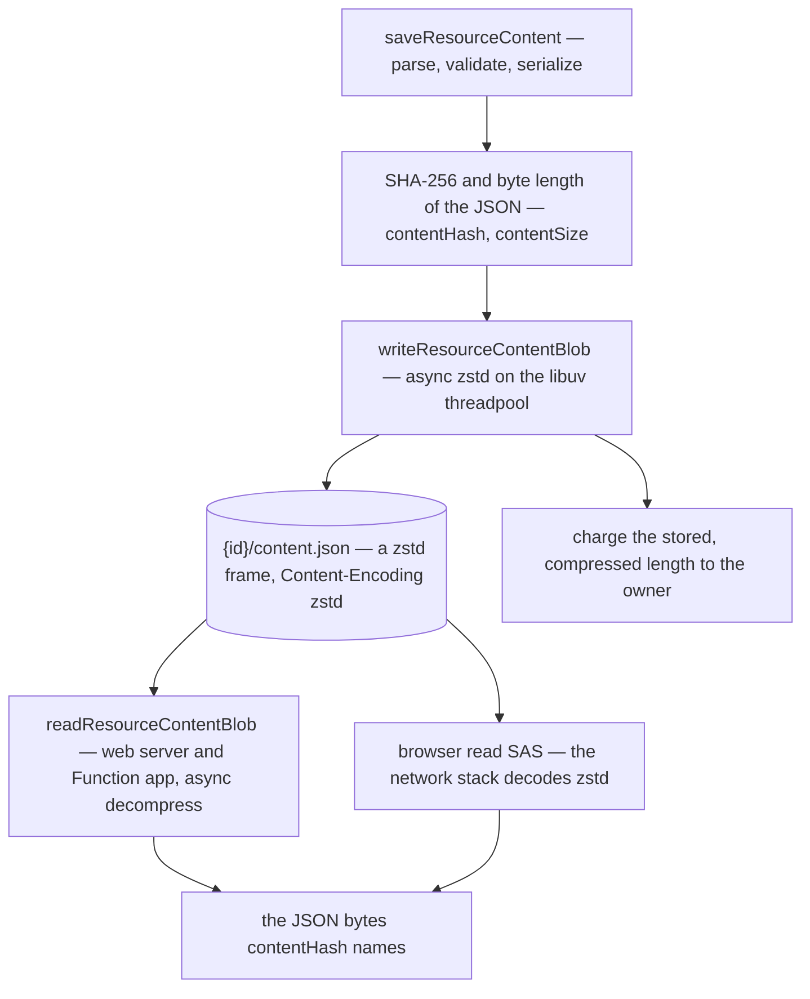

# Compressed content at rest

A resource's working copy, `{id}/content.json`, is stored as a **standalone zstd frame, with the blob's `Content-Encoding` set to `zstd`**. Every resource type gets this for free, because every save goes through `saveResourceContent` and every read goes through one shared reader. Retained versions were already zstd keyframes and deltas ([resource version store](/docs/resource/resource-version-store)). The working copy is also the copy that is read the most, so compressing it cuts the owner's quota charge, every server-side read and the browser's download of a large document ([large documents](/docs/architecture/large-documents)) by the same ratio. A Sheet's rows repeat the same keys and shapes on every line, so they compress several times over, even with a random id on every row.

Nothing about the document itself changes. Its hash, its size for transport and its schema all still describe the JSON. Only the bytes at rest change.

## The write and the reads

`@esposter/db` holds both directions of the codec, so the web server, the Function app and the one-off backfill cannot disagree about the format:

- **`writeResourceContentBlob`** compresses the serialized document and uploads it with `Content-Encoding: zstd`, then returns the stored length. It is the only writer.
- **`readResourceContentBlob`** downloads and decompresses the blob, and reads a 404 as "no content yet". Every server reader goes through it: `readSerializedResourceContent` (the inline read, revisions, blueprint capture and dataset reads), the delta commit's dictionary in `readResourceContentDelta`, and `sendTodoReminderHandler`'s re-check of a reminder.
- **The browser's large read is unchanged.** Blob Storage serves a blob's stored `Content-Encoding` on every read, and the network stack decodes it before `fetch` returns the body. So the page still receives the JSON bytes that it hashes, parses and keeps as its delta baseline.

The staged upload stays gzip. The browser's `CompressionStream` has no zstd, and the server re-serializes what it validates rather than storing the upload ([compression](/docs/architecture/compression)).

## Decisions

**zstd, because both readers can decode it.** The [compression standard](/docs/architecture/compression) picks zstd wherever the repo chooses the bytes. Here the browser is a counterparty, and zstd is in its codec set: every current engine decodes `Content-Encoding: zstd` natively, and the repo targets current engines only. So there is no gzip fallback and no browser-side decoder to ship.

**The window is pinned at 8 MB.** RFC 9659 forbids an HTTP zstd encoder from producing a frame that needs a window larger than 8 MB. The writer therefore sets `ZSTD_c_windowLog` to `MAX_CONTENT_ENCODING_WINDOW_LOG` explicitly. This is part of the stored format, not a tunable. No dictionary is used, because a browser decoding a `Content-Encoding` has none.

**Level 1, `CONTENT_COMPRESSION_LEVEL`.** The working copy is rewritten on every autosave, so its level is chosen for speed, which makes it a different decision from `DEFAULT_COMPRESSION_LEVEL`, the level the version store spends once per retained version. On Sheet-shaped rows, the fastest level also produced the smallest frame of the levels tried. The committed `packages/db/src/services/resource/writeResourceContentBlob.bench.md` records the speed side of that comparison.

**What each number describes.** `contentHash` stays the hash of the JSON, because a client compares its own bytes against it. `contentSize` stays the JSON's length, because it sizes the transport and the server's cost to parse. The storage charge is the compressed length, because the ledger counts stored bytes and a blob's `BlobCreated` event reports the stored length. So the quota meter drops by the ratio, and the reconcile still agrees with the charge ([storage quotas](/docs/resource/storage-quotas)).

**Latest shape only.** Every reader assumes the frame, and there is no plain-JSON branch ([persisted data — latest shape only](/docs/architecture/persisted-data-latest-shape-only)). Content is the owner's data and must never reset. So the blobs written before the change are rewritten once by `pnpm backfill:compress-content` in `apps/web`, run against each storage account right after the deploy that ships the readers. The script is deleted once production has run it.

## What it costs in compute

The save gains one compression, and every server read gains one decompression. Neither runs on the event loop: `node:zlib`'s asynchronous calls run on the libuv threadpool, so they take CPU but no request waits behind them.

- **The compression** at level 1 runs faster than the save's own `JSON.stringify` and SHA-256 over the same bytes. A typical document costs well under a millisecond, and one at `MAX_RESOURCE_CONTENT_SIZE` a small fraction of the seconds its validation already takes.
- **The decompression** is faster still, and it replaces a download several times larger.
- **The browser** decodes in its network stack, not on the page's main thread, and a large Sheet crosses the wire at a fraction of its size.

## Failure semantics

- **The compression fails:** the save throws before anything is uploaded. It unwinds the way a failed upload already does: the version bump rolls back with its transaction, and a cleared binding stays cleared.
- **The backfill is interrupted:** it is idempotent and resumable. It skips a blob whose listing already says `zstd`, and it reads and writes under an `ifMatch` on the etag the listing saw. So a save that lands during the rewrite wins, and that blob is left with the save's own compressed write.
- **The quota:** each rewritten blob raises a `BlobCreated` event with its new length, and the reconcile moves the owner's counter by the difference. Nothing charges the backfill separately.
- **The deploy window:** a server running the old code cannot read a compressed blob, and the new code cannot read a plain one. Reads that fail between the deploy and the backfill are failed requests the owner retries, not lost data.

## Key files

| File                                                                 | Role                                                                 |
| -------------------------------------------------------------------- | -------------------------------------------------------------------- |
| `packages/db/src/services/resource/writeResourceContentBlob.ts`      | async compress and upload with `Content-Encoding: zstd`              |
| `packages/db/src/services/resource/readResourceContentBlob.ts`       | download and async decompress, a 404 read as no content              |
| `packages/db/src/services/resource/constants.ts`                     | `CONTENT_COMPRESSION_LEVEL`, `MAX_CONTENT_ENCODING_WINDOW_LOG`       |
| `apps/web/server/services/resource/saveResourceContent.ts`           | writes through `writeResourceContentBlob`, charges the stored length |
| `apps/web/server/services/resource/readSerializedResourceContent.ts` | the web server's reads through the shared reader                     |
| `apps/web/server/services/resource/readResourceContentDelta.ts`      | the delta commit's dictionary from the shared reader                 |
| `apps/functions/src/handlers/sendTodoReminderHandler.ts`             | the reminder's re-check through the shared reader                    |
| `apps/web/scripts/backfill/compressContent.ts`                       | one-off rewrite of the blobs stored before the change                |

## Sources

- [Zstandard](https://github.com/facebook/zstd) (Meta): the benchmark table showing zstd's fastest levels compress at hundreds of MB/s and decompress at over a GB/s per core.
- [RFC 9659 — Window Sizing for Zstandard Content Encoding](https://www.rfc-editor.org/rfc/rfc9659.html) (IETF): an HTTP zstd encoder must not need a window larger than 8 MB, which is the pinned window log.
- [zstd content-encoding](https://caniuse.com/zstd) (Can I use): native decoding in every current engine, which the no-fallback decision rests on.
- [Zlib: threadpool usage and performance considerations](https://nodejs.org/api/zlib.html#threadpool-usage-and-performance-considerations) (Node.js): every zlib API except the explicitly synchronous ones runs on the libuv threadpool.
