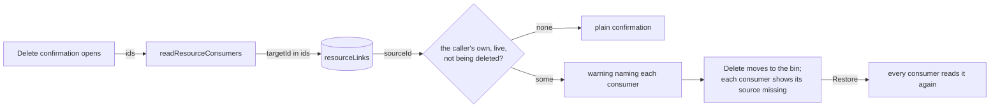

# Delete-Time Reference Warning

Deleting a resource that others consume says so before it happens. The confirmation that already asks before every delete adds a warning when any of the owner's other resources reference what is going: "Used by 2 other resources, which will show it as missing until restored", followed by each one's name and type. Airtable's field manager answers the same question, what depends on this, before a field is deleted. A delete with no consumers looks exactly as it did.

## How it works

`ResourceConsumersWarning` sits in both delete confirmations: the blade header's, for the resource the page is open on, and the list's, for one row or a whole selection. It mounts with the confirmation, so the read happens only when a delete is being asked about, and `useQuery` fires `resource.readResourceConsumers` with the ids.

The procedure is one lookup of the [resource-link index](/docs/architecture/resource-links) by target. It returns the caller's live resources that hold a link to any of the ids, of any role (a dashboard's or an email's `Dataset`, a program's `Email` or `Survey`), ordered by name. Three kinds of resource are left out, each for its own reason:

- **A resource being deleted alongside.** Deleting a dashboard together with its sheet leaves no reference behind to miss.
- **A resource already in the recycle bin.** It reads nothing until it is restored, and its own restore would show the source missing then.
- **Another owner's resource.** Its reference never resolves to the caller's resource ([cross-owner references](/docs/architecture/security/cross-owner-references)), and naming it would hand the caller its name.

The warning is advisory. Delete stays enabled, because the delete is a soft one: the toast after it offers Restore, and a restore heals every consumer at once, since nothing rewrote their content in the meantime ([dangling reference cleanup](/docs/resource/rejected/dangling-reference-cleanup)). Each consumer says its source is missing where the reference is picked ([datasets](/docs/architecture/dataset)).

## Key files

| File                                                               | Role                                                     |
| ------------------------------------------------------------------ | -------------------------------------------------------- |
| `apps/web/server/trpc/routers/resource.ts`                         | `readResourceConsumers`, the index lookup by target      |
| `apps/web/shared/models/db/resource/ReadResourceConsumersInput.ts` | the ids being deleted                                    |
| `apps/web/app/components/Resource/ConsumersWarning.vue`            | the warning, read when a confirmation opens              |
| `apps/web/app/components/Resource/Blade/Header.vue`                | the blade's delete confirmation                          |
| `apps/web/app/components/Resource/List/ConfirmDeleteDialog.vue`    | the list's delete confirmation, for a row or a selection |

## Notes

- The index is written by every save, and it shipped before any consumer held content, so the warning never undercounts a resource saved before it existed ([resource links](/docs/architecture/resource-links)).
- The read is capped at the list read limit, which is far past the consumers one resource has.

## Sources

- Airtable, "Field manager and field dependencies" — which objects depend on a field, identified before it is changed or deleted: https://support.airtable.com/docs/field-manager-and-field-dependencies
