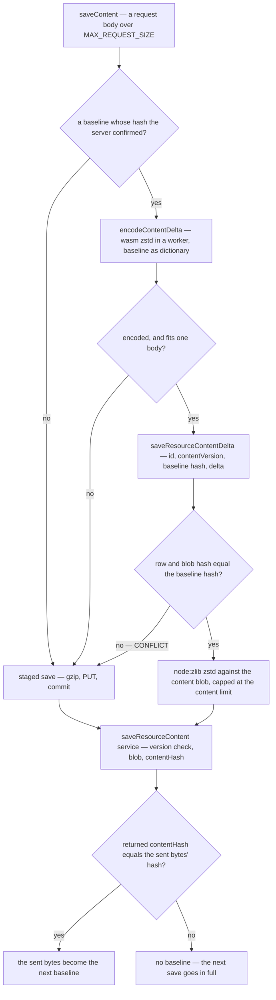

# Delta content saves

A [staged content save](/docs/architecture/file-uploads) makes a large document savable, but not cheap: without more, every autosave of a large Sheet gzips and uploads the whole document although the owner changed one cell. So once a client holds the bytes the server stored, its next large save sends only what changed, without knowing anything about any resource type.

The [resource version store](/docs/resource/resource-version-store) already stores a version as a zstd frame compressed with an earlier version's plaintext as the dictionary, and the encoder's long-range matching turns a near-duplicate document into a few hundred bytes with no diff format and no per-type structure. A delta save is the same trick on the wire: the client compresses the new serialization with **the last stored serialization** as the dictionary, and the server, which holds that same document as the content blob, reverses it.

## The baseline is the server's bytes

The content blob holds the serialization of the _parsed_ document, and a content schema's transforms (string normalization, for one) can make it differ from what the client sent. So every save — inline, staged or delta — writes `contentHash`, the SHA-256 of the stored bytes, on the `resources` row in the transaction that writes the blob, and hands the row back. The store keeps the bytes it sent as its baseline only when their hash is that one; otherwise its next large save goes in full, and the one after that has a baseline again. Loading a resource seeds the baseline the same way: `setPersistedContent` hashes the document it was handed, and keeps its bytes when they hash to the row's `contentHash`, so a session's first large save is already a delta — never over a baseline a save has set since, which names newer bytes. The baseline is not reactive and not persisted, since nothing renders it.

## A mismatch is not an error the owner sees

Another device's save, a restore or a blueprint deploy each move the content blob. The commit refuses a baseline the row no longer names before it reads anything, and checks the blob's own hash after reading it, which settles the one case the row cannot: a blob a failed transaction left behind it. Either refusal is `CONFLICT` with `CONTENT_BASELINE_MISMATCH_ERROR_MESSAGE` — the one code the commit raises that `errorLink` does not alert — and the store answers it with a staged save inside the same queued call. An encoder that fails, or a delta too large for one request body because the edit was large, falls back the same way. A delta only ever saves the owner an upload; it never adds a way for a save to fail.

## The delta travels in the JSON body

A delta is proportional to the edit, so it rides the ordinary tRPC body, base64-encoded, with the id, the `contentVersion` and the baseline hash beside it. Base64 costs a third more on a payload of kilobytes, and buys a procedure with no binary input route, no multipart size limit of its own and no second parser. The input is capped at `MAX_REQUEST_SIZE`, and the server's output at `MAX_RESOURCE_CONTENT_SIZE`, so a small frame that inflates past the content limit stops there.

## The browser codec

`node:zlib`'s zstd is a native binding that exists only in Node; the browser's `CompressionStream` offers gzip, deflate and Brotli but no zstd, and none of them takes a dictionary, and every published WebAssembly zstd either has no dictionary API or cannot set the window. So the app builds its own: `pnpm zstd:gen` compiles a small C shim (`apps/web/scripts/zstd/compressWithDictionary.c`) over the pinned upstream zstd release to WebAssembly with Zig, both downloads verified against their published checksums, and commits the module under `app/generated/zstd/` ([generated artifacts](/docs/architecture/generated-artifacts)). Nothing else ever needs a compiler — the generator runs only to move the zstd version, which tracks the libzstd `node:zlib` bundles, so both ends run one codec.

- **Parameters shared, not restated.** The window must span the dictionary and the document, or the encoder cannot reach back into the baseline past a few megabytes and the delta degrades to plain compression. `getWindowLog` and `DEFAULT_COMPRESSION_LEVEL` live in `@esposter/shared`, read by the version store's encoder and this one alike, and the server's decoder admits the window the same derivation gives at the content limit.
- **Loaded lazily, run in a worker.** The delta path imports `encodeContentDelta` with `await import`, which starts a worker of its own for the one save and terminates it after, so no page that never saves a large document fetches the module, and the encoder's memory — the size of both documents and then some — is handed back rather than held.

What a delta does not change is the server's work: it still reads, parses, validates and writes the whole document on every save, in-region and off the owner's connection. The committed benches put both commit paths at a small multiple of the bare parse every save already pays, and the wasm encoder close to Node's native one.

## Key files

| File                                                            | Role                                                              |
| --------------------------------------------------------------- | ----------------------------------------------------------------- |
| `apps/web/app/store/resource/index.ts`                          | keeps the confirmed baseline and chooses inline, delta or staged  |
| `apps/web/app/services/resource/saveResourceContentDelta.ts`    | encodes and commits a delta, or answers undefined for a full save |
| `apps/web/app/services/resource/encodeContentDelta.ts`          | one worker per delta, terminated after it                         |
| `apps/web/app/workers/resource/contentDelta.worker.ts`          | loads the generated module and compresses off the main thread     |
| `apps/web/app/services/resource/compressContentDelta.ts`        | the compress call over the module's memory                        |
| `apps/web/server/services/resource/readResourceContentDelta.ts` | refuses a moved baseline, decodes against the content blob        |
| `apps/web/server/services/resource/saveResourceContent.ts`      | writes `contentHash` with every content blob                      |
| `apps/web/scripts/zstd/index.ts`                                | `pnpm zstd:gen` — the pinned, checksummed build of the module     |
| `packages/shared/src/services/zstd/getWindowLog.ts`             | the window both encoders derive                                   |

## Sources

- [RFC 9842 — Compression Dictionary Transport](https://www.rfc-editor.org/rfc/rfc9842.html) (IETF) — a previous version of a resource used as a zstd or Brotli dictionary, identified by the SHA-256 of its contents, so the newer version crosses as a delta. The RFC covers responses only; a delta save applies the same idea to requests, with the same hash identifying the baseline.
- [Behind the feature: the hidden challenges of autosave](https://www.figma.com/blog/behind-the-feature-autosave/) (Figma) — whole-file serialization on every save stalls a large document, and Figma writes only the changes since the last save. A delta save does the same, with the compressor finding the changes instead of the editor recording them.
- [Compression Streams](https://compression.spec.whatwg.org/) (WHATWG) — the formats a browser compresses natively — gzip, deflate and Brotli, none with a dictionary — which is why the zstd encoder is a module of the app's own.
