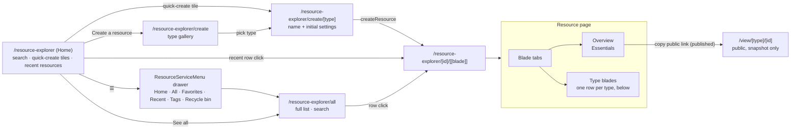
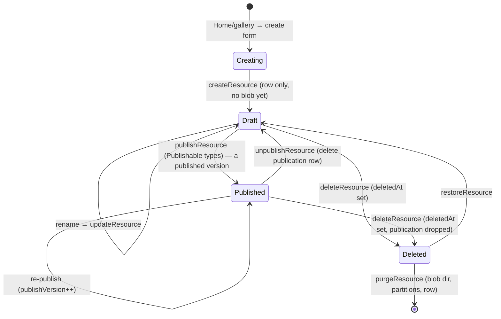

# Resource Explorer

The single Azure-portal-like UI for every resource: one list, one resource page with capability-aware blades, one public view route. The shell is driven entirely by `ResourceDefinitionMap` ([resources](/docs/architecture/resource)). Azure Portal is the UX reference, deliberately literal: Home mirrors the portal landing, Create mirrors the marketplace (a page per resource type, never a modal).

| Azure portal                    | Resource Explorer                                                                                    |
| ------------------------------- | ---------------------------------------------------------------------------------------------------- |
| Home (search + recents)         | `/resource-explorer`                                                                                 |
| Service left menu               | `ResourceServiceMenu` ([resource service menu](/docs/resource/resource-service-menu))                |
| All resources list              | `/resource-explorer/all`                                                                             |
| Create a resource (marketplace) | `/resource-explorer/create` gallery → `/resource-explorer/create/[type]`                             |
| Resource menu (left nav)        | blade tabs under the title on `/resource-explorer/[id]/[[blade]]`                                    |
| Overview + Essentials           | Overview blade with Essentials panel                                                                 |
| Toolbar commands                | Publish or Share as the one shown action; the rest in the page's overflow menu                       |
| Breadcrumbs                     | the click path only, current page as the title ([breadcrumb trail](/docs/resource/breadcrumb-trail)) |

## Routes

| Route                               | Page                                                | Purpose                                                                                         |
| ----------------------------------- | --------------------------------------------------- | ----------------------------------------------------------------------------------------------- |
| `/resource-explorer`                | `pages/resource-explorer/index.vue` (auth)          | Home — search + quick-create + recent resources                                                 |
| `/resource-explorer/all`            | `pages/resource-explorer/all.vue` (auth)            | full list (all types, search)                                                                   |
| `/resource-explorer/favorites`      | `pages/resource-explorer/favorites.vue` (auth)      | the same list over starred resources ([service menu](/docs/resource/resource-service-menu))     |
| `/resource-explorer/recents`        | `pages/resource-explorer/recents.vue` (auth)        | the same list over opened resources, newest open first                                          |
| `/resource-explorer/tags`           | `pages/resource-explorer/tags.vue` (auth)           | tag names + resource counts, linking into `/all` pre-filtered                                   |
| `/resource-explorer/recycle-bin`    | `pages/resource-explorer/recycle-bin.vue` (auth)    | soft-deleted resources — restore or purge ([recycle bin](/docs/resource/recycle-bin))           |
| `/resource-explorer/create`         | `pages/resource-explorer/create/index.vue` (auth)   | create gallery — type picker (marketplace)                                                      |
| `/resource-explorer/create/[type]`  | `pages/resource-explorer/create/[type].vue` (auth)  | per-type create form (name + initial settings) → `/resource-explorer/[id]`                      |
| `/resource-explorer/[id]/[[blade]]` | `pages/resource-explorer/[id]/[[blade]].vue` (auth) | resource page; omitted blade = Overview; blade validated in route middleware                    |
| `/view/[type]/[id]`                 | `pages/view/[type]/[id].vue` (public)               | published view, dispatched via `ViewComponentMap` ([publishing](/docs/architecture/publishing)) |

`all`, `favorites`, `recents`, `tags`, `recycle-bin` and `create` are static segments so they win over the dynamic `[id]` sibling. Blades are path segments (not query params) so they deep-link. Email invite blocks link the public respondent page via `RoutePath.View(ResourceType.Survey, id)`. The launcher's `ProductGroups` has one **Resource Explorer** entry landing on Home, rather than one entry per editor.

The whole explorer is **client-only rendered**: `apps/web/configuration/routeRules.ts` sets `ssr: false` for `/resource-explorer` and `/resource-explorer/**`, so no blade needs a `<ClientOnly>` of its own. It is an auth-gated app surface with no SEO value that touches `window`/`localStorage` during setup, so there is nothing worth server-rendering. Only the public `/view/[type]/[id]` pages stay SSR, for SEO and social/OG unfurls.

## Navigation map



## Home — `/resource-explorer`

The Azure-portal landing. Not a table — a dashboard of entry points across the page's full width, in the order a visit runs, each a section under its own heading rather than a card:

- **Search** — a button drawn as the field it opens, which opens the command palette in its resources scope ([global search](/docs/resource/global-search)).
- **Create** — **quick-create tiles** from `ResourceDefinitionMap` (icon + title → `/resource-explorer/create/[type]`) under the page's one accent action, **Create a resource** (→ gallery).
- **Resources** — **Recent** and **Favorites** as `UiTabs` keyed to the `tab` query, and a **See all** link ([favorites & recents](/docs/resource/favorites-and-recents)). The cards fill the width a column at a time, each the type's mark beside the resource's name with its type and when it was last touched under it, and a right-click, a long press or the menu key opens it in a new tab, copies its link, or adds it to or removes it from the favorites. Renaming and deleting stay on the workbench. Each tab's empty state takes its copy and its mark from `ResourceListSourceDefinitionMap`, as the list's does, and a failed Recent read is an error state with its own retry.

## All resources — `/resource-explorer/all`

`pages/resource-explorer/all.vue` renders the `resource` layout with `title="All"` above `ResourceListView` — a `UiDataTable` over `resource.readResources` (cross-type, owner, offset-paginated). `/favorites` and `/recents` are the same three lines with a different `source` prop, so everything below describes them too ([service menu](/docs/resource/resource-service-menu)):

- Columns: favorite (the star), type (icon + label from `ResourceDefinitionMap`), name, createdAt, updatedAt, lastAccessedAt (hidden by default), and a trailing actions `⋮`. The chooser offers every column except the pinned ones — name for every source, plus the column the source is ordered by, which is what puts **Last Accessed** permanently on `/recents` (`useResourceListColumns`). Publish status is deliberately **not** a list column — it is a capability surfaced per-resource on the Overview blade and as an opt-in filter pill.
- Toolbar (workbench only): the search across the row's width, the summary and group-by-type toggles, the column chooser, an overflow menu of Export CSV, Refresh and the recycle bin, and a **close ✕** (`closeTo` → Home) — **not** a Create button. Create lives on Home; `/all` is a layer you close back to Home.
- Filter-pill row, bulk select, context menu, URL-synced filter state, and the footer count are the list workbench — see [list filters & views](/docs/resource/list-filters-and-views).
- Row click → `/resource-explorer/{id}` via `navigateTo` — the single affordance for opening a resource (the name cell is plain text, not a competing link).
- `?search=`, `?types=`, `?status=`, `?sortBy=`, and `?page=` deep-link the list, so [global search](/docs/resource/global-search) links land filtered.

## Create flow — `/resource-explorer/create` → `/resource-explorer/create/[type]`

Create is a **page per resource type**, mirroring the Azure marketplace + create blade — never a modal. The gallery shows tiles for every `ResourceDefinitionMap` entry (icon, title, description); the per-type form collects the name (`createNameSchema`) plus any type-specific initial settings (most types are name-only), calls `createResource(type, …)`, and routes to the new resource's Overview blade. The content blob is written on the first save inside an editor blade, not at create time.

## Resource page — `/resource-explorer/[id]/[[blade]]`

One header, then the blade — no absolute overlay, no `z-index`. The `resource` layout's header is a page header as [Primer's](https://primer.style/product/components/page-header/guidelines/) has it: the trail with the storage meter on its far end, then the resource's own title row, then its blades as tab links whose line closes the header. Below it, `<ResourceExplorer>` is one surface holding the blade and nothing beside it.

Like every route but Home it does not pass `is-service-menu-shown`: the blade tabs are the navigation on this page, and a second menu beside them would be two answers to "where am I".

```text
  Resource Explorer › All                          ▣▣▣▣▢▢▢▢▢▢ 3.2 GB of 10 GB used   ← trail + storage meter
[▦] Q3 Report                            ☁ Saved 2m ago  [Share] [★] [⋯] [✕]      ← the resource's title row
    Sheet
 Overview   Activity   Data   Settings                                              ← blade tabs
─────────────────────────────────────────────────────────────────────────────────
  Essentials                                                                         ← blade content, full width
```

- **No list pane beside the blade.** A resource fills the surface however the visitor reached it: a pane would duplicate a way back that the breadcrumb and the header's close ✕ both already give, and it would spend width the blade itself uses better.
- **The blades are tabs under the title.** A type has three or four of them, so a row of tab links costs no width the blade could use, where a rail beside it took a column or a collapse toggle to give one back. They stay on screen on every width, a row that scrolls sideways where it is too short, and the current one is marked by the route. The Azure rail, its collapse caret and the dropdown it became on a narrow screen were retired with the UI library's first page header.
- **The title row is the resource as an item in its slot**: the type's mark in a sunk block, beside the name as the page's heading and the type under it. The blade is not named beside it, since its tab already says which face is open.
- **One action shown, the rest in the page's overflow menu** ([resource page parity](/docs/resource/resource-page-parity)). A right-click, a long press or the menu key on the title opens the same list.
- **Nested close** — the ✕ peels back to whatever the trail says the visitor came through (`navigationTrail` store's `closeTo`), falling back to the hub on a direct arrival. Clicking it and clicking the last crumb are the same move, on the list page and the resource page alike.
- **Single unified breadcrumb** — the `resource` layout owns the only breadcrumb; the blade box has none. A plain destination is a link; an inline `@click="navigateTo(...)"` is for logic-then-navigate actions. Raw `<a>` is never used — see [navigation](/docs/architecture/navigation).

### Blades

`getResourceBladeDefinitions(type)` is the one answer to "which blades does this type have, in what order". It emits the built-ins first — **Overview** always, **Editor** only when the type registers an inline component, **Activity** always, **Publish history** only for a `PublishableResourceType` — then the type's own blades from `ResourceBladeDefinitionMap`. The `ResourceBladeType` enum is declared in that same nav order with `perfectionist/sort-enums` disabled, so the declaration stays readable as the order rather than alphabetically. Editor-backed types register their inline component in `ResourceEditorComponentMap`; `ResourceBladeOutlet` renders it under a `<Suspense>` whose fallback is the spinner and a loading line, since no one skeleton is every blade's shape (GrapesJS and the other content blades use async setup) — the route rule above already keeps it off the server. Blade-only types (Program, Sheet, TodoList) have no `ResourceEditorComponentMap` entry, so their nav skips the Editor blade entirely.

| Type      | Blades after Overview                                         |
| --------- | ------------------------------------------------------------- |
| Sheet     | Data (grid editor), Settings (parse configuration form)       |
| Survey    | Editor (SurveyJS creator, inline), Responses (response table) |
| TodoList  | Items (todo table), Calendar (FullCalendar over this list)    |
| Program   | Setup, Status — no canvas, so no Editor                       |
| Dashboard | Editor (canvas incl. bind-to-data, inline)                    |
| Email     | Editor (GrapesJS, inline)                                     |
| Webpage   | Editor (GrapesJS, inline)                                     |
| Flowchart | Editor (VueFlow, inline)                                      |
| Note      | Editor (Tiptap, inline)                                       |
| Blueprint | Editor (inline)                                               |

- **Overview blade**: Essentials panel (type, created/updated) plus a type-specific summary slot. **Publish status + version and the public link render only for `PublishableResourceType`** — a non-publishable resource shows no status row at all.
- **Commands** (on the page header's title row): Refresh, Rename, Duplicate, Version history and Delete always; Publish, Unpublish and Share for `PublishableResourceType`; an Import and an Export per format for `PortableResourceType` (contributed by `PortableFormatMap` entries — `deserialize` ⇒ Import, a self-contained async `export()` ⇒ Export); then the star and the close ✕. Which one is shown, the overflow menu and the type-the-name delete guard are [resource page parity](/docs/resource/resource-page-parity).
- State via `useResourceStore` ([resources](/docs/architecture/resource)).

## Resource lifecycle

Every resource follows one lifecycle regardless of type — the type only decides which blades and capability commands appear:



**Create → first write.** `createResource` writes only the Postgres identity row; the content blob does not exist until the first `saveResourceContent` inside an editor blade — no half-written blob to reconcile.

**Update = one write path.** Settings and Data are separate blades but one content blob with one `contentVersion` — never two write paths for one artifact. Optimistic concurrency: a stale `contentVersion` rejects the save.

**Linking to other resources** is the dataset capability ([datasets](/docs/architecture/dataset)), not a resource-to-resource foreign key: a consumer holds a `DatasetReference` (`{ type, id }`) and either copies (Sheet import — one-time row copy) or references (Dashboard visual / Email merge fields — re-resolved on load via `dataset.readDataset`).

**Delete.** `deleteResource` is a soft delete — identical for every type: it stamps `deletedAt` and drops the `resource_publications` row, while the `{id}/` blob directory and the type's table partitions survive so a restore can hand the whole resource back. `purgeResource` is what destroys them, from the bin or from the 30-day timer ([recycle bin](/docs/resource/recycle-bin)). Because links are bare `DatasetReference` ids (not FKs), deleting a source leaves consumers' stored references dangling; the consumer re-resolves on load and fails/returns empty rather than cascading. Published snapshots are unaffected (they baked data in at publish time). Surfacing a "source no longer available" state is deferred ([dangling dataset references](/docs/resource/deferred/dangling-dataset-references)).

## Key files

| File                                                   | Role                                                                                              |
| ------------------------------------------------------ | ------------------------------------------------------------------------------------------------- |
| `app/pages/resource-explorer/[id]/[[blade]].vue`       | resource page shell: loads `useResourceStore`, 404-guards id + blade, clears the store on unmount |
| `app/layouts/resource.vue`                             | the page header: trail and storage meter, the title row, the page's tabs                          |
| `app/components/Resource/Explorer/Index.vue`           | the blade body — the outlet and the version history panel on one surface                          |
| `app/components/Resource/List/View.vue`                | a `UiDataTable` over `resource.readResources` — the workbench, parameterised by `source`          |
| `app/components/Resource/ServiceMenu.vue`              | the area's menu, opened from Home's `☰` as a drawer                                              |
| `app/components/Styled/Navigation/Overlay.vue`         | the drawer shell behind the service menu                                                          |
| `app/components/Resource/Blade/Header.vue`             | the title row: the resource in its slot, save state, the one action, the star, the overflow and ✕ |
| `app/services/resource/getResourceBladeDefinitions.ts` | which blades a type has, in nav order — read by the tabs and the route guard                      |
| `app/components/Resource/Blade/Navigation.vue`         | the blade tabs from `getResourceBladeDefinitions`                                                 |
| `app/components/Resource/Blade/Outlet.vue`             | Overview vs inline editor vs type blade on the active slug                                        |
| `app/components/Resource/Overview.vue`                 | generic Overview blade (Essentials + type summary slot)                                           |
| `app/services/resource/ResourceBladeDefinitionMap.ts`  | type → its own blade definitions                                                                  |
| `app/services/resource/ResourceEditorComponentMap.ts`  | type → inline Editor-blade component                                                              |
| `app/services/resource/PortableFormatMap.ts`           | portable type → formats (Import/Export)                                                           |
| `app/services/resource/ViewComponentMap.ts`            | publishable type → public view renderer                                                           |
| `app/store/resource/index.ts`                          | the blade's own state — row + publication + typed content + save/capability actions               |
| `app/composables/resource/useResourceRouter.ts`        | a type to its own procedures, through its name — the whole client dispatch                        |

## Notes

- The shell reuses the [shell cohesion](/docs/resource/shell-cohesion) primitives; styling follows the `styling`/`vuetify` skills.
- **One list mechanism**: there is no per-editor picker anywhere. Home recents, `/all`, `/favorites` and `/recents` are all `resource.readResources` (different filter/sort/limit), not four data paths. Home's Favorites tab is the one endpoint of its own, `resource.readFavorites`, and it still builds its scope with the same `getResourcesWhere`.
- **One create mechanism**: the gallery plus a per-type form is the only way to make a resource — no per-editor "new" button or modal. Create is a page (marketplace parity), never a dialog.
- **Editors are pure editors.** The resource lifecycle (create / select / rename / delete / publish) lives only in the Explorer + Overview blade — never in an editor's header. Editor headers keep only editing tools; editors save independently (autosave / edit-dialog).
- **The layout's header is the only page header on the page.** A blade's own header is a plain toolbar (`ResourceEmailEditor`, `DashboardEditorHeader`) — a second page header would render a second breadcrumb trail and a second storage meter.
