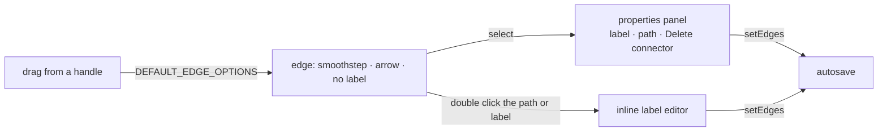

# Flowchart Connectors

A flowchart's lines are directed: the arrow says which step comes next, and a decision's branches are read by their labels. Every edge a flowchart gets is therefore drawn with an arrowhead, along a right-angled path, and can carry a label. A selected edge gets the properties panel a selected node has, with a named **Delete connector** action.

## How it works

Every edge, drawn by hand or created in code, takes its defaults from one constant, so the two cannot differ:

- **Defaults.** `DEFAULT_EDGE_OPTIONS` (`apps/web/app/services/flowchartEditor/constants.ts`) is passed as the canvas's `default-edge-options`: `markerEnd` is a closed arrow and `type` is `smoothstep`. Vue Flow applies those defaults to a connection the same as to an edge added in code, and a stored edge's own `type` and `markerEnd` win over them.
- **Edge model.** `GraphEdge` carries `label` and `markerEnd`, and `graphEdgeSchema` validates both. The label is capped at the same ceiling a node's label is.
- **Drawing.** Every path type is rendered by one labelled edge component (`apps/web/app/components/FlowchartEditor/Edge/Index.vue`), which draws the path with Vue Flow's own path function for its type (`EdgePathMap`) and places the label at that path's midpoint.
- **Editing.** Double clicking the path or the label opens an input; Enter or leaving the input writes the label back, and an Enter that confirms an input method's composition does not.
- **Panel.** `FlowchartEditor/Panel/Index.vue` shows one panel for a single selected node or, when no node is selected, a single selected edge. The edge's content (`Panel/EdgeContent.vue`) holds the label and a path toggle with three choices: Curved, Right-angled and Straight.
- **Published view.** A published flowchart draws its labels and arrowheads from the stored edges with Vue Flow's built-in edges, so it needed no change.

## Decisions

- **Path choices.** The panel offers curved, right-angled and straight. Vue Flow's step and simple-bezier types stay valid in the schema, since a stored edge may hold either, but the panel does not offer them.
- **Legacy edges.** An edge saved before this change has no `markerEnd`, so it draws the default arrow the moment the canvas loads it.
- **One write path.** Label and path edits go through `setEdges`, so they reach the same `update:edges` autosave as a drag does.
- **One panel at a time.** A node selected together with an edge keeps the node's panel, so the two never stack.

## Left out

- Edge colours, widths and dash styles: the node colour groups steps, and a styled line is decoration a flowchart does not need to be read.
- Waypoints (dragging a segment to reroute it): right-angled routing between four handles covers ordinary charts.

## Key files

| File                                                            | Role                                                    |
| --------------------------------------------------------------- | ------------------------------------------------------- |
| `apps/web/shared/models/flowchartEditor/data/GraphEdge.ts`      | the edge model and schema, with `label` and `markerEnd` |
| `apps/web/app/services/flowchartEditor/constants.ts`            | `DEFAULT_EDGE_OPTIONS` and the path toggle items        |
| `apps/web/app/services/flowchartEditor/EdgeTypeMap.ts`          | every path type drawn through the labelled edge         |
| `apps/web/app/services/flowchartEditor/EdgePathMap.ts`          | each path type's path function                          |
| `apps/web/app/components/FlowchartEditor/Edge/Index.vue`        | the labelled edge and its inline label editor           |
| `apps/web/app/components/FlowchartEditor/Panel/Index.vue`       | the properties panel, for a node or an edge             |
| `apps/web/app/components/FlowchartEditor/Panel/EdgeContent.vue` | the edge's label and path fields                        |
| `apps/web/app/components/Resource/Flowchart/Editor.vue`         | the canvas's default edge options and edge types        |

## Sources

- [Vue Flow — edges](https://vueflow.dev/guide/edge.html): `label`, `markerEnd` and the `smoothstep` type on an edge.
- [Wikipedia — Flowchart](https://en.wikipedia.org/wiki/Flowchart): flowlines as arrows showing the order of operations.
